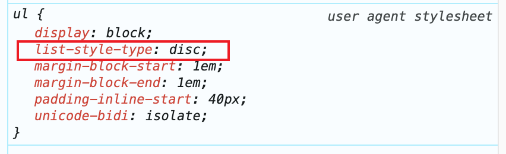

## 前言

每个CSS属性都有一个默认值，比如`background-color`的默认值是`transparent`，`margin`的默认值是`auto`，这些常见的属性我们都知道它们的默认值，但是有些不常见的属性，我们可能就不知道它们的默认值了，那么如何获取这些属性的默认值呢？

这时候就要用上`initial`、`revert`、`unset`这三个**CSS关键字**了。有些前端开发者可能分不清3个关键字的区别，下面详细介绍下。

## initial

`initial` 表示**CSS属性的初始值**，可以将某个 CSS 属性恢复到其初始状态。


比如一段这样的 HTML 结构：

```html
<div class="parent">
  parent
  <div class="child">
    child
  </div>
</div>
```
如果给它父元素添加`font-size: 30px`，那么 `child` 的 `font-size` 会继承父元素，也是 `30px`。

```css
.parent {
  font-size: 30px;
}
```

如果给子元素 `child` 加上 `font-size: initial`，那么它的字体大小就会使用 CSS 属性的初始值，也就是 `16px`。

```css
.parent {
  font-size: 30px;
}
.child {
  font-size: initial;
}
```

`initial`用途：**不知道 CSS 属性的初始值时，我们可以直接使用它进行还原**。


> 注意点：`initial` 代表的是 CSS 属性的初始值，而不是浏览器中该属性的初始值，因为浏览器会自带一些样式表，会覆盖 CSS 属性的初始值。比如 `display` 属性的初始值是 `inline`，而浏览器样式表将 `<div>` 的值设置为 `block`，将 `<table>` 的 `display` 默认值设置为 `table`等。

## revert

`revert` 表示**浏览器样式表中该 css 属性的默认值**。HTML 在浏览器渲染中，会默认增加一个样式表 `user agent stylesheet`，比如我们都知道 `body`标签会有一个默认 `8px` 的`margin`，这个就是浏览器默认增加的样式。


举个常见的例子，无序列表 `ul li` 会有默认样式，每个 `li` 前面会出现一个小圆点，这个是因为浏览器内置样式表给 `ul` 加了一个 `list-style-type: disc` 的样式。



我们在实际项目开发中，一般会使用 `list-style-type: none` 把这个默认样式给重置掉，然而某些场景，我们可能又想用到这个浏览器默认样式，这时候我们就可以借助 `revert` 关键字来实现。

```css
ul {
  list-style-type: revert;
}
```

## unset

`unset`，顾名思义就是 `该 css 属性未设置`，它有如下特点：
- 如果当前使用的CSS属性具有继承特性，等同于 `inherit` 关键字。有继承特性的属性包括文本与字体相关，比如 `font-family、font-size、font-weight、color、white-space等`，列表相关比如 `list-style-type、list-style-position` 等。
- 如果当前使用的CSS属性没有继承特性，等同于 `initial` 关键字。

## 使用小技巧

`initial`、`revert`、`unset` 关键字都支持用在 css 属性 `all` 上，对该元素所有的 css 属性生效。 

```css
.box {
  all: initial;
}
```

## inset

这里顺便提一下 `inset`，它是一个简写属性，对应 `top`、`right`、`bottom`、`left`，比如我们写一个垂直居中一般会这么写：

```css
.parent {
  position: absolute;
}
.child {
  position: absolute;
  left: 0;
  top: 0;
  right: 0;
  bottom: 0;
  margin: auto;
}
```

其实这里子元素的样式可以简写为：

```css
.child {
  position: absolute;
  inset: 0;
  margin: auto;
}
```

## 小结
`initial`、`revert`、`unset` 是 css 中三个关键字，它们的区别如下:
- `initial`: 表示 css 属性的初始值。
- `revert`: 浏览器样式表中该 css 属性的默认值。
- `unset`: 当前的 css 属性具有继承特性，相当于 `inherit`，否则相当于 `initial`。

另外 `unset` 是一个简写属性，可以表示 `top`、`right`、`bottom`、`left` 的值。