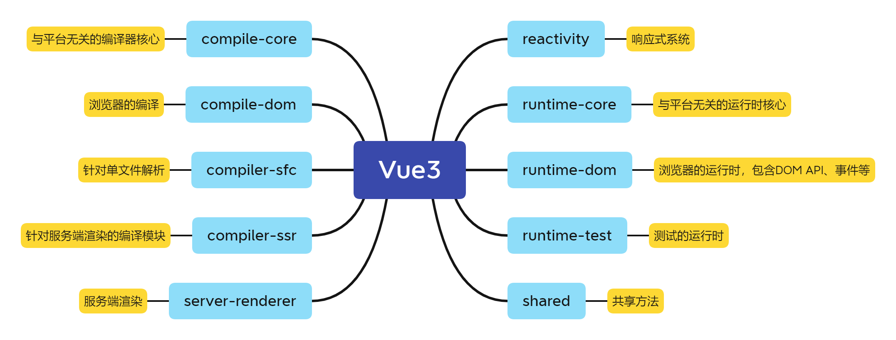

## vue3架构
Vue3源码采用**monorepo**方式进行管理，将模块拆分到packages中，这样做的好处如下：
1. 将多个模块集合到一个仓库，方便维护
2. 方便版本管理和依赖管理，各模块间相互引用也比较方便
3. 各个包可以单独安装使用，不需要导入整个vue

## 组合式API - Composition API
vue2中`Options API`（即提供props、methods、data、computed、watch等属性供用户使用）的问题：
1. 复用性比较差，虽然提供mixins和extends，但会出现数据来源不明确和重名问题
2. 需要使用带有副作用`this`，存在this指向问题，同时对tree-shaking也不友好
3. 对于上百行的大型组件来说，当你了解某段逻辑时，你需要不断上下移动阅读，体验很差

vue3`Composition API`特点：
1. 方便抽离，复用性强，可以把干净的逻辑提取到一个单独函数或者文件中，让开发者专注于逻辑内聚问题。
2. 抛弃this，tree-shaking友好，打包出来体积更小

## 响应式系统
vue3采用`proxy`替代了`Object.defineProperty`:
1. 提升了性能，不再需要一次性全部递归拦截
2. 能拦截到对象属性的新增和删除
3. 能拦截原生数组的索引、length操作

## diff算法
vue3采用**快速diff**（内部采用了一个最长递增子序列的算法）替换了vue2的**双端diff**，优化了diff效率。

## 渲染优化
在渲染方面，vue3提供了**自定义渲染器**，大大提升了扩展能力。

## 编译优化
- Block和patchFlag：为动态节点打上补丁标志，即patchFlag，同时还提出了block的概念，block本质上是一个虚拟节点，但它会多出一个dynamicChildren数组，会收集它所有的动态子代节点，比对的时候会忽略DOM层级结构的，所以对于带有v-if、v-for等结构化指令的节点也作为block的角色。
- 静态提升：将静态虚拟的节点提升到render函数之外，这样能够减少更新时创建虚拟DOM带来的性能开销和内存占用。
- 预字符串化：在静态提升的基础上，当模板中包含大量连续纯静态的标签节点时，将这样静态节点序列化成字符串，然后通过innerHTML进行设置，这样做能够减少创建虚拟节点产生的性能开销和内存占用。
- 缓存内联事件处理函数：可以避免不必要的更新
- v-once指令：缓存虚拟节点，避免组件更新时重新创建虚拟DOM的性能开销，同时带有v-once指令的节点不会被父级block收集，所以不会参与diff操作，避免无用的diff开销。

## 新增组件
- Teleport：可以将指定内容渲染到特定容器中，而不受DOM层级的限制。

## 对TypeScript支持更加友好
vue2源码采用Flow做类型检测，对TypeScript支持并不友好，而Vue3采用TypeScript进行重写，对TS的支持更加友好。

## vue3的核心包介绍
1. compiler-core：与平台无关的编译核心包
2. compiler-dom：针对浏览器平台的编译包
3. compiler-sfc：解析单文件
4. compiler-ssr：服务端渲染的编译模块
5. reactivity: 响应式系统
6. template-explorer：一个开发工具，用于调试编译器输出
7. vue-compat: 用于兼容vue2的包
8. runtime-core: 与平台无关的运行时核心包
9. runtime-dom: 针对浏览器平台的运行时包，包括DOM API和事件处理等
10. runtime-test: 用于测试的运行时包
11. server-renderer: 服务端渲染包
12. shared: 共享工具包
13. vue: 完整的Vue包，包含编译器和运行时
14. ref-transform: 一个用于将ref转换为普通变量的编译器插件，以便在模板中使用普通变量
15. size-check: 一个用于检查Vue应用大小的工具

##
