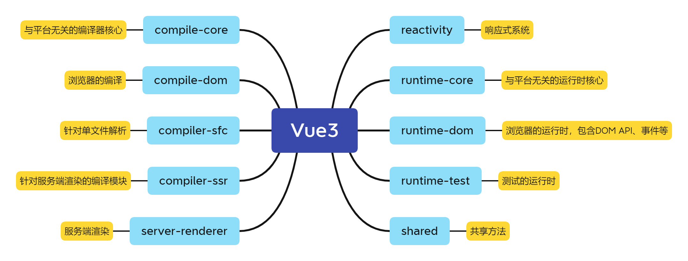

## 1、说说你对 Vue.js 的理解？
`Vue.js` 是一个用于创建用户界面的开源 `JavaScript` 框架，它的特点如下：

### 1.1 声明式框架
- 早在JQ的时代编写的代码都是命令式的，命令式框架重要特点就是关注过程。
- 声明式框架更加关注结果。命令式的代码封装到了框架内部，过程靠框架来实现。

### 1.2 数据驱动/响应式数据
通过 `Object.defineProperty（Vue 2）` 或 `Proxy（Vue 3）` 实现数据劫持，数据变化时自动更新视图，开发者无需手动操作 DOM。

### 1.3 虚拟DOM
通过高效的 `Diff` 算法比对虚拟 `DOM` 的变化，最小化真实 `DOM` 操作，提升性能。

### 1.4 组件化
将 UI 拆分为独立可复用的组件，每个组件包含自己的模板、逻辑和样式，通过组合组件构建复杂应用。

### 1.5 指令系统
提供 `v-if`、`v-for`、`v-bind`、`v-on` 等指令，以声明式方式增强 HTML 的功能。

### 1.6 渐进式框架
- **渐进集成**：可以从小规模功能（如静态页面交互）逐步扩展到完整的单页应用（SPA）。
- **灵活生态**：核心库只关注视图层，但配合官方路由（Vue Router）、状态管理（Vuex/Pinia）、构建工具（Vite）等，能轻松扩展为全功能框架。

就是你可以单独用 `vue` 的响应式构建静态页面，如果你需要状态管理，就用官方的状态管理工具 `Vuex/Pinia`，如果你需要构建一个应用，有多个页面，可以用官方路由 `Vue-router`，如果你需要一键生成项目，可以用官方的 `vue-cli` 或者使用 `vite` 的 `npm create vue@latest` 命令一键创建项目。

## 2、请说一下对 Vue.js 响应式数据的理解？

`vue` 是通过数据驱动视图的，响应式指的是当数据发生变化时，使用到该数据的页面会自动更新。在表单中，可以通过响应式实现**双向绑定**，实现表单值和数据的**双向同步**。

### 2.1 基本原理
1. **数据劫持**：`vue2` 中使用 `Object.defineProperty` 对对象属性进行劫持，对数组则采用重写数组的七个方法`（push,shift,pop,splice,unshift,sort,reverse）`来实现劫持，而 `vue3` 则通过 `Proxy` API 可以天然对对象和数组实现数据劫持。
2. **依赖收集**：在 `getter` 中收集依赖(谁在使用这个数据)。
3. **派发更新**：在 `setter` 中通知所有依赖进行更新，更新页面。

### 2.2 特点
1. **自动更新**：数据变化时，依赖该数据的视图会自动更新。
2. **深度监听**：嵌套对象也会被递归转为响应式。
3. **异步更新**：Vue 会异步执行 DOM 更新，提高性能。


### 2.3 Vue3 响应式改进

使用 `Proxy` 代替 `Object.defineProperty`：
- 可以检测到对象属性的添加和删除。
- 对数组的变化无需特殊处理，天然可以监听到通过数组索引修改元素和修改 `length` 属性的行为。
- 性能更好。


### 2.4 扩展：针对响应式可以做的性能优化（vue2）：
- 对象层级过深，性能就会差，所以响应式尽量扁平化。
- 不需要响应数据的内容不要放到 data 中。
- 不需要更新的静态数据可以用 `Object.freeze()` 冻结数据。

### 2.5 注意事项
1. 对象新增属性：`vue 2` 中需要使用 `Vue.set` 或 `this.$set` 方法。
2. 数组变化：`vue 2` 中直接通过索引修改或修改 `length` 属性不会触发响应，应使用变异方法(`push/pop/shift`等)或 `Vue.set、this.$set`。
3. 性能考量：响应式系统需要追踪依赖，大型对象可能会有性能开销。

响应式系统让开发者可以专注于数据逻辑，而无需手动处理 DOM 更新，大大提高了开发效率。

## 3、Vue3 的升级点？

### 3.1 架构升级
Vue3 源码采用 **monorepo** 方式进行管理，将模块拆分到packages中，这样做的好处如下：
1. 将多个模块集合到一个仓库，方便维护。
2. 方便版本管理和依赖管理，各模块间相互引用也比较方便。
3. 各个包可以单独安装使用，不需要导入整个 vue。



### 3.2 组合式API -> Composition API
vue2 中 `Options API`（即提供props、methods、data、computed、watch等属性供用户使用）的问题：
1. 复用性比较差，虽然提供 mixins 和 extends，但会出现数据来源不明确和重名问题。
2. 需要使用带有副作用`this`，存在this指向问题，同时对 `tree-shaking` 也不友好。
3. 对于上百行的大型组件来说，当你了解某段逻辑时，你需要不断上下移动阅读，体验很差。

vue3`Composition API`特点：
1. 方便抽离，复用性强，可以把干净的逻辑提取到一个单独函数或者文件中，让开发者专注于逻辑内聚问题。
2. 抛弃this，tree-shaking 友好，打包出来体积更小。

### 3.3 响应式系统
vue3采用`proxy`替代了`Object.defineProperty`:
1. 提升了性能，不再需要一次性全部递归拦截。
2. 能拦截到对象属性的新增和删除。
3. 能拦截原生数组的索引、length操作。

### 3.4 diff算法
全量 `diff` 算法中采用**最长递增子序列**减少节点的移动。在非全量 `diff` 算法中只比较动态节点，通过 `PatchFlag` 标记更新动态的部分。

### 3.5 渲染优化
在渲染方面，vue3提供了**自定义渲染器**，大大提升了扩展能力。

### 3.6 编译优化
- **`Block`和 `patchFlag`**：为动态节点打上补丁标志，即 `patchFlag`，同时还提出了 `block` 的概念，`block` 本质上是一个虚拟节点，但它会多出一个 `dynamicChildren` 数组，会收集它所有的动态子代节点，比对的时候会忽略DOM层级结构的，所以对于带有 `v-if`、`v-for` 等结构化指令的节点也作为 `block` 的角色。
- **静态提升**：将静态虚拟的节点提升到render函数之外，这样能够减少更新时创建虚拟DOM带来的性能开销和内存占用。
- **预字符串化**：在静态提升的基础上，当模板中包含大量连续纯静态的标签节点时，将这样静态节点序列化成字符串，然后通过innerHTML进行设置，这样做能够减少创建虚拟节点产生的性能开销和内存占用。
- **缓存内联事件处理函数**：可以避免不必要的更新。
- **v-once指令**：缓存虚拟节点，避免组件更新时重新创建虚拟DOM的性能开销，同时带有v-once指令的节点不会被父级block收集，所以不会参与diff操作，避免无用的diff开销。

### 3.7 新增组件
- Teleport：可以将指定内容渲染到特定容器中，而不受DOM层级的限制。

### 3.8 对TypeScript支持更加友好
vue2源码采用Flow做类型检测，对TypeScript支持并不友好，而Vue3采用TypeScript进行重写，对TS的支持更加友好。

### 3.9 体积更小（移除了不常用的 API）
- 移除 inline-template (Vue2 中就不推荐使用)。
- $on、$off、$once （如果有需要可以采用 mitt 库来实现）。
- 删除过滤器 filter （可以通过计算属性或者方法来实现）。
- $children移除 （可以通过provide，inject方法构建$children）。
- 移除.sync .native 修饰符 (.sync通过 v-model:xxx实现，.native为 Vue3 中的默认行为) 以及不在支持 keycode 作为v-on修饰符（@keyup.13 不再支持）。
- 移除全局 API。Vue.component、Vue.use、Vue.directive (将这些 api 挂载到实例上)。
- 通过构建工具 Tree-shaking 机制实现按需引入，减少用户打包后体积。


## 4、Vue.js 为什么需要虚拟DOM？
虚拟DOM（Virtual DOM）就是用 js 对象来描述真实 DOM，是对真实 DOM 的抽象。

### 4.1 性能优化
- **直接操作 DOM 代价高昂**：浏览器 DOM 操作是非常消耗性能的。
- **最小差异更新**：通过比对新旧虚拟 DOM 节点，找出最小差异进行更新。
- **批量更新**：在数据修改后，异步批量更新。

> 虚拟DOM并不一定能提升性能，比如你就改了一个数据，vue还要走一遍 DOM diff 比对完后再去调用原生 DOM API去更新，这时候其实你直接通过原生DOM API 去更新肯定性能更高，但是虚拟 DOM 能保证性能的下限，在你的应用复杂且庞大的时候，不至于性能太差。

### 4.2 跨平台
- **抽象层作用**：虚拟 DOM 是对真实 DOM 的抽象表示。
- **多端渲染**：同一套虚拟 DOM 可以渲染到不同平台（Web、Native、Canvas等）。
- **服务端渲染(SSR)**：在没有真实 DOM 的环境下也能生成页面结构。

### 4.3 声明式编程的优势
- **开发者友好**：开发者只需关心数据状态，不必手动操作 DOM。
- **自动优化**：框架层面负责最高效的更新策略，开发者无需微观管理。

### 4.4 与响应式系统的协同
- **依赖追踪**：虚拟 DOM 与 Vue 的响应式系统紧密结合。
- **组件级更新**：数据更改后，在组件级别进行页面更新。

## 5、Vue.js 组件间传值的方式
**vue2**：

- 一、父子通信
  1. `props`
  2. `$emit`
  3. `$attrs、$listeners`
  4. `$parent、$children`
  5. `$ref`
  6. `作用域插槽`
  7. `v-model`
- 二、兄弟组件通信
  1. `mitt`
  2. `$parent`
  3. `vuex/pinia`
  4. `app.config.globalProperties`
- 三、跨层级通信
  1. `vuex`
  2. `provide/inject`
  3. `event bus`

**vue3**：
- 一、父子通信
  1. `props`
  2. `defineEmits`
  3. `$attrs`
  4. `$ref + defineExpose`
  5. `$parent`
  6. `作用域插槽`
  7. `v-model`
- 二、兄弟组件通信
  1. `mitt`
  2. `$parent`
  3. `vuex/pinia`
  4. `app.config.globalProperties`
- 三、跨层级通信
  1. `mitt`
  2. `vuex/pinia`
  3. `provide/inject`


**扩展：其它通信方式**：
- 浏览器本地存储`storage`。
- 全局`window`对象。
- ES6模块化 import/export。

## 6、v-show 和 v-if 有什么区别？使用场景分别是什么？

**相同点**：控制元素在页面是否显示。

**不同点**：
- **控制手段不同**：`v-show` 控制的是 `css` 的 `display` 属性是否为 `none` 来控制元素的是否隐藏，而 `v-if` 是直接不渲染 DOM 元素或者直接删除 DOM 元素。
- **控制过程区别**：`v-if` 切换有一个局部编译/卸载的过程，切换过程中合适地销毁和重建内部的事件监听和子组件，如果控制的是组件，也会执行组件的生命周期钩子；而`v-show` 只是简单的基于css切换。
- **编译区别**：`v-if` 在编译过程中会被转化成**三元表达式**,条件不满足时不渲染此节点。`v-show` 会被编译成指令，条件不满足时控制样式将对应节点隐藏 （内部其他指令依旧会继续执行）。
- **性能消耗**：`v-if` 比 `v-show` 有更高的性能消耗。

**使用场景**：频繁切换 + 不需要销毁状态用 `v-show`，反之用 `v-if`。

## 7、v-if 和 v-for  哪个优先级更高？
- vue2 中 `v-for` 的优先级比 `v-if` 高，它们作用于一个节点上会导致先循环后对每一项进行判断，浪费性能。
- vue3 中 `v-if` 的优先级比 `v-for` 高，这就会导致 `v-if` 中的条件无法访问 `v-for` 作用域名中定义的变量别名。

所以不管是 `vue2` 还是 `vue3`，都不推荐同时使用 `v-if` 和 `v-for`，更好的方案是采用计算属性，或者在外层再包裹一个容器元素，将 `v-if` 作用在容器元素上。

不推荐用：
```vue
<li v-for="item in arr" v-if="item.visible">
  {{ item}}
</li>
```

推荐用：
```vue
<!-- visibleArr为计算属性 -->
<li v-for="item in visibleArr">
    {{ item}}
  </li>
```


## 8、Vue.js 的 nextTick 是什么？有什么使用场景？

Vue.js 中的 nextTick（或实例方法 this.$nextTick）是一个 Vue 提供的一个 API，用于在响应式状态变更后等待下一个 DOM 更新周期完成后再执行代码。由于 Vue 的 DOM 更新是异步的：当你修改响应式数据时，Vue 内部会缓冲这些变更，并在`“下一个 tick”`中一次性应用到 DOM，用这种批量更新的方式提高性能。所以这意味着数据变更后立即访问 DOM 可能获取到旧值，而 nextTick 确保回调在 DOM 实际更新后运行。

其使用场景如下：
- **数据更新后立即操作 DOM**：如获取元素尺寸、焦点设置或第三方库初始化。如果不使用 nextTick，你可能拿到的是未更新的 DOM，导致错误。
- **避免多次渲染**：Vue.js 内部用它批量更新 DOM，提高性能。
- **与异步操作结合**：如在 Promise 或 setTimeout 后更新数据，然后 await nextTick 来处理后续 DOM 依赖的任务。
- **组件生命周期钩子中**：在 mounted 或 updated 钩子中，如果需要基于更新后的 DOM 执行代码，使用 nextTick 确保安全。
- **测试和调试**：在单元测试中，确保 DOM 已同步更新后再断言。

## 9、Vue中 computed 和 watch 的区别
| 特性 | computed (计算属性) | watch (侦听器) |
|---------|---------|---------|
| 设计目的  | 派生新数据   | 观察数据变化执行副作用   |
| 返回值   | 必须返回一个值   | 不需要返回值   |
| 缓存   | 有缓存，依赖不变时不重新计算	   | 无缓存，每次变化都执行   |
| 异步操作   | 不能包含异步操作   | 可以执行异步操作   |
| 初始执行  | 立即执行  | 默认不立即执行(配置 immediate: true后会立即执行)  |
| 使用场景   | 模板中使用的派生数据   | 数据变化时需要执行的操作(如API调用、复杂逻辑)   |


## 10、Vue2 的生命周期方法有哪些？一般在哪一步发起请求及原因
- **beforeCreate**：在实例初始化之后，数据观测(data observer) 和 event/watcher 事件配置之前被调用。
- **created**：实例已经创建完成之后被调用。在这一步，实例已完成以下的配置：数据观测(data observer)，属性和方法的运算， watch/event 事件回调。这里没有$el
- **beforeMount**：在挂载开始之前被调用：相关的 render 函数首次被调用。
- **mounted**：el 被新创建的 vm.$el 替换，并挂载到实例上去之后调用该钩子。
- **beforeUpdate**：数据更新时调用，发生在虚拟 DOM 重新渲染和打补丁之前。
- **updated**：由于数据更改导致的虚拟 DOM 重新渲染和打补丁，在这之后会调用该钩子。
- **beforeDestroy**：实例销毁之前调用。在这一步，实例仍然完全可用。
- **destroyed**：Vue 实例销毁后调用。调用后，Vue 实例指示的所有东西都会解绑定，所有的事件监听器会被移除，所有的子实例也会被销毁。 该钩子在服务器端渲染期间不被调用。

**钩子函数的作用**：

- **created**：实例已经创建完成，因为它是最早触发的原因可以进行一些数据，资源的请求。(服务端渲染支持created方法)
- **mounted**：实例已经挂载完成，可以进行一些DOM操作
- **beforeUpdate**：可以在这个钩子中进一步地更改状态，这不会触发附加的重渲染过程。
- **updated**：可以执行依赖于 DOM 的操作。然而在大多数情况下，你应该避免在此期间更改状态，因为这可能会导致更新无限循环。 该钩子在服务器端渲染期间不被调用。
- **destroyed**：可以执行一些优化操作,清空定时器，解除绑定事件

在哪发送请求都可以，主要看具体你要做什么事，一般会在 `created` 和 `mounted` 发起请求，但注意服务端渲染不执行 `mounted` 钩子。


## 11、Vue.js 中组件中的 data 为什么是一个函数?

每次使用组件时都会对组件进行实例化操作，并且调用 `data` 函数返回一个对象作为组件的数据源。这样可以保证多个组件间数据互不影响。

## 12、谈谈对 Vue.js 组件化的理解？
在 Vue.js 中，每一个 `.vue` 文件即一个 vue 组件，组件化的核心包括模板 template、属性 props、事件、插槽 slot、生命周期等。

组件化好处: 高内聚、可重用、可组合。
- 组件化开发能大幅提高应用开发效率、测试性、复用性等;
- 降低更新范围，只重新渲染变化的组件。

## 13、谈谈对 Vue.js 单向数据流的理解？
Vue.js 的单向数据流是其核心设计原则之一，它确保数据在组件间流动时具有**可预测性**和**一致性**，便于调试和追踪 bug。

数据总是从父组件向下流动到子组件（通过 `props` 传递），而子组件不能直接修改从父组件接收到的数据。如果子组件需要更新数据，只能通过触发事件（`emits` 或自定义事件）通知父组件，由父组件负责实际的更新。

## 14、Vue.js 父组件如何监听子组件的生命周期？
- vue2 用 @hook:mounted。
- vue3 用 @vue:mounted。

下面演示 vue3 的写法，vue2 同理。
```vue
<!-- parent.vue -->
<template>
  <Child @vue:mounted="fn" />
</template>


<script lang="ts" setup>
import Child from './Child.vue'
const afterChildMounted = () => {
  console.log('after child mounted')
}
</script>
```

```vue
<!-- Child.vue -->
<script setup>
import { onMounted } from 'vue'

onMounted(() => {
  console.log('child mounted')
})

</script>

```


## 15、请说一下 Vue.js 中 key 的作用？

在 Vue.js 中，`key` 属性主要用于优化列表渲染，特别是与 `v-for` 指令结合使用时。它为列表中的每个元素提供一个唯一的标识符，帮助 Vue 跟踪节点的身份，从而在数据变化时更高效地更新 DOM。

- **提升渲染效率**：Vue 默认使用“就地更新”（in-place patch）策略来处理列表变化，即不移动 DOM 元素，而是直接更新现有元素的内容。如果列表项的顺序发生变化，这种策略可能导致问题（如状态丢失）。`key` 允许 Vue 复用和重新排序现有的 DOM 元素，确保更新更精确。
- **保留组件状态**：当列表项包含有状态的组件（如表单输入框）时，`key` 确保组件的内部状态（如输入值）不会在数据重排时丢失或错位。
- **优化 diff 算法**：Vue 的虚拟 DOM diff 过程依赖 `key` 来比较新旧节点。如果没有 key，Vue 会按索引比较，可能导致不必要的重新渲染。

## 16、Vue.use 是干什么的？
`Vue.use` 方法是用于安装（注册）Vue 插件的全局方法。它允许开发者在 Vue 应用中引入第三方插件或自定义插件，从而扩展 Vue 的功能，如添加全局组件、指令、混入（mixins）或其他特性。
主要作用

- **插件安装机制**：当调用 Vue.use(plugin) 时，Vue 会检查插件是否有一个 install 方法。如果有，它会调用 plugin.install(Vue, options)，其中 Vue 是 Vue 构造函数，options 是可选参数。这使得插件可以修改 Vue 的行为或添加新功能。
- **避免重复安装**：Vue.use 会自动检查插件是否已安装，如果已安装，则不会重复调用 install 方法。
- **使用时机**：通常在创建 Vue 实例之前调用，例如在 main.js 中引入插件。

## 17、Vue.js 常用的修饰符及其作用？
1. 事件修饰符 
- **.stop**：阻止事件冒泡，相当于 `event.stopPropagation()`。
- **.prevent**：阻止默认行为，相当于 `event.preventDefault()`。
- **.capture**：使用捕获模式而非冒泡模式触发事件。
- **.self**：只在事件从元素本身触发时执行（忽略子元素冒泡）。
- **.once**：事件只触发一次（相当于 addEventListener 的 once 选项）。
- **.passive**：改善滚动事件的性能（不阻塞 UI 线程）。
- **.native**：在自定义组件上监听原生 DOM 事件。

2. v-model表单修饰符
- **.lazy**：在 change 事件后更新数据，而不是 input 事件（延迟更新）。
- **.number**：将输入值自动转换为数字类型。
- **.trim**：自动去除输入值的首尾空格。

3. 按键修饰符（Key Modifiers）
- **.enter**：监听 Enter 键。
- **.tab**：监听 Tab 键。
- **.delete**：监听 Delete 或 Backspace 键。
- **.esc**：监听 Esc 键。
- **.space**：监听空格键。
- **.up / .down / .left / .right**：监听方向键。

4. .sync 修饰符

`.sync` 修饰符主要是为了简化组件间的双向数据绑定，它是一种语法糖，允许子组件通过特定事件更新父组件的 prop，而无需手动编写事件监听器。


## 18、vue3 中 ref 和 reactive 的区别？

相同点：`ref` 和 `reactive` 都可以创建响应式数据。

不同点：
1. 入参不同：
- **ref**：可以传基本数据类型（primitive values，如number、string、Symbol、undefined、null、bigInt、boolean），也可以包括对象。
- **reactive**：只能传入引用数据(object、array等)。

2. 访问和修改方式不同：

- **ref**：必须使用 .value 来读写。
- **reactive**：像普通对象一样直接访问属性，无需额外后缀。


3. 实现上不同：
- **ref**：如果传入基础数据类型，直接用 RefImpl 类的 get set, 但如果传入的是引用数据类型，内部是借助 reactive 实现。
- **reactive**：内部采用 Proxy 进行代理实现的响应式。

## 19、Vue3 中如何获取当前组件实例？
通过 `getCurrentInstance` 函数可以获取当前组件实例。
```vue
<script setup>
import { getCurrentInstance } from 'vue';
const instance = getCurrentInstance();
console.log('instance: ', instance);
</script>
```

## 20、如何使用异步组件？
vue3:
```vue
<script setup>
import { defineAsyncComponent } from 'vue';
const AsyncCom = defineAsyncComponent(() => import('./MyComponent.vue'));
</script>
```

vue2:
```vue
<script>
export default {
  components: {
    AsyncCom: () => import('./MyComponent.vue')
  }
};
</script>
```


## 21、Vue.js 父子组件生命周期钩子的执行流程？

1. **组件创建阶段**： 父 beforeCreate → 父 created → 父 beforeMount → 子 beforeCreate → 子 created → 子 beforeMount → 子 mounted → 父 mounted。
2. **组件更新阶段**：父 beforeUpdate → 子 beforeUpdate → 子 updated → 父 updated。
2. **组件销毁阶段**：父 beforeDestroy → 子 beforeDestroy → 子 destroyed → 父 destroyed。


## 结语
以上是整理的 20+ Vue 初、中级的高频面试题，如有错误或者可以优化的地方欢迎评论区指正，后续还会更新 Vue 面试题高级篇。