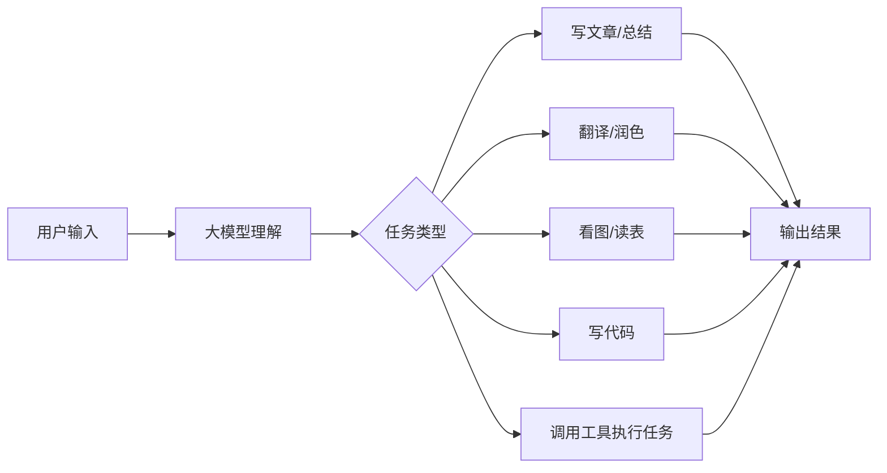
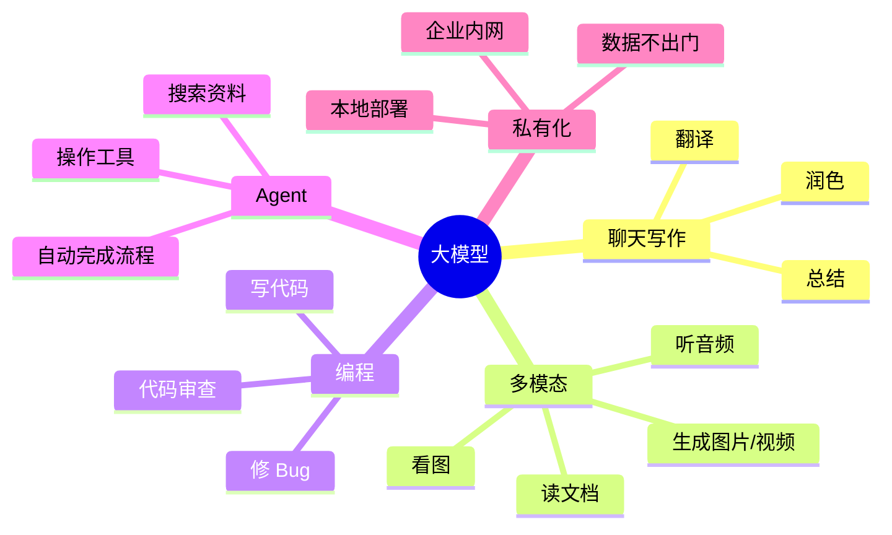
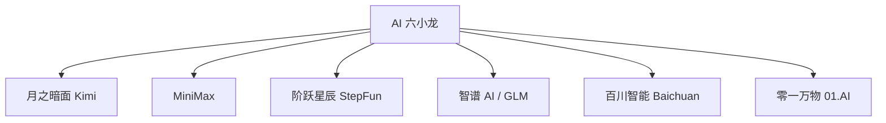
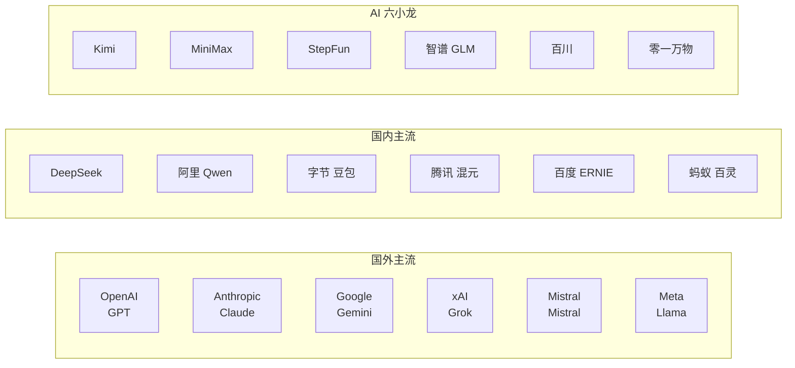
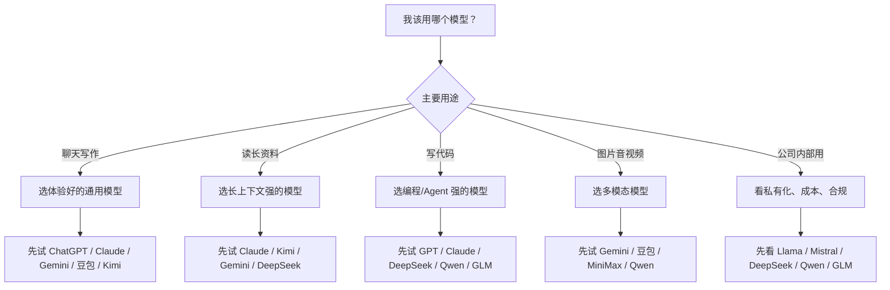
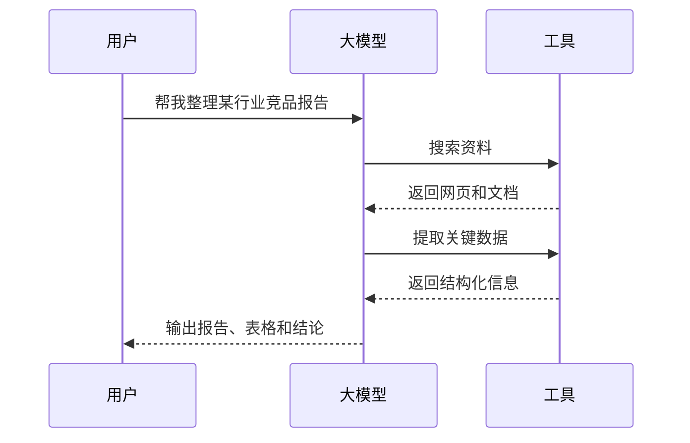

# 一篇看懂国内外主流大模型：GPT、Claude、Gemini、DeepSeek、通义千问到底有什么区别？

> 本文面向普通读者，不要求懂编程，也不要求懂机器学习。  
> 信息更新到 2026 年 4 月 29 日。大模型更新很快，具体型号、价格和开放方式以各家公司官网为准。

## 先说结论

今天的大模型，可以简单理解成“会读、会写、会看图、会写代码、会调用工具的超级输入法”。  

国外主流玩家主要是 OpenAI、Anthropic、Google、xAI、Mistral、Meta；国内主流玩家包括 DeepSeek、通义千问、豆包、腾讯混元、百度文心、蚂蚁百灵，以及被称为“AI 六小龙”的 Kimi、MiniMax、阶跃星辰、智谱、百川智能、零一万物。

选模型不用只盯着“谁最强”。普通人更应该看三件事：**你要做什么、你在哪个产品里用、能不能稳定便宜地用到**。

## 大模型到底是什么？

大模型的英文常见说法是 `Large Language Model`，简称 LLM。名字里有“语言”，但现在的大模型早就不只处理文字了。

你可以把它想成一个“见过很多资料的通用助手”：

- 你给它一段文字，它能总结、改写、翻译。
- 你给它一张图片，它能描述、识别、分析。
- 你给它一个表格，它能帮你找规律。
- 你让它写代码，它能生成、修改、排查问题。
- 你给它工具权限，它可以联网搜索、读文件、操作软件，变成 Agent。

## 为什么会有这么多模型？

因为大模型不是只有一种用法。

就像汽车有家用车、货车、跑车、越野车，大模型也有不同定位：

| 模型类型 | 适合做什么 | 普通人怎么理解 |
|---|---|---|
| 通用聊天模型 | 问答、写作、总结、翻译 | 日常全能助手 |
| 推理模型 | 数学、逻辑、复杂规划 | 更愿意“想一会儿”的助手 |
| 多模态模型 | 图片、音频、视频、文档 | 能看、能听、能读图表 |
| 编程模型 | 写代码、修 Bug、做网页 | 程序员助手 |
| 开源/开放权重模型 | 本地部署、企业私有化 | 可自己装进电脑或服务器的模型 |
| Agent 模型 | 调工具、跑流程、做任务 | 不只回答，还能动手 |

## 国外主流大模型

### 1. OpenAI：GPT 系列

OpenAI 是普通用户最熟悉的大模型公司，ChatGPT 就是它的代表产品。

截至本文更新，OpenAI 已发布 GPT-5.5，并称它在 Agent 编程、电脑操作、知识工作和早期科研任务上提升明显，同时在 ChatGPT 和 Codex 中面向 Plus、Pro、Business、Enterprise 用户推出。

普通人可以这样理解 GPT：

- **优势**：综合能力强，生态成熟，产品体验好。
- **适合**：写作、学习、办公、编程、资料整理、Agent 工作流。
- **特点**：不只是聊天，还在向“能完成复杂任务的 AI 同事”发展。

### 2. Anthropic：Claude 系列

Claude 是 Anthropic 的模型，近几年在写作、长文本理解、代码和 Agent 场景里很受欢迎。

Claude Opus 4.7 是目前较新的高端版本之一，Anthropic 官方强调它适合复杂软件工程、专业知识工作和多步骤 Agent 任务，并提供 1M 上下文窗口。

普通人可以这样理解 Claude：

- **优势**：长文档理解强，文字表达自然，代码能力强。
- **适合**：读长文、写方案、写代码、处理复杂文档。
- **特点**：像一个比较稳、比较细的专业助手。

### 3. Google：Gemini 系列

Gemini 是 Google 的大模型系列。Google 的优势在搜索、安卓、浏览器、云服务和多模态技术。

Google 已发布 Gemini 3.1 Pro，官方定位是处理复杂任务的模型，可通过 Gemini API、Vertex AI、Gemini App 和 NotebookLM 使用。

普通人可以这样理解 Gemini：

- **优势**：多模态、搜索和 Google 生态结合紧密。
- **适合**：资料研究、图片理解、文档分析、和 Google 工具配合使用。
- **特点**：背后有 Google 的搜索、云和办公生态。

### 4. xAI：Grok 系列

Grok 是马斯克旗下 xAI 的模型，和 X 平台关系紧密。

普通人可以这样理解 Grok：

- **优势**：和 X 信息流结合，风格更直接。
- **适合**：热点信息、社交媒体内容、轻松对话。
- **特点**：产品气质更像“网络热点助手”。

### 5. Mistral：欧洲代表

Mistral AI 是欧洲最重要的大模型公司之一，长期强调开放模型和企业级部署。

Mistral 3 包含 Mistral Large 3 和 Ministral 3 系列，官方强调多模态、多语言和开放权重，适合企业和开发者按成本、速度、性能做取舍。

普通人可以这样理解 Mistral：

- **优势**：开放、轻量、企业部署友好。
- **适合**：企业系统、欧洲合规场景、本地化部署。
- **特点**：不是只做一个聊天产品，而是更偏“模型基础设施”。

### 6. Meta：Llama 系列

Meta 的 Llama 系列最大特点是开放权重生态。很多开发者、研究者和公司会基于 Llama 做二次开发。

Llama 4 系列在 2025 年发布了 Scout、Maverick 等模型；到 2026 年，Meta 也在继续推进新的 AI 模型与 Meta AI 产品。

普通人可以这样理解 Llama：

- **优势**：开放生态大，适合改造和私有部署。
- **适合**：开发者、本地模型、企业定制。
- **特点**：它更像“AI 世界的基础零件”，很多应用会把它装进自己的产品里。

## 国内主流大模型

### 1. DeepSeek：深度求索

DeepSeek 是过去两年最受关注的国产大模型之一。它的特点是性价比、开源影响力和推理能力。

DeepSeek 官方已在 2026 年 4 月发布 DeepSeek-V4 Preview，包括 DeepSeek-V4-Pro 和 DeepSeek-V4-Flash，并强调 1M 上下文、Agent 能力和开源权重。

普通人可以这样理解 DeepSeek：

- **优势**：推理能力强，性价比高，开源影响大。
- **适合**：学习、写作、代码、复杂问答、企业低成本接入。
- **特点**：把高能力模型的使用门槛明显拉低。

### 2. 通义千问：阿里 Qwen

通义千问，也叫 Qwen，是阿里云推出的大模型系列。

Qwen 的特点是“模型家族很全”：有通用模型、代码模型、视觉模型、音频模型，也有很多开放权重版本。2026 年 4 月，Qwen 已发布 Qwen3.6-Plus、Qwen3.6-27B 等模型，重点强化真实 Agent、编程和多模态能力。它适合开发者，也适合接入阿里云和企业应用。

普通人可以这样理解 Qwen：

- **优势**：开源生态强，模型类型丰富，中文能力好。
- **适合**：企业应用、开发者、本地部署、多模态任务。
- **特点**：像一个“模型工具箱”，不是单一模型。

### 3. 豆包：字节跳动

豆包是字节跳动的大模型产品，背后有抖音、今日头条、剪映等内容生态。

字节在 2026 年推出 Doubao 2.0 / Seed 2.0 相关能力，重点面向复杂任务、Agent 和多模态内容创作。

普通人可以这样理解豆包：

- **优势**：产品入口多，内容创作能力强，普通用户使用门槛低。
- **适合**：聊天、写文案、做短视频素材、语音和多媒体创作。
- **特点**：更贴近日常 App，而不是只面向开发者。

### 4. 腾讯混元：Hunyuan

腾讯混元是腾讯自研的大模型体系，和腾讯云、腾讯元宝、办公协作、游戏、内容生态都有关系。

混元的一个重点方向是和腾讯已有产品结合，比如 AI 助手、企业服务、代码工具和多媒体生成。

普通人可以这样理解混元：

- **优势**：腾讯生态大，适合和微信、QQ、腾讯云、企业服务结合。
- **适合**：办公、内容、企业服务、智能助手。
- **特点**：不是只比聊天能力，更看重能不能进腾讯的产品体系。

### 5. 百度文心：ERNIE

百度文心大模型是国内较早进入公众视野的大模型之一，和百度搜索、百度智能云、文心一言/文心助手关系紧密。

百度已推进 ERNIE 5.0 相关模型，方向包括全模态、搜索增强、产业应用和智能云服务。

普通人可以这样理解文心：

- **优势**：搜索、知识库、产业场景积累多。
- **适合**：搜索问答、知识管理、企业应用、内容生成。
- **特点**：适合和百度搜索及智能云结合使用。

### 6. 蚂蚁百灵：Ling / Ring / Ming

蚂蚁集团的百灵大模型体系包括 Ling、Ring、Ming 等模型线。它的方向和金融科技、企业服务、智能体、全模态能力关系较密切。

普通人可以这样理解蚂蚁百灵：

- **优势**：金融科技和企业场景资源多。
- **适合**：金融、办公、企业服务、复杂推理。
- **特点**：更偏“严肃业务场景里的 AI 底座”。

## 国内“AI 六小龙”

“AI 六小龙”不是严格官方称号，更多是媒体和投资圈对一批聚焦大模型研发与应用的创业公司的统称。

### 1. 月之暗面 Kimi

Kimi 最早因为“长文本能力”出圈，适合读论文、读报告、总结网页和长文档。后续 Kimi K2.5、K2.6、K2 Thinking 等模型继续强化多模态、推理、编程和 Agent 能力。

一句话理解：**Kimi 像一个擅长读长资料的研究助手。**

### 2. MiniMax

MiniMax 同时做文本、语音、视频、音乐和智能体产品，旗下海螺 AI 被很多内容创作者使用。MiniMax M2.7 等模型则更偏 Agent、编程和生产力任务。

一句话理解：**MiniMax 更像全模态内容与 Agent 公司。**

### 3. 阶跃星辰 StepFun

阶跃星辰的 Step 系列模型强调基础模型、推理效率和 Agent 能力。Step 3.5 Flash 等模型主打高效推理和开源生态。

一句话理解：**StepFun 更偏基础模型和 Agent 引擎。**

### 4. 智谱 AI：GLM

智谱 AI 的 GLM 系列是国内知名开源模型路线之一。GLM-5 系列重点提升编程、推理和智能体能力。

一句话理解：**智谱像国内开源大模型路线的重要代表。**

### 5. 百川智能 Baichuan

百川智能由搜狗前 CEO 王小川创立，早期以通用大模型出圈，后来也在医疗等专业场景上投入。

一句话理解：**百川更强调通用模型到垂直行业的落地。**

### 6. 零一万物 01.AI

零一万物由李开复创立，Yi 系列模型曾在开源社区有较高关注度，也探索面向普通用户和企业的 AI 应用。

一句话理解：**零一万物更重视模型能力和应用产品并行。**

## 一张图看懂中外模型格局

## 普通人应该怎么选？

别问“哪个模型最强”，先问“我拿它干什么”。

| 你的需求 | 优先考虑 |
|---|---|
| 日常聊天、写作、学习 | GPT、Claude、Gemini、豆包、Kimi、通义千问 |
| 读长文档、总结报告 | Claude、Kimi、Gemini、DeepSeek、Qwen |
| 写代码、修代码 | GPT、Claude、DeepSeek、Qwen、GLM、MiniMax |
| 图片、音频、视频创作 | Gemini、豆包、MiniMax、Qwen、文心、混元 |
| 企业私有化部署 | Llama、Mistral、DeepSeek、Qwen、GLM |
| 中文内容和国内产品生态 | DeepSeek、Qwen、豆包、文心、混元、Kimi |
| 低成本 API 调用 | DeepSeek、Qwen、MiniMax、GLM、Mistral |

## 别被这些词吓住

### 参数

参数可以粗略理解成模型内部的“知识和能力容量”。参数越大不一定越好，因为还要看训练数据、训练方法、推理效率和产品体验。

### Token

Token 是模型计费和处理文本的基本单位。可以理解成“文字切成的小块”。你输入越多、输出越多，消耗的 token 越多。

### 上下文窗口

上下文窗口就是模型一次能“记住”和处理多少内容。窗口越大，越适合读长报告、长合同、长代码库。

### 多模态

多模态就是不只处理文字，还能处理图片、音频、视频、表格、PDF 等内容。

### Agent

Agent 是大模型从“只回答问题”走向“能执行任务”的关键。比如你让它“帮我查资料并整理成表格”，它可能会搜索网页、打开文档、提取信息、生成表格。

## 未来趋势：大模型正在从“聊天”走向“干活”

2023 年，大家觉得 AI 会聊天已经很神奇。  
2024 年，大家开始用 AI 写文章、画图、写代码。  
2025 年以后，竞争重点越来越明显：谁能更稳定地完成复杂任务。

未来几年，大模型会有几个趋势：

1. **更像 Agent**：不只是回答，而是能调用工具、执行流程。
2. **更懂多模态**：文字、图片、视频、语音会混在一起处理。
3. **更便宜**：高能力模型会逐渐普及，API 成本继续下降。
4. **更本地化**：越来越多公司会把模型部署到自己的服务器。
5. **更行业化**：医疗、金融、教育、法律、制造业会有专用模型。

## 最后：模型很多，但普通人只要抓住一个原则

大模型不是越新越好，也不是国外一定比国内好，更不是参数越大越好。

普通人选模型，最实用的判断方式是：

> 它能不能稳定解决我的问题？  
> 它是不是在我常用的软件里？  
> 它的价格、速度、隐私和体验能不能接受？

今天的大模型竞争，本质上已经不是“谁会聊天”，而是“谁能进入真实工作和生活，把事情做完”。

## 参考资料

- OpenAI：Introducing GPT-5.5，https://openai.com/index/introducing-gpt-5-5/
- OpenAI：Introducing GPT-5.1 for developers，https://openai.com/index/gpt-5-1-for-developers/
- Anthropic：Claude Opus 4.7，https://www.anthropic.com/claude/opus
- Google：Gemini 3.1 Pro，https://blog.google/innovation-and-ai/models-and-research/gemini-models/gemini-3-1-pro/
- Mistral AI：Introducing Mistral 3，https://mistral.ai/news/mistral-3
- DeepSeek：DeepSeek-V4 Preview，https://api-docs.deepseek.com/news/news260424
- DeepSeek：透明度中心，https://www.deepseek.com/transparency/
- Qwen Research，https://qwen.ai/research/
- Qwen3.6-27B，https://qwen.ai/blog?id=qwen3.6-27b
- 字节 Seed 2.0，https://seed.bytedance.com/en/blog/seed2-0-%25E6%25AD%25A3%25E5%25BC%258F%25E5%258F%2591%25E5%25B8%2583
- 火山引擎：豆包大模型 2.0，https://developer.volcengine.com/articles/7610285824933445675
- 腾讯云：腾讯混元大模型产品概述，https://cloud.tencent.com/document/product/1729/104753
- ERNIE Blog，https://ernie.baidu.com/blog/zh/
- 蚂蚁百灵，https://www.ant-ling.com/zh/
- Ant Ling 模型文档，https://developer.ant-ling.com/en/docs/models/ling
- Kimi API 文档，https://platform.kimi.ai/docs/overview
- MiniMax 模型发布记录，https://platform.minimaxi.com/docs/release-notes/models
- MiniMax M2.7，https://www.minimax.io/news/minimax-m27-en
- StepFun：Step 3.5 Flash，https://static.stepfun.com/blog/step-3.5-flash/
- GLM-5 技术报告，https://arxiv.org/abs/2602.15763
