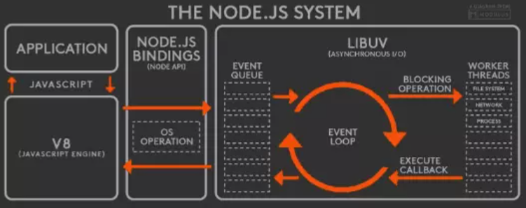
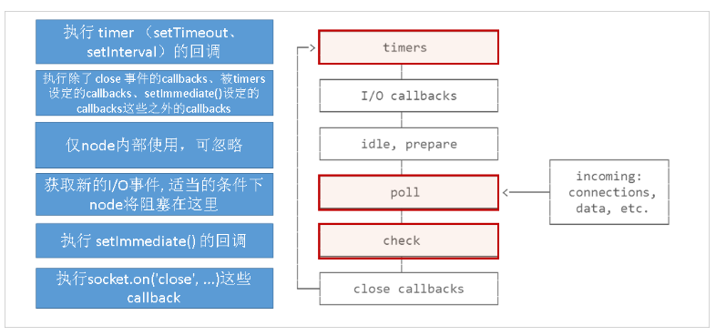
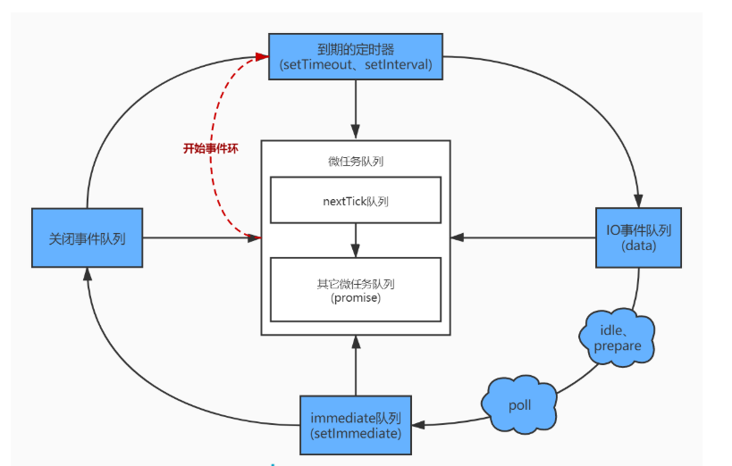

## js是单线程的
众所周知js是单线程的，这是由它的用途而决定的，那么问题来了，如果既有同步代码和异步代码，单线程的js是如何处理的呢？假如说js代码在执行时遇到了一个setTimeout定时器，延时1秒，js线程不可能自己去计时，因为它后面还有很多同步代码等待它去执行，而这时候就要依靠其它的线程了。
## 浏览器是多线程的
准确来讲，我们说js是单线程的，是指浏览器分配给js负责解析执行js脚本的线程是单线程的，而浏览器本身是多线程的，除了js引擎线程，还有GUI渲染线程(与js引擎线程互斥)、事件触发线程、定时器触发线程、异步HTTP请求线程等。
## EventLoop
为了对任务调度进行更为精确的控制，于是将任务拆分成宏任务和微任务两类。


其执行顺序为：
1. 执行主执行栈
2. 清空微任务队列
3. 执行requestAnimationFrame回调、事件处理以及刷新页面
4. 取出一个宏任务放入主执行栈中执行，然后按此步骤如此循环

## 宏任务
页面的大部分任务是在主任务上执行的，比如下面这些都是宏任务：
* 渲染事件(DOM解析、布局、绘制)
* 用户交互(鼠标点击、页面缩放)
* JavaScript脚本执行
* 网络请求
* 文件读写
#### 宏任务的特点：
* 宏任务会添加到消息到消息队列的尾部，当主线程执行到该消息的时候就会执行
* 每次从事件队列中获取一个事件回调并且放到执行栈中的就是一个宏任务，宏任务执行过程中不会执行其它内容
* 每次宏任务执行完毕后会进行GUI渲染线程的渲染，然后再执行下一个宏任务
* 宏任务: script（整体代码）, setTimeout, setInterval, setImmediate, I/O, UI rendering
* 宏任务颗粒度较大，不适合需要精确控制的任务
* 宏任务是由宿主方控制的
```html
<script>
    document.body.style = 'background:red';
    document.body.style = 'background:yellow';
    document.body.style = 'background:blue';
</script>
// 页面渲染一次
```
上述script整体为一个宏任务，每次宏任务执行完毕后才会进行GUI渲染线程的渲染，所以最终只会渲染一次，body的背景颜色为蓝色
```html
<script>
    document.body.style = 'background:red';
    setTimeout(function(){
        document.body.style = 'background:yellow'
    },0)
</script>
// 页面渲染两次
```
script标签和setTimeout都是宏任务，script标签执行后会进行一次渲染，body背景呈红色，而后执行setTimeout,又会渲染一次，body背景呈现黄色，虽然执行代码的速度很快，但还是明显能看到颜色闪烁的效果。
## 微任务
* 宏任务结束后会进行渲染然后执行下一个宏任务
* 微任务是当前宏任务执行后立即执行的宏任务
* 当宏任务执行完，就到达了检查点,会先将执行期间所产生的所有微任务都执行完再去进行渲染
* 微任务是由V8引擎控制的，在创建全局执行上下文的时候，也会在V8引擎内部创建一个微任务队列
* 微任务: process.nextTick（Nodejs）, Promises, Object.observe, MutationObserver
#### promise
* 微任务队列会一次性清空
```js
function loop() {
     Promise.resolve().then(loop);
}
loop();
// 不会报调用栈溢出的错误
```
* 微任务会先于渲染执行
```js
document.body.style = 'background:red';
console.log(1);
Promise.resolve().then(() => {
  console.log(2);
  document.body.style = 'background:yellow'
});
console.log(3);
// 结果：打印 1 3 2
// 页面只渲染一次，看不到闪烁效果
```
* 宏任务结束之后会先执行微任务
```js
setTimeout(() => { 
    console.log(1); 
    Promise.resolve(3).then(data => console.log(data))
}, 0)
setTimeout(() => { console.log(2) }, 0)
// 结果：打印 1 3 2
```
```js
// 比较二者执行栈的区别
button.addEventListener('click', () => {
    Promise.resolve().then(() => console.log('Micro task 1'));
    console.log('Listener 1');
});
button.addEventListener('click', () => {
    Promise.resolve().then(() => console.log('Micro task 2'));
    console.log('Listener 2');
});
//button.click();
// 结果：
// 点击按钮打印：Listener 1 Micro task 1 Listener 2 Micro task 2
// 主动调用button.click() 打印：Listener 1 Listener 2 Micro task 1 Micro task 2
```
## EventLoop实现
* JS 分为同步任务和异步任务
* 同步任务都在JS引擎线程上执行，形成一个执行栈
* 事件触发线程管理一个任务队列，异步任务触发条件达成，将回调事件放到任务队列中
执行栈中所有同步任务执行完毕，此时JS引擎线程空闲，系统会读取任务队列，将可运行的异步任务回调事件添加到执行栈中，开始执行
* setTimeout/setInterval JS引擎线程=>定时触发器线程=>事件触发线程=>事件队列
* Ajax JS引擎线程=>异步http请求线程=>事件触发线程=>事件队列
#### 第一版 单线执行
```js
let ret1 = 1 + 1;
let ret2 = 2 + 2;
let ret3 = 3 + 3;
let ret4 = 4 + 4;
console.log(ret1, ret2, ret3, ret4);
// 结果：打印 2 4 6 8
```
#### 第二版 事件循环
`cnpm i readline-sync -S`
```js
const readLine = require('readline-sync')
while(true) {
    let num1 = readLine.question('input num1:')
    let num2 = readLine.question('input num2:')
    const ret = eval(num1 + '+' + num2)
    console.log(ret)
}
```
这是一个无线循环的过程，用户输出num1和num2的值后会算出它们相加之和，其运行结果如下：


#### 第三版 setTimeout
#### setTimeout第一版
**main.js**
```js
const {fork} = require('child_process')
let tasks = []
function showName() {
    console.log('zhangsan')
}
function setTimeout(callback, timeout) {
    const child = fork('./setTimeout.js')
    child.on('message', function(message) {
        if (message.ready) {
            tasks.push(callback)
        }
    })
    child.send({type: 'timer', timeout})
}
setTimeout(showName, 100)
setInterval(() => {
    const task = tasks.shift()
    task && task()
}, 0)
```
**setTimeout.js**
```js
process.on('message', function(message) {
    const {type, timeout} = message
    if (type === 'timer') {
        let end = Date.now() + parseFloat(timeout)
        setInterval(() => {
            if (Date.now() >= end) {
                process.send({ready: true})
                process.exit()
            }
        }, 0)

    }
})
// 运行main.js结果： 100ms之后打印: zhangsan
```
#### setTimeout第二版
```js
let tasks = []
let delayTasks = []
function showName() {
    console.log('zhangsan')
}
function setTimeout(callback, timeout) {
    delayTasks.push({callback,timeout, start: Date.now()})
}
setTimeout(showName, 100)
setTimeout(showName, 200)
setTimeout(showName, 300)
setTimeout(showName, 3000)
setInterval(() => {
    let task = tasks.shift()
    task && task()
    delayTasks = delayTasks.filter(item => {
        if (item.start + item.timeout <= Date.now()) {
            tasks.push(item.callback.bind(item))
            return false
        }
        return true
    })
}, 0)
// 打印结果： 先后打印四次zhangsan 
```
#### 第四版 XMLHttpRequest
* XMLHttpRequest是由浏览器的其他进程或发起请求，然后再将执行结果利用 IPC(Inter-Process Communication)
进程间通信的方式通知渲染进程，之后渲染进程再将对应的消息添加到消息队列中

**main.js**
```js
const {fork} = require('child_process')
let tasks = []
class XMLHttpRequest {
    constructor() {
        this.options = {}
    }
    open(method, url) {
        this.options.method = method
        this.options.url = url
    }
    send() {
        const child = fork('./XMLHttpRequest.js')
        child.on('message', (message) => {
            if (message.type === 'response') {
                this.response = message.data
                tasks.push(this.onload)
            }
        })
        child.send({type: 'send', options: this.options})
    }
}
function getData() {
    const xhr = new XMLHttpRequest()
    xhr.open('GET', 'http://localhost:3000/data')
    xhr.onload = function () {
        console.log(xhr.response)
    }
    xhr.send()
}
getData()
setInterval(() => {
    const task = tasks.shift()
    task && task()
}, 0)

```
**XMLHttpRequest.js**
```js
const url = require('url')
const http = require('http')
process.on('message', message => {
    if (message.type === 'send') {
        let {options} = message
        const urlObj = url.parse(options.url)
        const config = {
            hostname: urlObj.hostname,
            port: urlObj.port,
            path: urlObj.path,
            method: options.method
        }
        const req = http.request(config, res => {
            const chunks = []
            res.on('data', function (data) {
                chunks.push(data)
            })
            res.on('end', () => {
                process.send({
                    type: 'response',
                    data: JSON.parse(chunks.toString())
                })
                process.exit()
            })
        })
        req.on('error', err => {
            console.log('error')
        })
        req.end()
    }
})
```
**server.js**
```js
const http = require('http')
const server = http.createServer()
server.on('request', function(req, res) {
    res.end(JSON.stringify({message:'hello'}))
})
server.listen(3000, () => {
    console.log('listen in 3000')
})
// 结果：打印{ message: 'hello' }
```
#### 第五版 Promise
**main.js**
```js
const { fork } = require('child_process');
let tasks = []; // 宏任务队列
let microTasks = [] // 微任务队列
class XMLHttpRequest {
    constructor() {
        this.options = {};
    }
    open(method, url) {
        this.options.method = method;
        this.options.url = url;
    }
    send() {
        let child = fork('./XMLHttpRequest.js');
        child.on('message', (message) => {
            if (message.type === 'response') {
                this.response = message.data;
                tasks.push(this.onload);
            }
        });
        child.send({ type: 'send', options: this.options });
    }
}


function getData() {
    let xhr = new XMLHttpRequest();
    xhr.open('GET', 'http://localhost:3000/data');
    xhr.onload = function () {
        console.log(xhr.response);
    }
    xhr.send();
}
getData();
class Promise {
    constructor(executor) {
        executor(this.resolve)
    }
    then(onResolve) {
        this._onResolve = onResolve
    }
    resolve = (value) => {
        microTasks.push(() => this._onResolve(value))
    }
}
new Promise(function(resolve) {
    resolve('promise1')
}).then(res => console.log(res))
new Promise(function(resolve) {
    resolve('promise2')
}).then(res => console.log(res))
console.log('同步任务')
setInterval(() => {
    let task = tasks.shift()
    task && task()
    microTasks.forEach( task => task())
    microTasks = []
}, 0)
// 打印结果:
// 同步任务
// promise1
// promise2
//{ message: 'hello' }
```
## Node中的EventLoop
* Node.js采用V8作为js的解析引擎，而I/O处理方面使用了自己设计的libuv
* libuv是一个基于事件驱动的跨平台抽象层，封装了不同操作系统一些底层特性，对外提供统一的API
* 事件循环机制也是它里面的实现
    * V8引擎解析JavaScript脚本并调用Node API
    * libuv库负责Node API的执行。它将不同的任务分配给不同的线程,形成一个Event Loop（事件循环），以异步的方式将任务的执行结果返回给V8引擎
    * V8引擎再将结果返回给用户



### libuv
* 同步执行全局的脚本
* 执行所有的微任务，先执行nextTick中的所有的任务，再执行其它微任务
* 开始执行宏任务，共有6个阶段，从第1个阶段开始，会执行每一个阶段所有的宏任务





### setImmediate
* setTimeout/setInterval取值范围是[1,2的32次方-1],超出范围初始化为1，所以 setTimeout(fn,0) = setTimeout(fn,1)
```js
setTimeout(function  () {
  console.log('setTimeout');
},0);
setImmediate(function  () {
  console.log('setImmediate');
});
// 打印顺序先后不一定，关键看第一次进入事件环时setTimeout有没有到期
```
```js
const fs = require('fs')
const path = require('path')
fs.readFile(path.resolve(__dirname, '1.txt'), () => {
    setTimeout(() => {
        console.log('setTimeout')
    })
    setImmediate(() => {
        console.log('setImmediate')
    })
})
// 打印顺序固定,先打印setImmediate，后打印setTimeout,因为执行完到IO后，会先检查setImmediate队列
```
### process.nextTick
* nextTick独立于Event Loop,有自己的队列，每个阶段完成后如果存在nextTick队列会全部清空，优先级高于微任务
```js
setTimeout(() => {
    console.log('setTimeout1')
    Promise.resolve().then(function () {
        console.log('promise1')
    })
}, 0)
setTimeout(() => {
    console.log('setTimeout2')
    Promise.resolve().then(function () {
        console.log('promise2')
    })
}, 0)
setImmediate(() => {
    console.log('setImmediate1')
    Promise.resolve().then(function () {
        console.log('promise3')
    })
}, 0)

process.nextTick(() => {
    console.log('nextTick1');
    Promise.resolve().then(() => console.log('promise4'));
    process.nextTick(() => {
        console.log('nextTick2');
        Promise.resolve().then(() => console.log('promise5'));
        process.nextTick(() => {
            console.log('nextTick3')
            process.nextTick(() => {
                console.log('nextTick4')
            })
        })
    })
})
// 输出结果
// nextTick1 nextTick2 nextTick3 nextTick4
// promise4 promise5 setTimeout1  promise1 setTimeout2 promise2  setImmediate1 promise3 

```
## Node.js事件环
```js
const fs = require('fs');
const path = require('path')
setTimeout(() => {
    console.log('1');
    let rs1 = fs.createReadStream(path.resolve(__dirname, '1.txt'));
    rs1.on('close', (data) => console.log('end_a'));
    rs1.on('data', () => {
        rs1.destroy();
        setImmediate(() => console.log('setImmediate_a'));
        setTimeout(() => {
            console.log('setTimeout_a')
        });
        console.log('a');
    });
    console.log('2');
    setImmediate(function () {
        console.log('setImmediate1');
        process.nextTick(() => console.log('nextTick1'));
    });
    setImmediate(function () {
        console.log('setImmediate2');
        process.nextTick(() => console.log('nextTick2'));
    });
    console.log('3');
    setTimeout(() => {
        console.log('setTimeout1');
        process.nextTick(() => {
            console.log('nextTick3')
            process.nextTick(() => console.log('nextTick4'));
        });
    });
    setTimeout(() => {
        console.log('setTimeout2');
    });
    console.log('4');
}, 1000);
// 输出结果
// 1
// 2
// 3
// 4
// setImmediate1
// nextTick1
// setImmediate2
// nextTick2
// setTimeout1
// nextTick3
// nextTick4
// setTimeout2
// a
// setImmediate_a
// setTimeout_a
// end_a
```
<!-- 好了，关于EventLoop就先分享到这里，如有错误欢迎各位指出。 -->