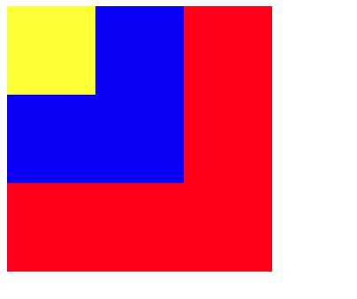

## 1、实现垂直居中的方式有哪些？
- **line-height**：文本可以使用 `line-height` 等于容器高度。
- **Flex 布局：**（`display: flex; align-items: center;`）。
- **absolute + transform 或者 absolute + 负margin**：`position: absolute; top: 50%; transform: translateY(-50%);`或者 `position: absolute; top: 50%; margin-top: -50px;（容器高度为 100px）`。
- **absolute + margin: auto**：`position: absolute; inset: 0; margin: auto`。
- **Grid 布局**：`display: grid; place-items: center;`。
- **table 布局**：`display: table-cell;vertical-align: middle;`。

## 2、选择器权重和样式优先级是怎样的？
**CSS 各选择器权重（从高到低）：**
| 选择器名称 | 选择器格式 | 权重 |
|---------|---------|---------|
| id选择器   | #id   | 100   |
| 类选择器   | .classname   | 10   |
| 属性选择器   |  [attr=value]  | 10   |
| 伪类选择器   |  li:first-child  | 10   |
| 标签选择器   |  a  | 1   |
| 伪元素选择器   |  div::after  | 1   |
| 相邻兄弟选择器   |  div+div  | 0   |
| 子选择器   |  div > a  | 0   |
| 后代选择器   |  div  a  | 0   |
| 通配符选择器   |  *  | 0   |

- 可以在样式后面使用 `!important` ，比如 `display: none !important`，此时该样式的权重最高，权重值为 `Infinity`，但需要慎用。
- `style内联样式`的权重为`1000`。
- 权重相同，后出现的覆盖前面。

## 3、CSS 隐藏元素的方法有哪些？
1. `display:none`: 元素不会渲染，不占据空间，也不响应绑定的事件。
2. `opacity: 0`: 将元素的透明度设置为0，进而让元素从视觉上消失，但元素仍然会占据空间，并且**会响应绑定的事件**。
3. `visibility: hidden`: 这种方式隐藏会让元素依旧占据空间，但**不会响应事件**。
4. `position: absolute;left: -9999px;top: -9999px;`: 利用绝对定位将元素移到屏幕外。
5. `z-index: -9999`: 降低元素层级，让当前元素被其它元素覆盖，间接达到元素隐藏的目的。
6. `overflow: hidden`: 超出该元素范围内的元素将会隐藏显示。
7. `clip-path: inset(100%)(向内裁剪100%)`或者`clip-path: circle(0)(半径为0的圆形)`: 使用元素裁剪来实现元素隐藏。
8. `transform: scale(0,0)`: 利用 css3 的元素缩放能力，将元素缩放为0来实现元素的隐藏。

## 4、Link 和 @import 的区别
| 特性 | link标签 | @import |
|---------|---------|---------|
| 所属标准  | XHTML/HTML标准   | CSS标准   |
| 引用内容类型  | 可用于引入 CSS、RSS、图标等多种资源	   | 仅支持css样式   |
| 加载时机  | 页面加载时同步加载	   | 等待整个页面加载完成后再加载   |
| JavaScript 控制  | 支持通过 DOM 操作修改样式链接	   | 不支持动态控制   |
| 兼容性  | 无兼容问题	   | CSS2.1 才有的语法，在 IE5+ 才能识别  |
| 性能  | 更快，有利于首屏渲染   | 	相对较慢，可能造成样式延迟加载  |

## 5、transition 和 animation 的区别

- 过渡（`transition`）：其核心是**状态变化**，如 `transition: all 0.5s ease;`，给所有属性加上一个 0.5s 的平滑过渡。
- 动画（`animation`）：其核心是**对动画过程进行多帧关键帧控制**，如 `@keyframes name { 0% { ... } 100% { ... } }`，然后 `animation: name 1s infinite;`。动画相比过渡而言更加复杂，支持循环和暂停。

## 6、聊一聊盒模型

CSS 盒模型描述了元素在页面上的空间占用，包括内容（content）、内边距（padding）、边框（border）和外边距（margin）。

- **标准盒模型（W3C 标准，默认盒模型）**：width 和 height 仅包含内容的宽度和高度，元素的总宽度 = width + 左右 padding + 左右 border + 左右 margin。
```css
.box {
  box-sizing: content-box;
}
```

- **IE 盒模型（border-box），也叫怪异盒模型**：元素的宽度 = width（width 里面包括内边距 padding 和边框 border） + 左右 margin。

```css
.box {
  box-sizing: border-box;
}
```


## 7、聊一聊 CSS 预处理器

CSS 预处理器是一种工具或语言扩展，它可以让开发者以更加高级的语法来编写 CSS，比如**可以定义变量、支持 CSS 嵌套写法、定义函数、使用循环**等，在开发时可以提高我们的开发效率和项目的可维护性。但由于我们运行的平台，比如浏览器不支持这些高级语法，所以在代码的运行的时候，需要利用对应的工具编译成标准的 CSS。

CSS 常见的预处理器包括 `Sass`、`Less` 、`Stylus`、`PostCSS` 等。

## 8、什么是 CSS Sprites?
**CSS Sprites** 技术就是我们常说的**雪碧图**，通过将多张小图标拼接成一张大图，然后通过 CSS 的 `background-image` 和 `background-position` 属性来显示图像的特定部分，能有效的**减少HTTP请求数量**以达到加速显示内容的技术。

## 9、什么是BFC？它有什么作用？
`BFC(block formatting context）`：简单来说，BFC 就是一种属性，这种属性会影响着元素的定位以及与其兄弟元素之间的相互作用。

**形成 BFC 的条件:**
1. 浮动元素，`float` 除 `none` 以外的值；
2. 绝对定位元素，`position（absolute，fixed）`；
3. `display` 为以下其中之一的值：`inline-blocks，table-cells，table-captions`；
4. `overflow` 除了 `visible` 以外的值（`hidden，auto，scroll`）。

**BFC常见作用:**
1. 包含浮动元素。
2. 不被浮动元素覆盖。
3. BFC 会阻止外边距折叠，可解决 **margin 塌陷**问题。

## 10、Flex 布局是什么？常用属性有哪些？

Flex（弹性盒布局）用于一维布局（如行或列），父容器设置 `display: flex;`。

**其常用属性如下：**
- 容器：flex-direction（方向）、justify-content（主轴对齐）、align-items（交叉轴对齐）、flex-wrap（换行）。
- 子项：flex-grow（增长比例）、flex-shrink（收缩比例）、flex-basis（基础大小）。适合响应式设计。

## 11、flex:1 是哪些属性组成的？
flex 实际上是 `flex-grow`、`flex-shrink` 和 `flex-basis` 三个属性的缩写。
- `flex-grow`：定义项目的的放大比例；
- `flex-shrink`：定义项目的缩小比例；
- `flex-basis`： 定义在分配多余空间之前，项目占据的主轴空间（main size），浏览器根据此属性计算主轴是否有多余空间。

## 12、flex-basis 和 width 的区别有哪些？
**定义和作用：**
- `flex-basis`: 是 `CSS Flexbox` 布局中的专有属性，在其它地方使用不生效。
-  `width` 是一个通用的 CSS 属性。它适用于任何元素（块级、行内块等），不受布局模式限制。

**优先级：** 

如果`flex-basis`的值为 `auto`（其默认值就是 auto，未显示设置采用的就是默认值），则 `flex item` 的初始大小会 `fallback` 到 `width`，也就是采用 `width` 设置的值作为初始大小，而如果 `flex-basis` 一旦设置了值，比如同时设置 `width: 100px;` 和 `flex-basis: 200px;`, `flex item` 的初始大小会采用 `flex-basis` 设置的 `200px`。

**计算规则**：
 - `flex-basis`: `flex item` 的最终大小 = `flex-basis + (剩余空间 * flex-grow) - (不足空间 * flex-shrink)`。
 - `width`，如果父级宽度足够，最终 `flex-item` 的最终大小 = `width`，如果空间不足，会进行宽度压缩， `flex-item` 的最终大小 < `width`，除非设置 `flex-shark: 0`，宽度就不会被压缩，最终宽度还是为 `width`的大小。


## 13、rem、em、px有什么区别？
- **px（像素）：**绝对单位，相对于屏幕分辨率大小固定。
- **rem（root em）：** 是 `CSS3` 引入的相对长度单位，相对于 **HTML 根元素**的字体大小计算。可实现响应式布局。
- **em**：是相对长度单位。相对于当前对象内**文本的字体尺寸**。

> 这个很多人有个误解，`em` 在设置自身字体大小的时候是相对于父元素的字体大小; 在用 `em`设置其他属性单位的时候, 比如`width`，是相对于自身的字体属性大小, 只是很多时候自身字体属性是继承自父元素.


## 14、如何清除浮动？

**浮动会导致父元素高度塌陷。清除方法如下：**
- 父元素添加 `overflow: hidden;`（触发 BFC）。
- 使用伪元素：`.clearfix::after { content: ''; display: block; clear: both; }`。
- 父元素设置 `float` 或 `display: table;`。

现代布局更推荐使用 `Flex/Grid` 避免浮动。

## 15、CSS 性能优化的常见技巧？

- **CSS 加载性能优化：**
  - 提取`公共 CSS` 文件。
  - 避免使用 `@import`。
  - 压缩 CSS 文件。
  - 利用浏览器缓存。
  - 使用 `CDN` 加速。
  - 使用 `CSS Sprite`。
  - CSS 样式抽离和去除`无用 CSS`。
  - 合理使用`内嵌 CSS`。
  
- **CSS 选择器性能优化：**
  - 避免使用通配符选择器。
  - 使用子选择器代替后代选择器。
  - 优先使用类（`Class`）和 `ID` 选择器。
  - 避免深层嵌套的选择器。
- **CSS 属性性能优化：**
  - 避免使用过于复杂的属性。
  - 避免使用不必要的属性。
  - 避免使用 `!important`。

- **CSS 动画性能优化：**
  - 使用 `transform` 和 `opacity` 属性来进行动画。
  - 避免使用过于复杂的动画效果。
  - 在动画中使用 `will-change` 属性。
  - 使用 `requestAnimationFrame()` 函数来优化动画。
- **CSS 渲染性能优化：**
  - 使用 `class` 合并 `DOM` 的修改。
  - 让 `DOM` 元素脱离文档流。


## 16、最后来一道考察 CSS 的 z-index 的面试真题

**请按层级从高到低的顺序列出元素：**
```html
<body>
  <div id="dom-1" style="position: fixed; z-index: 100;">
    <div id="dom-2" style="position: absolute; z-index: 2000;"></div>
  </div>
  <div id="dom-3" style="position: relative; z-index: 1000;"></div>
</body>
```

这里主要考察 `z-index` 的两条层级计算规则：
- 当父元素创建了一个层叠上下文 `position: relative/absolute/fixed` 时，此时父子元素的层级与 `z-index` 无关，就算 `dom-2` 的 `z-index` 为 `99`，其层级也比父级高。
- **子元素的 z-index 受父元素限制。即使子元素 z-index 很高，如果父元素 z-index 低，整个子树都会在低层。**


所以层级顺序从高到低依次是 `dom-3` > `dom-2` > `dom-1`。

我们加一点样式就能很明显看出层级关系，代码如下：

```html
<!-- z-index.html -->
<style>
  #dom-1 {
    width: 300px;
    height: 300px;
    background-color: red;
  }
  #dom-2 {
    width: 200px;
    height: 200px;
    background-color: blue;
  }
  #dom-3 {
    width: 100px;
    height: 100px;
    background-color: yellow;
  }
</style>
<body>
  <div id="dom-1" style="position: fixed; z-index: 100">
    <div id="dom-2" style="position: absolute; z-index: 2000"></div>
  </div>
  <div id="dom-3" style="position: relative; z-index: 1000"></div>
</body>
```
**其渲染结果如下：**



## 小结
以上是整理的一部分 CSS 的相关面试题，如有错误或者可以优化的地方欢迎评论区指正，后续还会更新 CSS 一些常见布局实现的面试题。

