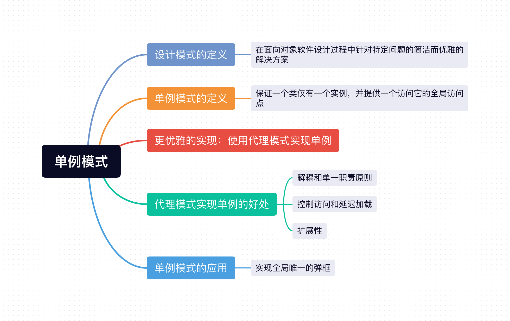

先提出一个问题，为什么要学习`设计模式`？

难道是提出一个`代码形容词`，是为了让代码看起`高大上 or 装逼`？

先看下设计模式的定义：`在面向对象软件设计过程中针对特定问题的简洁而优雅的解决方案`。

我的个人理解就是，设计模式是前人对于解决问题提炼出来的一种思想，其实我们日常代码中就会用到一些设计模式。

像我们平时用的装饰器可以看作是**装饰者模式**，ES6 提供的 `proxy` 也可以看作是**代理模式**，像 JavaScript 中的自定义事件 + `addEventListener` 就采用的是**发布订阅模式**。


设计模式是为了让你的代码变得`简单而优雅`。有很高的`可重用性`、`可维护性`以及`可扩展性`。

设计模式有很多种，我们今天先来盘一下最常用和经典的设计模式之一：`单例模式`。



## 1、单例模式定义
单例模式的定义：**保证一个类仅有一个实例，并提供一个访问它的全局访问点**。

其实就是，第一次访问会进行初始化，创建一个实例，后面访问的时候拿到的都是这个实例，不会再`重新创建`。
```js
class Singleton {
  constructor(name) {
    this.name = name;
  }
  getName() {
    return this.name;
  }
  static getInstance(name) {
    return this.instance || (this.instance = new Singleton(name))
  }
}

const instance1 = Singleton.getInstance('zs')
const instance2 = Singleton.getInstance('lisi')
console.log(instance1 === instance2) // true
```
在单例类`Singleton`上定义一个获取实例的`getInstance`方法，第一次调用`getInstance`的时候创建一个`Singleton`实例保存在`instance`属性上，后面再获取就直接取`this.instance`。

但是这样会出现一个问题，用户如果不调用`getInstance`，而直接去`new Singleton`，这样还是会`创建多个实例`出来，这样不是我们所期望的。

## 2、优化版

我们定义一个`Singleton`类，并用一个`instance`变量来保证在`new 多次`时，全局`Singleton`类实例的唯一性。
```js
let instance = null;
class Singleton {
  constructor(name) {
    this.name = name;
    if (!instance) {
      instance = this;
    }
    return instance;
  }
}

const instance1 = new Singleton('zs')
const instance2 = new Singleton('lisi')
console.log(instance1 === instance2) // true
```
## 3、更优雅的实现：使用代理模式实现单例
其实我们可以用ES6的`proxy`来实现单例，其代码如下：
```js
class Person {
    constructor(name, age) {
        this.name = name;
        this.age = age;
    }
}
function singleton(className) {
    let instance = null;
    return new Proxy(className, {
      construct(target, args) {
        if (!instance) {
          instance = Reflect.construct(target, args);
        }
        return instance;
      }
    })
  }
const ProxyPerson = singleton(Person);
const person1 = new ProxyPerson();
const person2 = new ProxyPerson();
console.log(person1 === person2); // true
```
## 4、代理模式实现单例的好处
1. **解耦和单一职责原则**：我们使用了代理之后，等于在我们使用的客户端和实际对象两者中间，加入了一层`代理对象`，而代理对象相当于一个黑盒子，而对我我们客户端来说，使用的时候不关心他里面的逻辑和实现细节，只关心它给我们提供了哪些功能和接口，调用就完事了， 这样遵循了`单一职责原则`，提高了代码的可维护性。
2. **控制访问和延迟加载**：其实也可以说就是安全性，在代理层做校验可以说是再好不过了，可以先把一些错误情况给拦截掉，起到`访问控制`的效果，然后也可以根据情况，决定时候`延迟创建实例`，也就是我们说的`惰性单例`，这样对于`CPU密集型`的实例来说，同时也能大大`提高性能`。
3. **扩展性**：我们可以在`代理层`通过`继承或实现相同的接口`来扩展实际对象的功能，这样就可以做到不修改实际对象的源码，又增加上了扩展功能。

## 5、单例模式的应用
假如我们要创建一个`全局唯一的弹框`，我们很容易先写在创建弹框的代码:
```js
const div = document.createElement('div')
div.innerHTML = '我是全局唯一的弹框'
div.style.display = 'none'
document.body.appendChild(div)
```

创建弹框我们有两种思路，我们可以在`一开始渲染页面`的时候就创建这个弹框，然后通过控制`display`进行显示隐藏，当然也可以惰性的懒加载，`第一次用到的时候再去创建弹框`，为了性能考虑，我们当然是选择后者。
```html
<html>
    <body>
        <button id="btn">显示弹框</button>
    </body>
    <script>
    const getSingle = (fn) => {
        let instance = null
        return (...args) => {
            return instance || (instance = fn.apply(this, args))
        }
    }
    const createModel = () => {
        const div = document.createElement('div')
        div.innerHTML = '我是全局唯一的弹框'
        div.style.display = 'none'
        document.body.appendChild(div)
        return div;
    }
    const createSingleModel = getSingle(createModel);
    btn.addEventListener('click', () => {
        const model = createSingleModel();
        model.style.display = 'block';
    })
    </script>
</html>
```

我们先把创建弹框的逻辑抽离到`createModel`方法中，然后我们创建一个`管理单例`的方法`getSingle`，先调用`getSingle`，将`createModel`交给`getSingle`去管理，这样就实现了`唯一性`，然后在按钮点击的时候，在调用`getSingle`返回的方法就行啦。

## 小结
上面介绍`Javascript`最经典的设计模式之一`单例模式`，简单来说，`单例`就是`单实例`，就是全局只能被创建一次，我们还用了`代理对象`来实现单例，用以增加其`维护性`和`扩展性`。