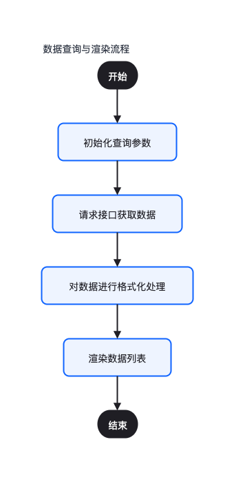
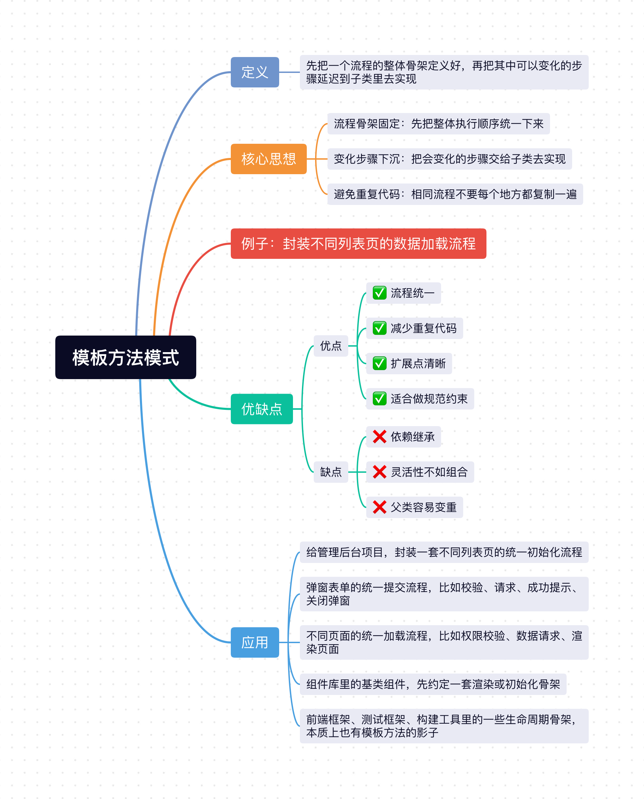

提到模板，我们很容易联想到平时开发使用过的模板：
1. HTML 模板，比如 `<h1><%= title %></h1>`。
2. JSX 模板（React 的模板方案），比如 `<h1>{title}</h1>`，
3. Vue 模板（.vue 文件），比如 `<h1>{{title}}</h1>`。

其核心思路就是把页面中静态的部分（静态 HTML）和动态的部分（数据 data）进行分离，在运行时动态注入动态的部分。

**这种前端模板是一种声明式地描述“界面应该长什么样”的语法或文件，属于视图层解决方案，而模板方法模式则是针对业务流程，是一种抽象的代码架构。**


比如在平时开发项目中，我们经常会遇到这样一种场景：
- 都是列表页，但请求接口不一样。
- 都是弹窗提交流程，但校验规则不一样。
- 都是页面初始化，但每个页面拿数据、处理数据、渲染数据的细节不一样。

这些场景有一个很明显的共同点：**整体流程很像，但其中某几个步骤不一样。**

比如一个后台列表页，通常都会经历这样几个步骤，如下图：



订单列表、用户列表、商品列表，整体套路几乎一样，只是请求地址、字段格式、渲染细节不一样。

这种场景，就很适合用 `模板方法模式`。

## 1、模板方法模式定义

模板方法模式的核心思想就是：**先把一个流程的整体骨架定义好，再把其中可以变化的步骤延迟到子类里去实现。**

用通俗的解释来说就是：
- 整体流程先定好。
- 哪些步骤必须做，也先定好。
- 哪些步骤允许不一样，再交给子类自己实现。

它的重点不在“某一个步骤怎么写”，而在“**先把流程骨架稳定下来**”。

## 2、核心思想
1. **流程骨架固定**：先把整体执行顺序统一下来。
2. **变化步骤下沉**：把会变化的步骤交给子类去实现。
3. **避免重复代码**：相同流程不要每个地方都复制一遍。

## 3、例子：封装不同列表页的数据加载流程

在前端项目里，后台管理系统经常会有各种列表页，比如：
- 用户列表页。
- 订单列表页。
- 商品列表页。

这些页面虽然业务内容不同，但它们的处理流程其实很像，分为这四步：
1. 先初始化查询参数。
2. 再请求接口拿数据。
3. 然后把后端数据转成页面需要的格式。
4. 最后渲染到页面上。

### 3.1 不用模板方法模式（每个页面都自己写一遍）

如果不用模板方法模式的话，一般会这么写：

```js
class UserListPage {
  async init() {
    const params = {
      pageNum: 1,
      pageSize: 10
    };

    const res = await fetchUserList(params);
    const list = res.data.list.map(item => ({
      id: item.id,
      name: item.nickname,
      statusText: item.status === 1 ? '启用' : '停用'
    }));

    this.render(list);
  }

  render(list) {
    console.log('渲染用户列表：', list);
  }
}

class OrderListPage {
  async init() {
    const params = {
      pageNum: 1,
      pageSize: 20
    };

    const res = await fetchOrderList(params);
    const list = res.data.records.map(item => ({
      id: item.orderId,
      amount: `￥${item.amount}`,
      statusText: item.status === 1 ? '已支付' : '待支付'
    }));

    this.render(list);
  }

  render(list) {
    console.log('渲染订单列表：', list);
  }
}
```

这种写法虽然能实现功能，但存在以下问题：
1. **流程重复**：初始化参数、请求数据、格式化数据、渲染，这一整套流程每个页面都在重复写。
2. **不好维护**：如果后面所有列表页都要在初始化前加 `loading`、在请求后统一做错误处理，那很多地方都得改。
3. **流程不统一**：有的人先格式化再渲染，有的人直接渲染原始数据，时间久了项目代码风格会越来越乱。

### 3.2 使用模板方法模式

更合理一点的做法是，把这套“列表页加载流程”先抽成一个父类骨架，然后把变化的步骤交给子类去实现。

```js
class BaseListPage {
  async init() {
    // 1. 初始化查询参数
    const params = this.getParams();

    // 2. 请求数据
    const res = await this.fetchData(params);

    // 3. 格式化数据
    const list = this.formatData(res);

    // 4. 渲染页面
    this.render(list);
  }

  getParams() {
    return {
      pageNum: 1,
      pageSize: 10
    };
  }

  fetchData() {
    throw new Error('fetchData 方法必须由子类实现');
  }

  formatData() {
    throw new Error('formatData 方法必须由子类实现');
  }

  render(list) {
    console.log('渲染列表：', list);
  }
}
```

然后不同页面只需要补自己那一部分差异逻辑：

```js
class UserListPage extends BaseListPage {
  fetchData(params) {
    return fetchUserList(params);
  }

  formatData(res) {
    return res.data.list.map(item => ({
      id: item.id,
      name: item.nickname,
      statusText: item.status === 1 ? '启用' : '停用'
    }));
  }

  render(list) {
    console.log('渲染用户列表：', list);
  }
}

class OrderListPage extends BaseListPage {
  getParams() {
    return {
      pageNum: 1,
      pageSize: 20
    };
  }

  fetchData(params) {
    return fetchOrderList(params);
  }

  formatData(res) {
    return res.data.records.map(item => ({
      id: item.orderId,
      amount: `￥${item.amount}`,
      statusText: item.status === 1 ? '已支付' : '待支付'
    }));
  }

  render(list) {
    console.log('渲染订单列表：', list);
  }
}
```

使用的时候就很统一了：

```js
const userPage = new UserListPage();
userPage.init();

const orderPage = new OrderListPage();
orderPage.init();
```

这样改造之后，代码的职责就清楚很多了：
- `BaseListPage` 负责定义流程骨架，它 `init` 方法封装了子类的算法框架，指导子类以何种顺序去执行哪些方法。
- `UserListPage`、`OrderListPage` 只负责实现自己的差异步骤。
- 外部只需要调用统一的 `init()` 即可。

这就是模板方法模式最核心的价值：**父类定流程，子类补细节。**

### 3.3 模板方法模式里最关键的是“先定顺序”

模板方法模式最关键的点，不是“抽一个父类”这么简单，而是：**先把执行顺序固定下来。**

比如在刚才这个例子里，流程顺序就是：
1. 先拿参数。
2. 再请求数据。
3. 再格式化数据。
4. 最后渲染。

这个顺序是父类统一规定好的。

子类可以改“怎么请求”“怎么格式化”“怎么渲染”，但一般不应该随便改整个执行顺序。

因为一旦执行顺序也到处不一样，那这个“流程骨架”就不存在了。

所以模板方法模式真正厉害的地方在于：**它不是只做代码复用，而是在做流程约束。**

## 4、钩子方法是什么？

很多时候，一个流程里并不是每个步骤都必须让子类强制实现。

有些步骤，我们只是希望子类“有需要就重写，没需要就用默认实现”，这种步骤通常就叫做`钩子方法`。

比如我们可以在列表页初始化前后，预留两个 hook：

```js
class BaseListPage {
  async init() {
    this.beforeInit();

    const params = this.getParams();
    const res = await this.fetchData(params);
    const list = this.formatData(res);

    this.render(list);
    this.afterInit();
  }

  beforeInit() {}

  afterInit() {}

  getParams() {
    return {
      pageNum: 1,
      pageSize: 10
    };
  }

  fetchData() {
    throw new Error('fetchData 方法必须由子类实现');
  }

  formatData() {
    throw new Error('formatData 方法必须由子类实现');
  }

  render(list) {
    console.log('渲染列表：', list);
  }
}
```

这样子类如果有特殊需求，就可以选择性重写：

```js
class UserListPage extends BaseListPage {
  beforeInit() {
    console.log('显示 loading');
  }

  afterInit() {
    console.log('隐藏 loading');
  }
}
```

这里的 `beforeInit`、`afterInit` 就很典型，它们不是必须实现的步骤，但父类提前把“扩展点”给你留好了。

所以钩子方法你可以简单理解为：

**流程还是父类控着，但父类会留一些可插拔的口子给子类扩展。**

## 5、模板方法模式的优缺点
### 5.1 优点：
- ✅ **流程统一**：可以把一类业务的执行顺序先规范下来。
- ✅ **减少重复代码**：公共流程只写一遍即可。
- ✅ **扩展点清晰**：哪些步骤可变、哪些步骤固定，会更明确。
- ✅ **适合做规范约束**：很适合沉淀成一套统一的页面基类、业务基类。

### 5.2 缺点：
- ❌ **依赖继承**：一旦父类设计得不好，子类会比较被动。
- ❌ **灵活性不如组合**：流程顺序通常由父类固定，子类不能随便改。
- ❌ **父类容易变重**：如果父类塞了太多通用逻辑，后面也会越来越臃肿。

## 6、模板方法模式的应用

模板方法模式在前端和日常业务开发里其实非常常见，比如：

1. 给管理后台项目，封装一套不同列表页的统一初始化流程。
2. 弹窗表单的统一提交流程，比如校验、请求、成功提示、关闭弹窗。
3. 不同页面的统一加载流程，比如权限校验、数据请求、渲染页面。
4. 组件库里的基类组件，先约定一套渲染或初始化骨架。
5. 前端框架、测试框架、构建工具里的一些生命周期骨架，本质上也有模板方法的影子。比如 `vue2` 组件的 `created`、`mounted` 等生命周期，`react 17` 版本之前组件的 `componentWillMount`、 `componentDidMount` 等生命周期。

## 小结
上面介绍了`Javascript`中非常经典的`模板方法模式`，它的核心思想就是：**先把流程骨架定义好，再把其中可变化的步骤交给子类去实现。**

对于前端开发来说，模板方法模式非常实用，像列表页初始化、表单提交流程、页面加载流程这些场景里，都能看到它的影子。它本质上就是帮我们把“固定流程”和“变化步骤”拆开，这样代码会更统一，也更容易维护。



- [JavaScript设计模式（一）：单例模式实现与应用](https://mp.weixin.qq.com/s/L9y4ZrBDb59EZvA8n_vkjQ)
- [JavaScript设计模式（二）：策略模式实现与应用](https://mp.weixin.qq.com/s/kd_CnuU6sn3n3jltPEETBw)
- [JavaScript设计模式（三）：代理模式实现与应用](https://mp.weixin.qq.com/s/lnLSMSgk_JECkVlqQ0PKtg)
- [JavaScript设计模式（四）：发布-订阅模式实现与应用](https://mp.weixin.qq.com/s/EaNMMrNMlkE8d_ADRWSs4g)
- [JavaScript设计模式（五）：装饰者模式实现与应用](https://mp.weixin.qq.com/s/YhuVTbvAdkgdmiuIb4TWQg)
- [JavaScript设计模式（六）：职责链模式实现与应用](https://mp.weixin.qq.com/s/fdWglSpROz2P4S687iVxfw)
- [JavaScript设计模式（七）：迭代器模式实现与应用](https://mp.weixin.qq.com/s/RawGBNaHbghv1bVdG3ZNFw)
- [JavaScript设计模式（八）：命令模式实现与应用](https://mp.weixin.qq.com/s/ybow3trfDnCEwSE6mhQ_6A)
- [JavaScript设计模式（九）：工厂模式实现与应用](https://mp.weixin.qq.com/s/hekTBpgmROu80Q6QjdvZzQ)