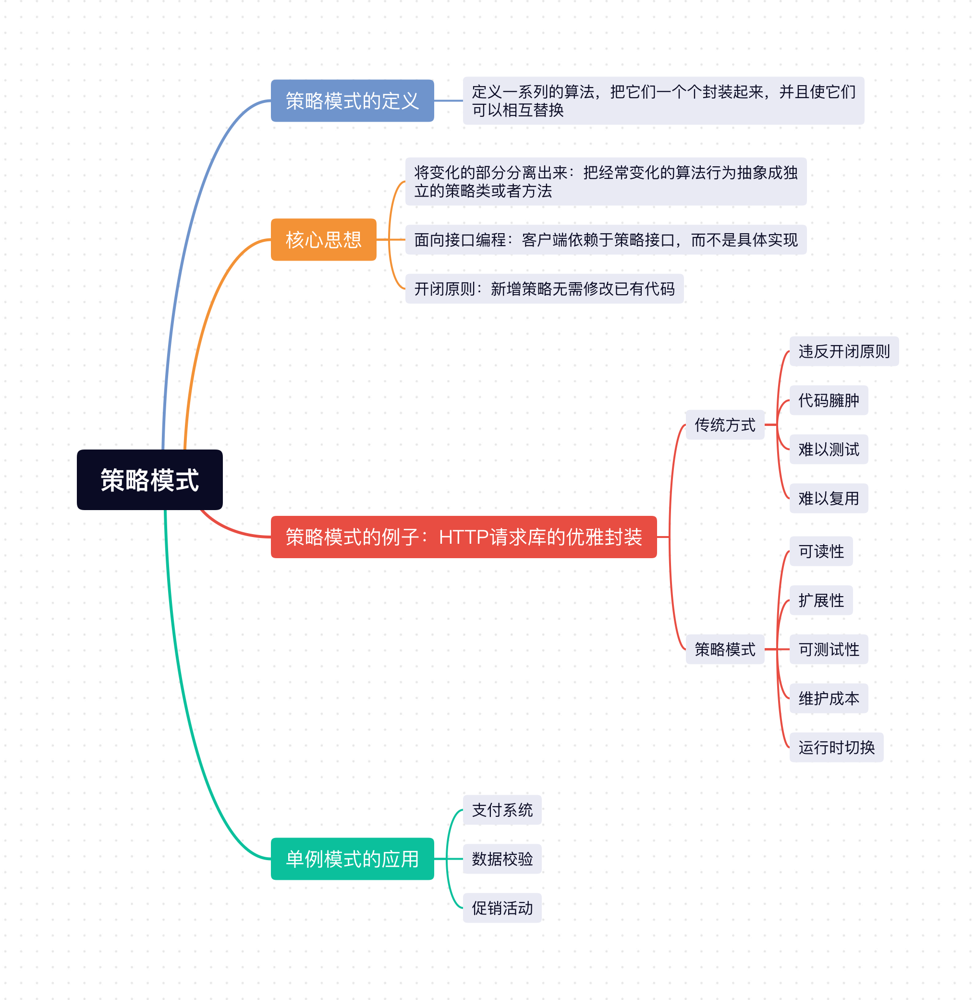

## 1、策略模式定义
策略模式的定义是：**定义一系列的算法，把它们一个个封装起来，并且使它们可以相互替换。**

## 2、核心思想
1. **将变化的部分分离出来**：把经常变化的算法行为抽象成独立的策略类或者方法。
2. **面向接口编程**：客户端依赖于策略接口，而不是具体实现。
3. **开闭原则**：新增策略无需修改已有代码。


## 3、例子：HTTP请求库的优雅封装

在实际项目开发中，有时候可能需要支持多种 HTTP 请求方式：
- 原生 `XMLHttpRequest`（兼容旧项目）。
- `fetch API`（现代浏览器）。
- `axios`（第三方库）。

如果不用设计模式，写出来的代码会变得难以维护。

### 3.1 不用策略模式（传统方式）

```js
// ❌ 传统方式：充满条件判断，修改困难，容易出错
function request() {
    if (this.type === 'xhr') {
        // XHR 逻辑
    } else if (this.type === 'fetch') {
        // fetch 逻辑
    } else if (this.type === 'axios') {
        //  axios 逻辑
    }
}
```

这段代码有以下问题：
1. **违反开闭原则**。新增请求方式需要修改 `request` 方法，增加新的 `else if`。
2. **代码臃肿**。所有实现都堆在一个方法里，几百行代码难以阅读。
3. **难以测试**。无法单独测试某种请求方式的实现。
4. **难以复用**。每种请求方式的配置、拦截器等无法独立扩展。

### 3.2 重构版：使用策略模式
```js
// ✅ 策略对象
const strategies = {
    xhr: ({ url, method = 'GET', data, headers = {} }) => {
        return new Promise((resolve, reject) => {
            const xhr = new XMLHttpRequest();
            xhr.open(method, url);
            Object.keys(headers).forEach(k => xhr.setRequestHeader(k, headers[k]));
            xhr.onload = () => resolve({ data: JSON.parse(xhr.responseText), status: xhr.status });
            xhr.onerror = () => reject(new Error('Network error'));
            xhr.send(method !== 'GET' ? JSON.stringify(data) : null);
        });
    },
    
    fetch: async ({ url, method = 'GET', data, headers = {} }) => {
        const res = await fetch(url, {
            method,
            headers: { 'Content-Type': 'application/json', ...headers },
            body: method !== 'GET' ? JSON.stringify(data) : undefined
        });
        return { data: await res.json(), status: res.status };
    },
    
    axios: async ({ url, method = 'GET', data, headers = {}, params }) => {
        const res = await axios({ url, method, data, params, headers });
        return { data: res.data, status: res.status };
    }
};

// 策略管理器
class RequestService {
    constructor(strategy = 'fetch') {
        this.setStrategy(strategy);
    }
    
    setStrategy(type) {
        if (!strategies[type]) {
            throw new Error(`Unknown strategy: ${type}`);
        }
        this.requestFn = strategies[type];
    }
    
    async request(config) {
        return this.requestFn(config);
    }
    
    // 便捷方法
    get(url, config = {}) {
        return this.request({ ...config, url, method: 'GET' });
    }
    
    post(url, data, config = {}) {
        return this.request({ ...config, url, method: 'POST', data });
    }
}

// 使用
const service = new RequestService('fetch');
const users = await service.get('https://api.example.com/users');

service.setStrategy('xhr');
const post = await service.post('https://api.example.com/posts', { title: 'Hello' });
```

**改造前后代码对比：**
| 维度 | 重构前 | 重构后 |
|------|--------|--------|
| **可读性** | 所有逻辑挤在一起 | 每种策略独立，易于阅读 |
| **扩展性** | 新增策略需修改核心方法 | 新增策略只需添加对象属性 |
| **可测试性** | 难以单独测试某一种策略 | 可独立测试每个策略函数 |
| **维护成本** | 修改一种策略可能影响其他 | 修改策略互不影响 |
| **运行时切换** | 需要重新判断 | 直接切换策略引用 |

## 4、策略模式的优缺点
### 4.1 优点：
- ✅ 开闭原则：新增策略无需修改上下文和其他策略。
- ✅ 消除条件判断：避免大量的 if-else 或 switch-case。
- ✅ 提高复用性：策略类可被不同上下文复用。
- ✅ 符合单一职责：每个策略类只负责一种算法。

### 4.2 缺点：
- ❌ 类/策略对象数量膨胀：每个策略都需要一个类或者策略对象，会占用更多内存（可通过享元模式优化）。
- ❌ 客户端需了解策略：客户端必须知道有哪些 strategy 可选，这样才能选择一个合适的 strategy。

## 5、策略模式的应用

策略模式常见有以下的应用场景：
1. 支付系统：需要多种支付策略，包括支付宝、微信、银联等支付方式。
2. 数据校验：根据数据用途制定校验策略，比如手机号、邮箱、身份证等。
3. 促销活动：不同促销活动有不同优惠策略，包括满减、打折、赠品等。
4. ...等等。


## 小结
上面介绍了`Javascript`最经典的设计模式之一`策略模式`，策略模式就是定义一系列的算法策略 strategy，把它们封装起来，然后根据场景分别调用，不同策略是平级关系，可以相互替换，修改新增策略不会影响其它策略。



## 往期回顾
- [JavaScript设计模式（一）：单例模式实现与应用](https://mp.weixin.qq.com/s/L9y4ZrBDb59EZvA8n_vkjQ)