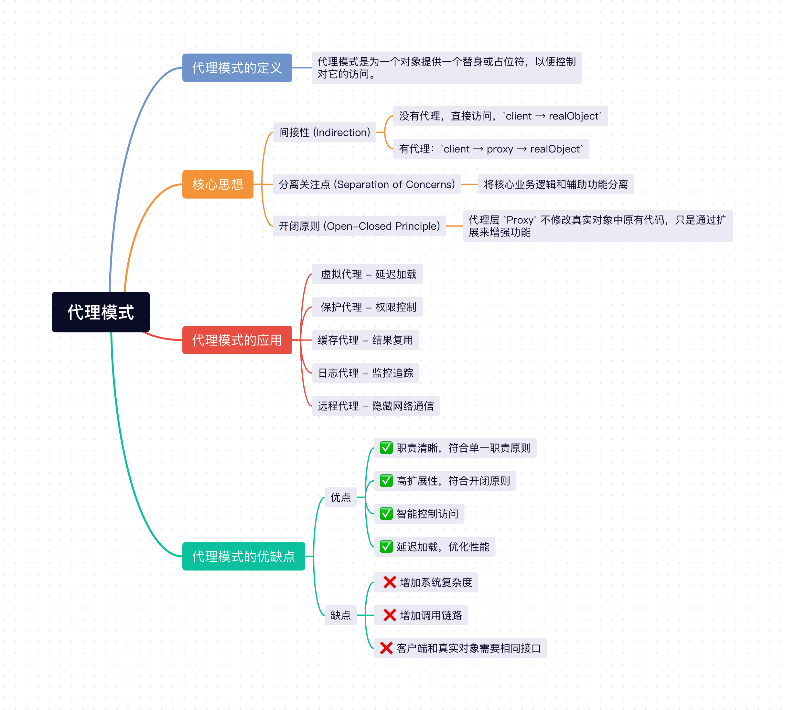

## 1、代理模式定义
**代理模式是为一个对象提供一个替身或占位符，以便控制对它的访问**。

典型的一个例子就是代购，你想买国外的限量版商品，但自己没有渠道或无法出国，所以找代购帮你去买。

## 2、核心思想
1. **间接性 (Indirection)**
    - 没有代理：直接访问，`client → realObject`。
    - 有代理：`client → proxy → realObject`。`proxy` 层可以做很多事情。
2. **分离关注点 (Separation of Concerns)：**将核心业务逻辑和辅助功能分离。核心业务逻辑还是在真实对象中，代理层 `Proxy` 可以添加一些辅助功能，如收集日志、添加缓存等。
3. **开闭原则 (Open-Closed Principle)：**代理层 `Proxy` 不修改真实对象中原有代码，只是通过扩展来增强功能。

代理模式就是**在访问者和目标对象之间建立一个中间层**，这个中间层可以：
- ✅ 控制访问时机（延迟加载）。
- ✅ 控制访问权限（权限校验）。
- ✅ 控制访问方式（缓存、日志）。
- ✅ 隐藏复杂性（远程调用） 。
- ✅ 增强功能而不修改目标对象 。

拿一个形象点的例子来说就是，想找明星的人必须先通过经纪人，而经纪人可以：
- 过滤掉不合适的邀约（权限控制）。
- 安排日程（延迟访问）。
- 谈价格（添加功能）。
- 处理合同（隐藏复杂性）。

## 3、代理模式的应用

### 3.1 虚拟代理 - 延迟加载

当操作代价比较昂贵时，我们可以将实际操作延迟到真正需要它的时候，这叫做**虚拟代理**，这样能降低执行开销。

```js
// 推迟昂贵操作，直到真正需要
class VirtualProxy {
    constructor(factory) {
        this.factory = factory;
        this.instance = null;
    }
    
    getInstance() {
        if (!this.instance) {
            this.instance = this.factory.create(); // 延迟创建
        }
        return this.instance;
    }
}
```

### 3.2 保护代理 - 权限控制

代理在中间可以过滤掉一些操作，这个叫做**保护代理**。我们可以根据用户角色，进行操作限制。

```js
// 根据访问者权限决定是否允许操作
class ProtectionProxy {
    constructor(realObject, allowedUsers) {
        this.realObject = realObject;
        this.allowedUsers = allowedUsers;
    }
    
    operation(user) {
        if (!this.allowedUsers.includes(user)) {
            throw new Error("Access denied");
        }
        return this.realObject.operation();
    }
}
```

### 3.3 缓存代理 - 结果复用

代理在中间也可以充当缓存作用，这就是**缓存代理**，可以缓存计算结果、接口请求结果等，大幅提高性能。

```js
// 缓存重复计算的结果
class CacheProxy {
    constructor(realObject) {
        this.realObject = realObject;
        this.cache = new Map();
    }
    
    operation(key) {
        if (this.cache.has(key)) {
            return this.cache.get(key); // 直接返回缓存
        }
        const result = this.realObject.operation(key);
        this.cache.set(key, result);
        return result;
    }
}
```

### 3.4 日志代理 - 监控追踪

通过代理，我们可以在具体的操作前后收集相关操作信息，比如操作时间、操作耗时、环境信息、用户标识等，并打印日志或者上报到日志服务器，这就是**日志代理**。

```js
// 思想：在不修改业务代码的情况下添加监控
class LoggingProxy {
    constructor(realObject) {
        this.realObject = realObject;
    }
    
    operation(...args) {
        console.log(`[${new Date().toISOString()}] 调用 operation`, args);
        const start = performance.now();
        
        const result = this.realObject.operation(...args);
        
        const duration = performance.now() - start;
        console.log(`[${new Date().toISOString()}] 完成，耗时 ${duration}ms`);
        
        return result;
    }
}
```

### 3.5 远程代理 - 隐藏网络通信

针对一些远程服务，代理可以屏蔽和远程通信细节，让用户像本地对象一样使用远程服务，这叫做**远程代理**。

```js
// 让远程服务像本地对象一样使用
class RemoteProxy {
    constructor(remoteUrl) {
        this.remoteUrl = remoteUrl;
    }
    
    async operation(data) {
        // 隐藏网络通信细节
        const response = await fetch(this.remoteUrl, {
            method: 'POST',
            body: JSON.stringify(data)
        });
        return response.json();
    }
}

// 客户端使用起来像本地对象
const proxy = new RemoteProxy('https://api.example.com');
const result = await proxy.operation({ cmd: 'query' });
```

## 4、代理模式的优缺点
### 4.1 优点：
- ✅ **职责清晰，符合单一职责原则：**代理模式将核心业务逻辑与辅助功能分离，代理层实现辅助功能，核心业务逻辑由真实对象来完成，职责分明。
- ✅ **高扩展性，符合开闭原则：**在不修改原有代码的情况下，通过代理层增加新功能。
- ✅ **智能控制访问：**可以在访问真实对象前后添加各种控制逻辑，比如利用保护代理增加权限控制。
- ✅ **延迟加载，优化性能：**可以在真正需要时才创建昂贵的对象，也就是之前说的虚拟代理。

### 4.2 缺点：
- ❌ **增加系统复杂度：**因为多加了一层代理层，复杂度自然就上去了，包括实现、维护、调试的复杂度，比如利用缓存代理增加了缓存层，在数据库更新数据的时候，需要主动让缓存失效，这无疑增加了复杂度。
- ❌ **增加调用链路：**代理增加了方法的调用层级，可能会降低性能。
- ❌ **客户端和真实对象需要相同接口。**比如真实对象有多个方法，缓存层也必须全部实现，即使它只代理了一个方法。

```js
// 真实对象有多个方法
class ComplexService {
    methodA() { }
    methodB() { }
    methodC() { }
    methodD() { }
}

// 代理必须实现所有方法，即使只需要代理部分方法
class ProxyService {
    constructor(service) {
        this.service = service;
    }
    
    methodA() {  // 即使不需要代理，也要实现
        return this.service.methodA();
    }
    
    methodB() {  // 即使不需要代理，也要实现
        return this.service.methodB();
    }
    
    methodC() {
        // 只关心 methodC 的缓存
        if (!this.cache) {
            this.cache = this.service.methodC();
        }
        return this.cache;
    }
    
    methodD() {  // 即使不需要代理，也要实现
        return this.service.methodD();
    }
}
```

## 小结
上面介绍了`Javascript`最经典的设计模式之一`代理模式`，代理模式就是为一个对象提供一个替身或占位符，以便控制对它的访问，它增加了一层代理层，我们可以很方便做权限控制、延迟加载、监控追踪等很多事情，同时代理模式也会增加系统复杂度、增加调用链路，实际项目中可根据需要使用。



## 往期回顾
- [JavaScript设计模式（一）：单例模式实现与应用](https://mp.weixin.qq.com/s/L9y4ZrBDb59EZvA8n_vkjQ)
- [JavaScript设计模式（二）：策略模式实现与应用](https://mp.weixin.qq.com/s/kd_CnuU6sn3n3jltPEETBw)