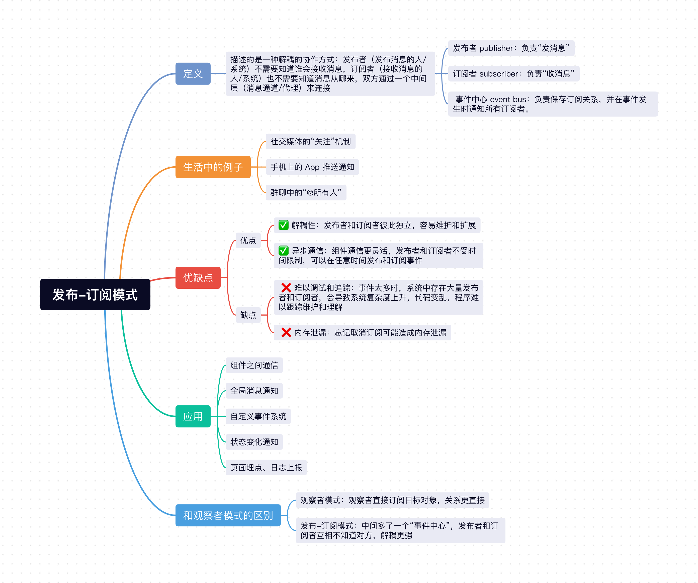

## 1、定义

发布-订阅模式描述的是一种**解耦**的协作方式：**发布者**（发布消息的人/系统）不需要知道谁会接收消息，**订阅者**（接收消息的人/系统）也不需要知道消息从哪来，双方通过一个**中间层**（消息通道/代理）来连接。


它里面包含三个角色：
- `发布者 publisher`：负责“发消息”。
- `订阅者 subscriber`：负责“收消息”。
- `事件中心 event bus`：负责保存订阅关系，并在事件发生时通知所有订阅者。

其核心思路就是：**发布者发消息，订阅者收消息，中间通过一个事件中心进行统一管理**。

## 2、生活中的例子

发布-订阅模式在生活中也有广泛的应用，比如社交媒体的“关注”机制，手机上的 App 推送通知，群聊中的“@所有人”等。

你关注了几个公众号，只要它们发文章，你就会收到消息：
- 公众号相当于发布者。
- 你相当于订阅者。
- 微信平台相当于中间的消息中心。


## 3、发布-订阅模式实现
它的核心功能如下：
- `subscribe`：订阅事件。
- `publish`：发布事件。
- `unsubscribe`：取消订阅。
- `events`: 事件中心对象，用来保存不同事件对应的回调函数。

**具体实现代码如下**：
```js
class EventBus {
  constructor() {
    this.events = {};
  }

  // 订阅事件
  subscribe(eventName, handler) {
    if (!this.events[eventName]) {
      this.events[eventName] = [];
    }

    this.events[eventName].push(handler);
  }

  // 发布事件
  publish(eventName, data) {
    const handlers = this.events[eventName];

    if (!handlers || handlers.length === 0) {
      return;
    }

    handlers.forEach(handler => {
      handler(data);
    });
  }

  // 取消订阅
  unsubscribe(eventName, handler) {
    const handlers = this.events[eventName];

    if (!handlers) {
      return;
    }

    this.events[eventName] = handlers.filter(item => item !== handler);
  }
}
```

**使用代码如下**：

```js
const bus = new EventBus();

function handleLogin(data) {
  console.log('更新用户信息：', data);
}

function handleCart(data) {
  console.log('同步购物车数据：', data);
}

// 订阅 login 事件
bus.subscribe('login', handleLogin);
bus.subscribe('login', handleCart);

// 发布 login 事件
bus.publish('login', { username: 'xiaoming' });

/**
 * 输出结果：
 * 
 * 更新用户信息： { username: 'xiaoming' }
 * 同步购物车数据： { username: 'xiaoming' }
 */
```

也就是说，当 `login` 事件被发布后，所有订阅了这个事件的函数都会收到通知并执行，如果某个模块不想在监听这个事件了，可以通过 `unsubscribe` 取消订阅。

```js
bus.unsubscribe('login', handleCart); // 取消订阅 login 事件的 handleCart 回调
bus.publish('login', { username: 'xiaoming' });

/**
 * 输出结果：
 * 
 * 更新用户信息： { username: 'xiaoming' }
 */
```

为了更加实用，我们可以在 `subscribe` 方法的返回值中直接返回一个“取消订阅函数”，这样用起来会更方便。

```js
class EventBus {
  // ...
  // 订阅事件
  subscribe(eventName, handler) {
    if (!this.events[eventName]) {
      this.events[eventName] = [];
    }

    this.events[eventName].push(handler);
    // 增加返回回调
    return () => {
      this.unsubscribe(eventName, handler);
    };
  }
  // ...
}
```

使用方式：
```js
const bus = new EventBus();

const cancel = bus.subscribe('message', data => {
  console.log('收到消息：', data);
});

bus.publish('message', 'Hello');
cancel();
bus.publish('message', 'World');

/**
 * 输出结果：
 * 
 * 第一次输出：收到消息： Hello
 * 第二次不会输出，因为订阅已经被取消了。
 */
```

**当你“注册”了某种副作用，最好顺手拿到一个“撤销它”的能力**。这种思想在不同框架和库里非常常见，比如 `React` 里的 `cleanup`，`Vue3` 中的 `stop`。

```js
// react
useEffect(() => {
  const handler = () => {
    console.log('resize');
  };

  window.addEventListener('resize', handler);

  return () => {
    window.removeEventListener('resize', handler);
  };
}, []);

```

```js
// vue3
const stop = watch(source, (newValue) => {
  console.log(newValue);
});

stop(); // 取消 watch 监听
```

## 4、发布-订阅模式的优缺点
### 4.1 优点：
- ✅ **解耦性**：发布者和订阅者彼此独立，容易维护和扩展。
- ✅ **异步通信**：组件通信更灵活，发布者和订阅者不受时间限制，可以在任意时间发布和订阅事件。


### 4.2 缺点：
- ❌ **难以调试和追踪**：事件太多时，系统中存在大量发布者和订阅者，会导致系统复杂度上升，代码变乱，程序难以跟踪维护和理解。
- ❌ **内存泄漏**：忘记取消订阅可能造成内存泄漏。

## 5、发布-订阅模式的应用

发布-订阅模式在下列场景有广泛的应用：
- 组件之间通信。
- 全局消息通知。
- 自定义事件系统。
- 状态变化通知。
- 页面埋点、日志上报。


## 6、和观察者模式的区别

发布-订阅模式和观察者模式很容易混淆。
- 观察者模式：观察者直接订阅目标对象，关系更直接。
- 发布-订阅模式：中间多了一个“事件中心”，发布者和订阅者互相不知道对方。

所以发布-订阅模式的解耦更强。

## 小结
上面介绍了`Javascript`最经典的设计模式之一`发布-订阅模式`，发布-订阅描述的是一种`解耦`的协作方式，`发布者`发送消息，`订阅者`接收消息，`中间层（事件中心）`负责保存订阅关系，并在事件发生时通知所有订阅者。

它让发布者和订阅者之间解藕，可以很方便的实现异步通信，但如果过度使用，也会让系统难以调试和追踪，忘记取消订阅可能造成内存泄漏，在实际项目中可根据需要使用。



## 往期回顾
- [JavaScript设计模式（一）：单例模式实现与应用](https://mp.weixin.qq.com/s/L9y4ZrBDb59EZvA8n_vkjQ)
- [JavaScript设计模式（二）：策略模式实现与应用](https://mp.weixin.qq.com/s/kd_CnuU6sn3n3jltPEETBw)
- [JavaScript设计模式（三）：代理模式实现与应用](https://mp.weixin.qq.com/s/lnLSMSgk_JECkVlqQ0PKtg)