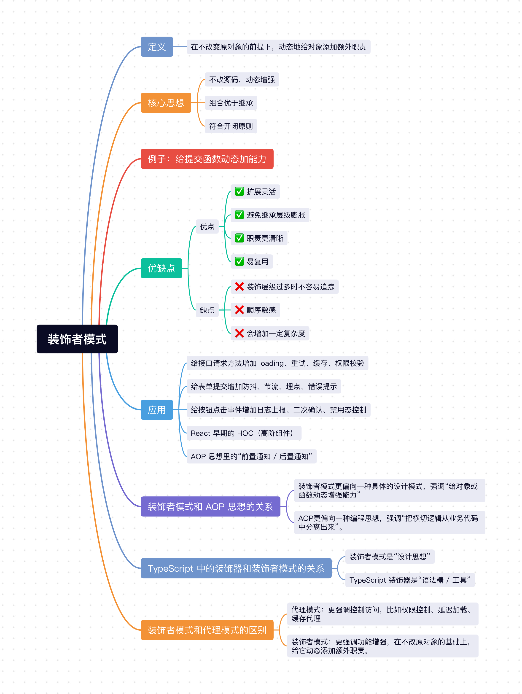

在前端开发中，我们经常会遇到这样一种需求：**不改原有逻辑，但要给它额外加点能力**。

比如一个提交订单的方法，原本只负责发请求，后来又要加上 `loading`、`权限校验`、`埋点`、`错误提示`，如果这些逻辑全都堆进原函数里，代码很快就会变得臃肿。

这个时候，`装饰者模式`就非常适合出场了。

## 1、装饰者模式定义
装饰者模式的定义是：**在不改变原对象的前提下，动态地给对象添加额外职责**。

它的核心不在于“重写原来的逻辑”，而在于“包一层，在外面增强它”。

简单来说就是：
- 原对象负责核心功能。
- 装饰者负责附加功能。
- 附加功能可以按需组合、叠加。

## 2、核心思想
1. **不改源码，动态增强**：原来的对象或函数不需要修改，只需要在外面包一层，就能扩展功能。
2. **组合优于继承**：相比通过继承不断扩展子类，装饰者模式更灵活，也更符合实际业务变化。
3. **符合开闭原则**：对扩展开放，对修改关闭。新增功能时尽量不去改老代码。

## 3、例子：给提交函数动态加能力

在实际项目里，一个“提交订单”的函数，最开始可能非常纯粹，只负责请求接口：

```js
async function submitOrder(orderInfo) {
  return request('/api/order', {
    method: 'POST',
    body: orderInfo
  });
}
```

### 3.1 不用装饰者模式（逻辑全堆在一起）

后来需求来了：
- 提交前需要做权限校验。
- 提交时要显示 `loading`。
- 提交成功和失败都要埋点上报。

如果我们不做拆分，代码很容易写成这样：

```js
async function submitOrder(orderInfo) {
  if (!hasPermission('order:submit')) {
    throw new Error('无权限提交订单');
  }

  showLoading();
  report('submit_order_start');

  try {
    const result = await request('/api/order', {
      method: 'POST',
      body: orderInfo
    });

    report('submit_order_success', result);
    return result;
  } catch (error) {
    report('submit_order_fail', error.message);
    throw error;
  } finally {
    hideLoading();
  }
}
```

这样写虽然能跑，但问题也很明显：
1. **核心职责不单一**：`submitOrder` 本来只该关心“提交订单”，现在把权限、埋点、loading 都揉进来了。
2. **难复用**：如果“删除订单”“保存草稿”也要加同样逻辑，那就只能继续复制粘贴。
3. **扩展麻烦**：后续再增加“重试机制”“防抖”“日志记录”，函数会越来越大。

### 3.2 使用装饰者模式

在 `JavaScript` 里，函数本身就非常适合做装饰。我们可以把这些“附加能力”拆成一个个独立的装饰函数：

```js
const withPermission = permissionKey => fn => async (...args) => {
  if (!hasPermission(permissionKey)) {
    throw new Error('无权限操作');
  }

  return fn(...args);
};

const withLoading = fn => async (...args) => {
  showLoading();

  try {
    return await fn(...args);
  } finally {
    hideLoading();
  }
};

const withTrack = eventName => fn => async (...args) => {
  report(`${eventName}_start`);

  try {
    const result = await fn(...args);
    report(`${eventName}_success`, result);
    return result;
  } catch (error) {
    report(`${eventName}_fail`, error.message);
    throw error;
  }
};

async function submitOrder(orderInfo) {
  return request('/api/order', {
    method: 'POST',
    body: orderInfo
  });
}

const enhancedSubmitOrder = withPermission('order:submit')(
  withLoading(
    withTrack('submit_order')(submitOrder)
  )
);
```

使用的时候直接调用增强后的函数即可：

```js
enhancedSubmitOrder({
  id: 1,
  productName: 'MacBook Pro'
});
```

这样改造之后有几个明显的好处：
- `submitOrder` 只负责核心业务。
- `withLoading`、`withTrack`、`withPermission` 都可以复用到别的函数上。
- 新增能力时，只需要再包一层，不用去改原函数。

这就是装饰者模式最典型的思想：**把原对象包起来，一层层增强功能，而且这些增强能力可以自由组合**。

### 3.3 装饰顺序也很重要

装饰者模式虽然灵活，但装饰顺序也会影响最终行为。

比如上面的执行顺序大致是：
1. 先做权限校验。
2. 再显示 `loading`。
3. 然后做埋点。
4. 最后才执行真正的提交逻辑。

如果把顺序换掉，比如先 `loading` 再做权限校验，那么没有权限时也会先闪一下加载状态，这通常不是我们想要的效果。

所以装饰者模式的本质不仅是“加功能”，还包括“按顺序组合功能”。

## 4、装饰者模式的优缺点
### 4.1 优点：
- ✅ **扩展灵活**：不需要修改原对象，就可以动态增加功能。
- ✅ **避免继承层级膨胀**：如果用继承实现增强，很容易出现很多子类，比如“带埋点按钮”“带 loading 按钮”“带权限校验按钮”，组合起来会越来越乱。
- ✅ **职责更清晰**：核心逻辑和附加逻辑拆分开，更符合单一职责原则。
- ✅ **易复用**：一个装饰函数可以复用到多个业务函数或对象上。

### 4.2 缺点：
- ❌ **装饰层级过多时不容易追踪**：如果一个函数包了很多层，调试时可能不容易一下看清楚执行链路。
- ❌ **顺序敏感**：装饰的先后顺序不同，最终结果可能完全不同。
- ❌ **会增加一定复杂度**：虽然避免了改原代码，但也引入了更多包装函数和抽象层。

## 5、装饰者模式的应用

装饰者模式在前端里其实非常常见，比如：

1. 给接口请求方法增加 `loading`、重试、缓存、权限校验。
2. 给表单提交增加防抖、节流、埋点、错误提示。
3. 给按钮点击事件增加日志上报、二次确认、禁用态控制。
4. `React` 早期的 `HOC（高阶组件）`，本质上也有很强的装饰思想。
5. `AOP` 思想里的“前置通知 / 后置通知”，也常常和装饰者模式非常接近。

## 6、装饰者模式和 AOP 思想的关系

很多同学第一次接触装饰者模式时，都会觉得它和 `AOP` 很像，这种感觉其实是对的。

`AOP（Aspect Oriented Programming，面向切面编程）` 的核心思想是：**把那些和核心业务无关、但又会反复出现的横切逻辑抽离出来**，比如日志、权限校验、埋点、性能统计、事务控制等。

这些逻辑为什么叫“横切逻辑”？

因为它们往往会散落在很多业务方法里：
- 提交订单要埋点。
- 删除订单要埋点。
- 导出数据要埋点。
- 用户登录也要埋点。

如果每个函数内部都手写一遍，就会造成大量重复代码。

而装饰者模式做的事情，恰恰就是：**在不修改原有核心逻辑的情况下，把这些通用能力包裹进去**。

比如前面这个例子：

```js
const enhancedSubmitOrder = withPermission('order:submit')(
  withLoading(
    withTrack('submit_order')(submitOrder)
  )
);
```

其中：
- `submitOrder` 是核心业务。
- `withPermission`、`withLoading`、`withTrack` 是切面逻辑。

从这个角度看，装饰者模式完全可以作为实现 `AOP` 的一种手段。

不过两者也不能完全划等号：
- **装饰者模式**更偏向一种具体的设计模式，强调“给对象或函数动态增强能力”。
- **AOP**更偏向一种编程思想，强调“把横切逻辑从业务代码中分离出来”。

你可以简单理解为：
- `AOP` 讲的是“为什么要抽离这些通用逻辑”。
- `装饰者模式` 讲的是“怎么把这些通用逻辑加回去”。

所以在很多 `JavaScript` 或前端项目里，我们会用高阶函数、装饰器、切面函数等方式来实现 `AOP`，而这些实现方式背后，往往都有装饰者模式的影子。

## 7、TypeScript 中的装饰器和装饰者模式的关系

在 `TypeScript` 里，我们经常能看到这样的写法：

```ts
function log(target: any, key: string, descriptor: PropertyDescriptor) {
  const originalMethod = descriptor.value;

  descriptor.value = function (...args: any[]) {
    console.log(`调用方法 ${key}，参数为：`, args);
    return originalMethod.apply(this, args);
  };

  return descriptor;
}

class UserService {
  @log
  getUser(id: number) {
    return { id, name: 'Tom' };
  }
}
```

这里的 `@log` 看起来就很像“给原方法包一层”，执行前先打印日志，再去执行原本的 `getUser`。

所以很多人会问：**TypeScript 装饰器是不是装饰者模式？**

答案是：**有关系，但不能简单地完全等同。**

### 7.1 为什么说它和装饰者模式有关系？

因为它们的目标很接近，都是在**不直接改原有核心逻辑**的前提下，为类、方法、属性增加额外能力。

比如：
- 方法调用前后打印日志。
- 给类增加元信息。
- 自动做权限校验。
- 自动做参数校验。

这些都符合“增强而不直接侵入核心逻辑”的思想，所以从设计意图上看，`TypeScript` 装饰器和装饰者模式是相通的。

### 7.2 为什么又不能完全说它就是装饰者模式？

因为 `TypeScript` 装饰器本质上是一种**语法机制**或者说**元编程能力**，它提供的是一个“声明式增强”的入口。

而经典的 `装饰者模式`，更强调的是：
- 创建一个包装对象。
- 让包装对象和原对象维持相同接口。
- 在包装层上叠加行为。

也就是说：
- **装饰者模式**是一种设计模式。
- **TypeScript 装饰器**是一种语言层面的实现手段。

两者不是同一个维度的概念。

更准确地说：
- `TypeScript` 装饰器**可以用来实现装饰者模式的思想**。
- 但它本身并不等于经典 `GoF` 语境里的装饰者模式。

这里顺便解释一下，`GoF` 是 `Gang of Four` 的缩写，中文一般翻译成“四人帮”，指的是提出经典设计模式体系的四位作者。他们在那本非常经典的《Design Patterns》里系统总结了很多面向对象设计模式，所以我们平时说“经典 `GoF` 设计模式”，通常就是在说那套传统语境下的设计模式定义。

### 7.3 怎么理解它们的关系更合适？

你可以把它理解成：

1. **装饰者模式**是“设计思想”。
2. **TypeScript 装饰器**是“语法糖 / 工具”。
3. 当我们用 `@log`、`@readonly`、`@inject` 这类装饰器去增强类或方法时，很多场景确实是在实践装饰式增强。

所以如果有人说：`TypeScript` 装饰器是装饰者模式的一种应用，这么说**不算错**，但最好补一句：

**它更像是对装饰者思想的一种语法化实现，而不是传统教材里那种最标准的对象装饰者模式。**

## 8、装饰者模式和代理模式的区别

装饰者模式和代理模式看起来很像，因为它们都是“包一层”。

但两者的侧重点并不一样：
- **代理模式**：更强调`控制访问`，比如权限控制、延迟加载、缓存代理。
- **装饰者模式**：更强调`功能增强`，在不改原对象的基础上，给它动态添加额外职责。

可以这样简单理解：
- 代理模式更像是“你要访问它，先经过我”。
- 装饰者模式更像是“它本来就能做这件事，我再给它加点额外能力”。

当然，在实际项目里，这两种模式有时候边界也会比较接近，但设计意图是不一样的。

## 小结
上面介绍了`Javascript`中非常经典的`装饰者模式`，它的核心思想就是：**在不改变原对象的情况下，动态地给对象添加额外职责**。

对于前端开发来说，装饰者模式非常实用，像 `loading`、权限校验、埋点、日志、防抖等能力，都很适合通过装饰者模式来实现。这样既能保证核心业务足够纯粹，也能让附加逻辑得到更好的复用和扩展。

同时它和 `AOP` 思想、`TypeScript` 装饰器也有很强的关联：`AOP` 更像是在讲横切逻辑的抽离，而装饰者模式更像是在讲如何把这些能力优雅地增强回去；`TypeScript` 装饰器则是把这种增强能力进一步语法化了。



## 往期回顾
- [JavaScript设计模式（一）：单例模式实现与应用](https://mp.weixin.qq.com/s/L9y4ZrBDb59EZvA8n_vkjQ)
- [JavaScript设计模式（二）：策略模式实现与应用](https://mp.weixin.qq.com/s/kd_CnuU6sn3n3jltPEETBw)
- [JavaScript设计模式（三）：代理模式实现与应用](https://mp.weixin.qq.com/s/lnLSMSgk_JECkVlqQ0PKtg)
- [JavaScript设计模式（四）：发布-订阅模式实现与应用](https://mp.weixin.qq.com/s/EaNMMrNMlkE8d_ADRWSs4g)
