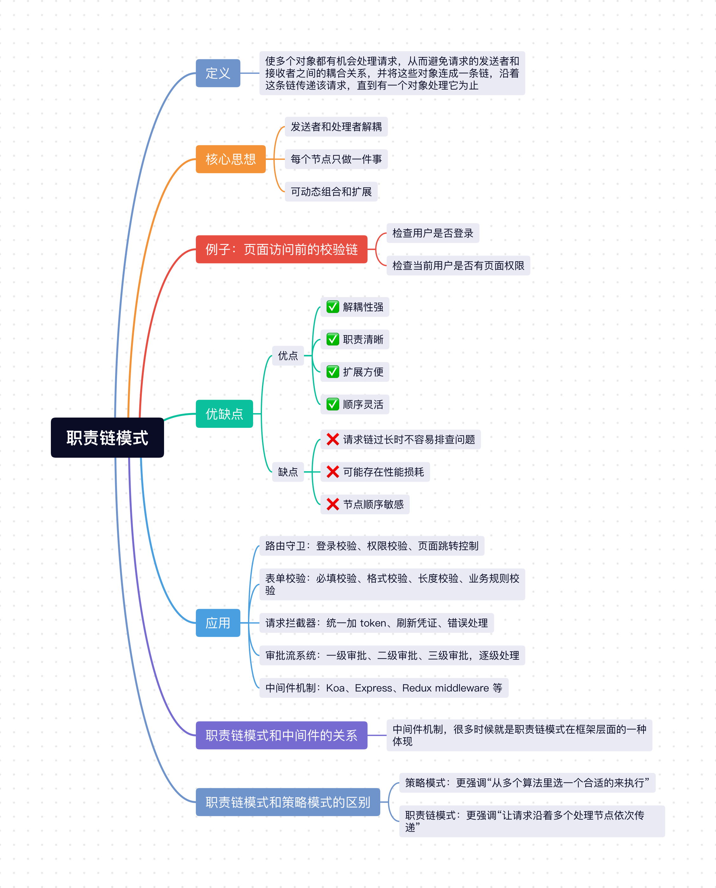

在日常开发中，我们经常会遇到这样一类场景：**一个请求或者动作，不是某一个模块立刻处理完，而是要先经过多道检查**。

比如用户访问一个后台页面时，可能要先检查：
- 是否已登录。
- `token` 是否过期。
- 是否有访问权限。
- 是否满足某些业务条件。

如果这些逻辑全都堆在一个函数里，很快就会变成一长串 `if-else`，后面无论新增规则还是调整顺序，都会越来越难维护。

这个场景，就非常适合`职责链模式`。

## 1、职责链模式定义
职责链模式的定义是：**使多个对象都有机会处理请求，从而避免请求的发送者和接收者之间的耦合关系，并将这些对象连成一条链，沿着这条链传递该请求，直到有一个对象处理它为止。**

简单来说就是：
- 一个请求会沿着一条链依次往后传。
- 链上的每个节点只负责自己那一段逻辑。
- 当前节点处理不了，或者不需要拦截，就交给下一个节点。

它的重点不是“谁一定要处理”，而是“**让请求在多个处理者之间有序流动**”。

## 2、核心思想
1. **发送者和处理者解耦**：请求发起方不需要关心到底是谁处理，只需要把请求交出去。
2. **每个节点只做一件事**：链上的每个处理者只关心自己的职责，比如只校验登录态，或者只校验权限。
3. **可动态组合和扩展**：职责链的顺序可以调整，新增节点也不需要大改原有逻辑。

## 3、例子：页面访问前的校验链

在实际项目里，用户访问一个管理后台页面时，常常不是直接渲染页面，而是要经过好几层前置处理。

比如访问 `/admin/order` 时，可能要先做这些事情：
- 检查用户是否登录。
- 如果 `token` 过期，则自动刷新。
- 检查当前用户是否有页面权限。
- 一切正常后，才允许进入页面。

### 3.1 不用职责链模式（所有逻辑堆在一个函数里）

如果我们不用职责链模式，代码很容易写成这样：

```js
async function handleRouteEnter(to) {
  if (!isLogin()) {
    redirect('/login');
    return;
  }

  if (isTokenExpired()) {
    try {
      await refreshToken();
    } catch (error) {
      redirect('/login');
      return;
    }
  }

  if (!hasPermission(to.meta.permission)) {
    redirect('/403');
    return;
  }

  renderPage(to);
}
```

这样写虽然能跑，但问题也很明显：
1. **逻辑越来越重**：所有前置处理都塞在一个函数里，职责不清晰。
2. **难扩展**：如果后面还要加“黑名单校验”“灰度校验”“埋点”“实验分流”，这个函数会越来越长。
3. **顺序耦合严重**：每一步逻辑都写死在一起，后续调整顺序或者复用部分逻辑都比较麻烦。

### 3.2 使用职责链模式

我们可以把每一步处理拆成独立的处理节点，让请求沿着链条依次往后走。

```js
class Handler {
  setNext(handler) {
    // 保存下一个处理节点
    this.next = handler;
    // 返回下一个节点，方便链式调用
    return handler;
  }

  async handle(context) {
    if (this.next) {
      // 当前节点不处理时，继续往后传
      return this.next.handle(context);
    }
  }
}

class LoginHandler extends Handler {
  async handle(context) {
    // 未登录则直接拦截，终止后续链条
    if (!isLogin()) {
      redirect('/login');
      return;
    }

    // 已登录，交给下一个节点
    return super.handle(context);
  }
}

class RefreshTokenHandler extends Handler {
  async handle(context) {
    // token 过期时，先尝试刷新
    if (isTokenExpired()) {
      try {
        await refreshToken();
      } catch (error) {
        // 刷新失败，同样终止链条
        redirect('/login');
        return;
      }
    }

    // token 正常后继续往后传
    return super.handle(context);
  }
}

class PermissionHandler extends Handler {
  async handle(context) {
    // 没有页面权限时直接拦截
    if (!hasPermission(context.to.meta.permission)) {
      redirect('/403');
      return;
    }

    // 有权限则放行
    return super.handle(context);
  }
}

class RenderHandler extends Handler {
  async handle(context) {
    // 前面的校验都通过后，才真正渲染页面
    renderPage(context.to);
  }
}

const loginHandler = new LoginHandler();
const refreshTokenHandler = new RefreshTokenHandler();
const permissionHandler = new PermissionHandler();
const renderHandler = new RenderHandler();

loginHandler
  .setNext(refreshTokenHandler)
  .setNext(permissionHandler)
  .setNext(renderHandler);

// 从链头开始处理请求
loginHandler.handle({
  to: {
    path: '/admin/order',
    meta: {
      permission: 'order:read'
    }
  }
});
```

这样改造之后有几个明显的好处：
- `LoginHandler` 只负责登录校验。
- `RefreshTokenHandler` 只负责处理 `token` 刷新。
- `PermissionHandler` 只负责权限判断。
- 真正渲染页面的逻辑，也被单独拆到了最后一个节点。

这就是职责链模式最典型的思想：**把一个大流程拆成多个独立节点，请求沿着链条依次传递，谁该处理谁处理，处理不了就往后传。**

### 3.3 职责链里最关键的是“传递”

职责链模式有一个特别关键的点，就是：**当前节点处理完之后，要不要继续往后传**。

比如：
- 用户未登录，那么 `LoginHandler` 就直接拦截，不再往后走。
- 用户已登录，那么请求继续传给下一个节点。
- 用户有权限，则继续往后传。
- 用户没有权限，则在当前节点终止。

也就是说，职责链里的每个节点通常都拥有两种能力：
1. **处理请求并终止链条**。
2. **放行请求并交给下一个节点**。

这也是它和普通“函数拆分”不一样的地方，职责链不仅仅是在拆模块，更是在定义一套清晰的流转关系。

## 4、职责链模式和中间件的关系

很多开发同学第一次学职责链模式时，都会觉得它和 `Koa`、`Express`、`Vue Router` 里的中间件机制很像，这种感觉其实非常对。

比如我们在很多框架里都会看到 `next()`：

```js
function checkLogin(ctx, next) {
  if (!isLogin()) {
    redirect('/login');
    return;
  }

  // 放行，进入下一个中间件
  next();
}

function checkPermission(ctx, next) {
  if (!hasPermission(ctx.permission)) {
    redirect('/403');
    return;
  }

  // 当前校验通过，继续往后走
  next();
}
```

这里的 `next()`，本质上就是“把请求交给下一个处理节点”。

从设计思想上看，中间件机制和职责链模式是非常接近的：
- 每个中间件只处理自己关心的逻辑。
- 当前中间件处理完后，可以决定是否调用 `next()`。
- 整个请求会按照顺序在多个处理节点之间流动。

所以我们完全可以说：**中间件机制，很多时候就是职责链模式在框架层面的一种体现。**

## 5、职责链模式的优缺点
### 5.1 优点：
- ✅ **解耦性强**：请求发送者不需要知道到底由哪个节点处理。
- ✅ **职责清晰**：每个节点只负责一类逻辑，更符合单一职责原则。
- ✅ **扩展方便**：新增一个处理节点，通常只需要插入到链条中即可。
- ✅ **顺序灵活**：可以根据业务需要调整链条的先后顺序。

### 5.2 缺点：
- ❌ **请求链过长时不容易排查问题**：如果一个请求经过很多节点，调试时可能不容易第一时间看出卡在哪一环。
- ❌ **可能存在性能损耗**：链条过长时，每次请求都要经过多个节点，会增加一些额外开销。
- ❌ **节点顺序敏感**：比如先校验权限还是先刷新 `token`，顺序不同，结果可能完全不同。

## 6、职责链模式的应用

职责链模式在日常业务开发里都非常常见，比如：

1. 路由守卫：登录校验、权限校验、页面跳转控制。
2. 表单校验：必填校验、格式校验、长度校验、业务规则校验。
3. 请求拦截器：统一加 `token`、刷新凭证、错误处理。
4. 审批流系统：一级审批、二级审批、三级审批，逐级处理。
5. 中间件机制：`Koa`、`Express`、`Redux middleware` 等。

## 7、职责链模式和策略模式的区别

职责链模式和策略模式都很常见，而且都带一点“拆分逻辑”的味道，所以也很容易混淆。

但它们的核心区别很明显：
- **策略模式**：更强调“从多个算法里选一个合适的来执行”。
- **职责链模式**：更强调“让请求沿着多个处理节点依次传递”。

你可以简单理解为：
- 策略模式更像是在说：“这次我选哪一种方案？”
- 职责链模式更像是在说：“这次请求要经过哪些关卡？”

举个很直观的例子：
- 支付时选择 `支付宝 / 微信 / 银联`，这是**策略模式**。
- 用户访问页面时先过登录校验、再过权限校验、最后才能进入页面，这是**职责链模式**。

所以两者虽然都在做“解耦”，但一个偏“选择”，一个偏“传递”。

## 小结
上面介绍了`Javascript`中非常经典的`职责链模式`，它的核心思想就是：**将多个处理节点串成一条链，让请求沿着链条依次传递，直到被处理或者终止。**

对于日常开发来说，职责链模式非常实用，像路由守卫、请求拦截器、表单校验、中间件机制等场景，都能看到它的影子。它可以让复杂流程拆分得更清晰，也更方便后续扩展和调整顺序。




## 往期回顾
- [JavaScript设计模式（一）：单例模式实现与应用](https://mp.weixin.qq.com/s/L9y4ZrBDb59EZvA8n_vkjQ)
- [JavaScript设计模式（二）：策略模式实现与应用](https://mp.weixin.qq.com/s/kd_CnuU6sn3n3jltPEETBw)
- [JavaScript设计模式（三）：代理模式实现与应用](https://mp.weixin.qq.com/s/lnLSMSgk_JECkVlqQ0PKtg)
- [JavaScript设计模式（四）：发布-订阅模式实现与应用](https://mp.weixin.qq.com/s/EaNMMrNMlkE8d_ADRWSs4g)
- [JavaScript设计模式（五）：装饰者模式实现与应用](https://mp.weixin.qq.com/s/YhuVTbvAdkgdmiuIb4TWQg)
