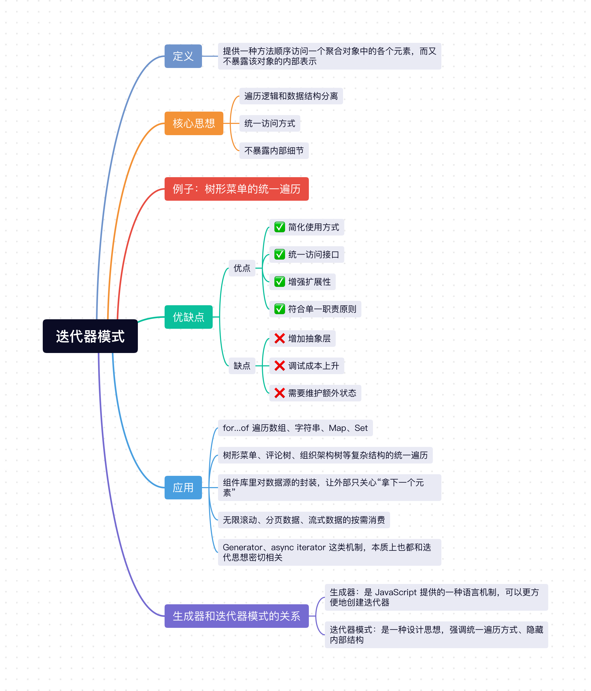

在日常开发里，我们经常要遍历和处理数据：
- 数组。
- `Map`、`Set`。
- 树形菜单。
- 评论树。
- 分页列表。

如果每一种数据结构，你都自己写一套遍历逻辑，那业务代码很快就会和数据结构细节绑死。

比如有的数据是扁平数组，有的数据是树结构，有的数据还得顺手过滤掉隐藏项。要是每次都在业务代码里手写 `for` 循环、递归、条件判断，那代码不仅不好复用，后面数据结构一变，遍历逻辑也得跟着改。

这种场景，就很适合用 `迭代器模式`。

## 1、迭代器模式定义
迭代器模式的定义是：**提供一种方法顺序访问一个聚合对象中的各个元素，而又不暴露该对象的内部表示。**

这句话听起来有点抽象，咱们把它翻译成人话，其实就是：
- 数据怎么存，集合自己知道。
- 数据怎么遍历，交给迭代器来处理。
- 使用者只需要一个统一的访问方式，不需要关心内部结构。

它的重点不在“存数据”，而在“**把遍历这件事标准化**”。

## 2、核心思想
1. **遍历逻辑和数据结构分离**：业务代码不用知道集合内部到底是数组、树，还是别的什么结构。
2. **统一访问方式**：不管底层怎么变，对外最好都提供差不多的遍历体验。
3. **不暴露内部细节**：使用者只管拿数据，不用直接碰集合内部实现。

## 3、例子：树形菜单的统一遍历

在前端项目里，树形菜单特别常见，比如后台管理系统左侧那一坨菜单：

```js
const menuTree = [
  {
    title: '工作台',
    hidden: false
  },
  {
    title: '订单管理',
    hidden: false,
    children: [
      {
        title: '订单列表',
        hidden: false
      },
      {
        title: '退款管理',
        hidden: true
      }
    ]
  },
  {
    title: '系统设置',
    hidden: false
  }
];
```

现在有个很常见的需求：**把所有可见菜单依次渲染出来**。

### 3.1 不用迭代器模式（业务代码自己递归）

如果不用迭代器模式，业务代码大概率就会先这么写：

```js
function collectVisibleMenus(nodes, result = []) {
  // 先遍历当前层
  nodes.forEach(node => {
    if (!node.hidden) {
      result.push(node);
    }

    // 再递归遍历子节点
    if (node.children?.length) {
      collectVisibleMenus(node.children, result);
    }
  });

  return result;
}

const visibleMenus = collectVisibleMenus(menuTree);

visibleMenus.forEach(menu => {
  renderMenu(menu.title);
});
```

这样写当然能跑，但你很快就会发现几个问题：
1. **业务代码知道太多内部细节**：它必须知道菜单数据里有 `children` 这个字段。
2. **遍历逻辑和业务逻辑耦合**：递归遍历和“渲染菜单”揉在一起了。
3. **不方便切换遍历方式**：如果后面你想改成广度优先遍历，或者遍历时顺手过滤掉禁用菜单，就还得继续改业务代码。

### 3.2 使用迭代器模式

更合理一点的做法是，把“怎么遍历树形菜单”这件事封装起来，对外只暴露统一的遍历能力。

```js
class MenuCollection {
  constructor(tree = []) {
    this.tree = tree;
  }

  [Symbol.iterator]() {
    // 用栈实现一个深度优先遍历
    const stack = [...this.tree].reverse();

    return {
      next() {
        while (stack.length) {
          const current = stack.pop();

          if (current.children?.length) {
            // reverse 一下，保证遍历顺序和原始数据一致
            stack.push(...[...current.children].reverse());
          }

          if (current.hidden) {
            // 隐藏菜单跳过，但继续遍历它的子节点
            continue;
          }

          return {
            value: current,
            done: false
          };
        }

        return {
          value: undefined,
          done: true
        };
      }
    };
  }
}

const menus = new MenuCollection(menuTree);

for (const menu of menus) {
  renderMenu(menu.title);
}
```

这样改造之后，外部使用的人就不需要关心：
- 菜单是不是树结构。
- 子节点字段是不是叫 `children`。
- 遍历到底是递归实现还是栈实现。

使用者只需要写：

```js
for (const menu of menus) {
  renderMenu(menu.title);
}
```

这就是迭代器模式最核心的价值：**把“怎么遍历”封装起来，让使用者只关心“我拿下一个元素就行了”**。

### 3.3 迭代器模式的灵活性

迭代器模式还有一个很实用的地方，就是后续很容易调整遍历策略。

比如现在我们实现的是**深度优先遍历**，如果后面需求改了，想换成**广度优先遍历**，那我们只需要改 `MenuCollection` 里的迭代逻辑，而不用去动外部使用代码。

也就是说：
- 对外使用方式不变。
- 对内遍历策略可以自由替换。

这其实和我们前面讲过的很多设计模式一样，核心目的都是**尽量减少变化对外部代码的影响**。

## 4、JavaScript 里的迭代器模式

其实在 `JavaScript` 里，迭代器模式你早就在用，只是很多时候没专门意识到。

比如：
- `Array`
- `String`
- `Map`
- `Set`
- `NodeList`

这些数据之所以都能被 `for...of` 遍历，本质上就是因为它们实现了迭代器相关协议。

```js
const arr = ['Vue', 'React', 'Svelte'];
const iterator = arr[Symbol.iterator]();

console.log(iterator.next()); // { value: 'Vue', done: false }
console.log(iterator.next()); // { value: 'React', done: false }
console.log(iterator.next()); // { value: 'Svelte', done: false }
console.log(iterator.next()); // { value: undefined, done: true }
```

从这个例子里，我们顺手区分两个很容易混淆的概念：

### 4.1 什么是 iterator？

`iterator` 指的是**迭代器对象**，它最起码要提供一个 `next()` 方法。

每调用一次 `next()`，就返回一个对象：
- `value`：当前遍历到的值。
- `done`：是否遍历结束。

### 4.2 什么是 iterable？

`iterable` 指的是**可迭代对象**，也就是这个对象实现了 `[Symbol.iterator]()` 方法。

当你执行：

```js
const iterator = arr[Symbol.iterator]();
```

本质上就是从一个 `iterable` 对象里，拿到了一个 `iterator`。

所以可以简单理解为：
- `iterable`：可以被迭代的对象。
- `iterator`：真正负责一次次往后取值的那个对象。

### 4.3 哪些语法在底层用到了迭代器？

像下面这些我们平时写得很顺手的代码，底层都和迭代器有关系：

```js
const set = new Set([1, 2, 3]);

for (const item of set) {
  console.log(item);
}

console.log([...set]);
console.log(Array.from(set));
```

也就是说，`for...of`、扩展运算符 `...`、`Array.from()` 等能力，背后都建立在迭代器机制之上。

## 5、生成器和迭代器模式的关系

很多同学看到这里，通常还会碰到另一个概念：`Generator（生成器）`。

它和迭代器模式也有很强的关系。

比如我们前面手写 `MenuCollection` 的时候，是自己返回了一个带 `next()` 方法的对象。其实在 `JavaScript` 里，我们也可以用生成器更省事地实现同样的效果：

```js
class MenuCollection {
  constructor(tree = []) {
    this.tree = tree;
  }

  *[Symbol.iterator]() {
    const stack = [...this.tree].reverse();

    while (stack.length) {
      const current = stack.pop();

      if (current.children?.length) {
        stack.push(...[...current.children].reverse());
      }

      if (current.hidden) {
        continue;
      }

      // yield 可以理解为“产出当前值，并等待下一次继续”
      yield current;
    }
  }
}
```

这里的生成器写法，本质上还是在实现迭代器，只不过语法更简洁，看起来也更顺。

所以两者的关系可以这样理解：
- **迭代器模式**：是一种设计思想，强调统一遍历方式、隐藏内部结构。
- **生成器**：是 `JavaScript` 提供的一种语言机制，可以更方便地创建迭代器。

也就是说，生成器不是迭代器模式本身，但它经常是实现迭代器模式时一个特别顺手的工具。

## 6、迭代器模式的优缺点
### 6.1 优点：
- ✅ **简化使用方式**：使用者不需要关心集合内部到底怎么存储、怎么遍历。
- ✅ **统一访问接口**：不同类型的数据结构，可以尽量提供一致的遍历体验。
- ✅ **增强扩展性**：后续更换遍历策略时，不容易影响外部代码。
- ✅ **符合单一职责原则**：集合负责存数据，迭代器负责遍历数据。

### 6.2 缺点：
- ❌ **增加抽象层**：如果数据结构本来就很简单，硬加一层迭代器可能有点过度设计。
- ❌ **调试成本上升**：当遍历过程被封装起来后，定位某些遍历顺序问题时，可能要多看一层实现。
- ❌ **需要维护额外状态**：像当前索引、遍历栈、队列等状态，都需要迭代器自己管理。

## 7、迭代器模式的应用

迭代器模式在前端和日常开发里其实特别常见，比如：

1. `for...of` 遍历数组、字符串、`Map`、`Set`。
2. 树形菜单、评论树、组织架构树等复杂结构的统一遍历。
3. 组件库里对数据源的封装，让外部只关心“拿下一个元素”。
4. 无限滚动、分页数据、流式数据的按需消费。
5. `Generator`、`async iterator` 这类机制，本质上也都和迭代思想密切相关。

## 小结
上面介绍了`Javascript`中非常经典的`迭代器模式`，它的核心思想就是：**为集合提供统一的遍历方式，并且不暴露集合内部的实现细节。**

对于前端开发来说，迭代器模式非常实用，像 `for...of`、`Map`、`Set`、树形菜单遍历、分页数据消费这些场景里，都能看到它的影子。它本质上就是帮我们把“怎么遍历”从“怎么使用数据”里拆开，这样代码会更清晰，后面改起来也更从容。



## 往期回顾
- [JavaScript设计模式（一）：单例模式实现与应用](https://mp.weixin.qq.com/s/L9y4ZrBDb59EZvA8n_vkjQ)
- [JavaScript设计模式（二）：策略模式实现与应用](https://mp.weixin.qq.com/s/kd_CnuU6sn3n3jltPEETBw)
- [JavaScript设计模式（三）：代理模式实现与应用](https://mp.weixin.qq.com/s/lnLSMSgk_JECkVlqQ0PKtg)
- [JavaScript设计模式（四）：发布-订阅模式实现与应用](https://mp.weixin.qq.com/s/EaNMMrNMlkE8d_ADRWSs4g)
- [JavaScript设计模式（五）：装饰者模式实现与应用](https://mp.weixin.qq.com/s/YhuVTbvAdkgdmiuIb4TWQg)
- [JavaScript设计模式（六）：职责链模式实现与应用](https://mp.weixin.qq.com/s/fdWglSpROz2P4S687iVxfw)
