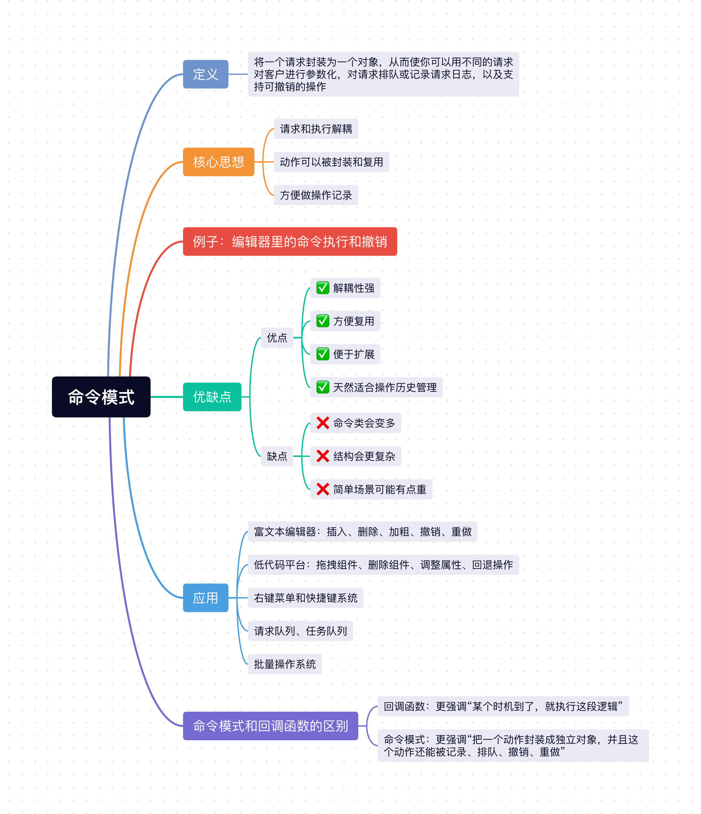

在平时开发项目中，很多流程其实可以拆解成一个个动作，比如：
- 点击按钮提交表单。
- 点击工具栏按钮加粗文字。
- 输入框按快捷键撤销、重做。
- 右键菜单执行复制、删除、重命名。

刚开始这些需求都不复杂，直接在点击事件里写逻辑即可。

但项目一旦复杂起来，你很快就会发现一个问题：**同一个动作，可能会从很多入口触发**。

比如“删除一条内容”这件事，可能既能通过按钮点击触发，也能通过右键菜单触发，还能通过键盘快捷键触发。后面如果你还想加上`操作记录`、`撤销重做`、`批量执行`，代码就会开始变乱。

这种场景，就很适合用 `命令模式`。

## 1、命令模式定义

命令模式就是**将一个请求封装为一个对象，从而使你可以用不同的请求对客户进行参数化，对请求排队或记录请求日志，以及支持可撤销的操作。**

用口语化一点的话解释就是：
- 把“要做什么事”封装成一个独立的命令对象。
- 不需要关心谁来触发它。
- 具体怎么执行，也可以交给命令对象自己去处理。

它的重点不在“按钮点击”这件事本身，而在“**把动作抽成一个可以被传递、记录、执行、撤销的对象**”。

## 2、核心思想
1. **请求和执行解耦**：触发者只负责发命令，不关心具体怎么做。
2. **动作可以被封装和复用**：一个命令可以被按钮、快捷键、右键菜单等多个入口复用。
3. **方便做操作记录**：因为命令本身是一个独立对象，所以特别适合做日志、队列、撤销、重做。

## 3、例子：编辑器里的命令执行和撤销

在前端项目里，编辑器、低代码平台、表单搭建器这类场景，经常会有很多用户操作：
- 插入一段文字。
- 删除一段文字。
- 新增一个组件。
- 撤销上一步。

这些操作如果只是偶尔点一下按钮，看起来很简单，但一旦你想支持“同一个动作多个入口触发”或者“撤销/重做”，命令模式的封装价值就出来了。

### 3.1 不用命令模式（逻辑都写在事件里）

不用命令模式的代码如下：

```js
const editor = {
  content: '',
  insert(text) {
    this.content += text;
    render(this.content);
  },
  delete(length) {
    this.content = this.content.slice(0, -length);
    render(this.content);
  }
};

insertBtn.onclick = () => {
  editor.insert('Hello ');
};

deleteBtn.onclick = () => {
  editor.delete(6);
};

document.addEventListener('keydown', event => {
  if ((event.metaKey || event.ctrlKey) && event.key === 'Backspace') {
    editor.delete(6);
  }
});
```

这种写法虽然能实现功能，但有以下3个问题：
1. **触发入口和执行逻辑绑得太死**：按钮点击、快捷键监听里都直接写了具体操作。
2. **同一个动作容易重复**：多个入口可能都在写 `editor.delete(6)` 这种代码。
3. **不方便做撤销/重做**：因为你只是“直接执行了一个动作”，但没有把这个动作本身保存下来。

### 3.2 使用命令模式

更合理一点的做法是，把每个操作都封装成一个命令对象。

先定义真正干活的接收者，也就是编辑器本身：

```js
class Editor {
  constructor() {
    this.content = '';
  }

  insert(text) {
    this.content += text;
    this.render();
  }

  delete(length) {
    const deletedText = this.content.slice(-length);
    this.content = this.content.slice(0, -length);
    this.render();
    return deletedText;
  }

  render() {
    editorContainer.innerText = this.content;
  }
}
```

然后把“插入文本”、“删除文本”封装成命令：

```js
class InsertTextCommand {
  constructor(editor, text) {
    this.editor = editor;
    this.text = text;
  }

  execute() {
    // 执行插入动作
    this.editor.insert(this.text);
  }

  undo() {
    // 撤销时，把刚插入的内容删掉
    this.editor.delete(this.text.length);
  }
}

class DeleteTextCommand {
  constructor(editor, length) {
    this.editor = editor;
    this.length = length;
    this.deletedText = '';
  }

  execute() {
    // 先保存被删除的内容，后面 undo 要用
    this.deletedText = this.editor.delete(this.length);
  }

  undo() {
    // 撤销删除，本质上就是把删掉的内容再插回去
    this.editor.insert(this.deletedText);
  }
}
```

接着再定义一个命令管理器，专门负责执行和记录历史：

```js
class CommandManager {
  constructor() {
    this.history = [];
  }

  execute(command) {
    // 执行命令
    command.execute();
    // 执行成功后放进历史栈
    this.history.push(command);
  }

  undo() {
    const command = this.history.pop();

    if (!command) {
      return;
    }

    // 撤销最后一次操作
    command.undo();
  }
}
```

最后，按钮、快捷键这些触发入口都只负责发命令：

```js
const editor = new Editor();
const commandManager = new CommandManager();

insertBtn.onclick = () => {
  commandManager.execute(new InsertTextCommand(editor, 'Hello '));
};

deleteBtn.onclick = () => {
  commandManager.execute(new DeleteTextCommand(editor, 6));
};

document.addEventListener('keydown', event => {
  if ((event.metaKey || event.ctrlKey) && event.key === 'z') {
    commandManager.undo();
  }
});
```

这样改造之后，代码的职责就清楚很多了：
- `Editor` 只负责真正执行编辑动作。
- `InsertTextCommand`、`DeleteTextCommand` 只负责描述“要执行什么命令”。
- `CommandManager` 只负责管理命令执行和历史记录。
- 按钮、快捷键这些入口，只负责触发命令。

这就是命令模式最核心的价值：**把“发起请求”和“执行请求”拆开，让一个动作变成可传递、可记录、可撤销的对象。**

### 3.3 命令模式为什么特别适合做撤销？

命令模式有一个很典型的应用场景，就是`undo / redo`。

原因也很简单，因为每个操作都已经被封装成一个独立命令了，所以你只要：
- 执行的时候，把命令存起来。
- 撤销的时候，调用这个命令对应的 `undo()`。

比如：
- 插入文本的撤销，就是删除刚插入的内容。
- 删除文本的撤销，就是把删掉的内容恢复回来。

也就是说，命令模式天然就很适合这种“**操作本身也需要被管理**”的场景。

## 4、JavaScript 里怎么理解命令模式

在 `JavaScript` 里，因为函数本身就是一等公民，所以很多时候，命令模式不一定非得写成传统面向对象那种 class 形式。

有时候我们也会把命令写得更轻一点：

```js
function createCommand(execute, undo) {
  return {
    execute,
    undo
  };
}

const insertHelloCommand = createCommand(
  () => editor.insert('Hello '),
  () => editor.delete(6)
);

insertHelloCommand.execute();
insertHelloCommand.undo();
```

这种写法本质上还是命令模式，因为你依然是在做同一件事：
- 把一个动作封装起来。
- 让它拥有独立的执行入口。
- 在需要的时候再交给别人去执行。

所以在 `JavaScript` 里理解命令模式，不要把注意力只放在“是不是 class”，更重要的是看：**你有没有把动作抽象成一个独立的命令单元。**

## 5、命令模式和回调函数的区别

很多同学第一次看命令模式，都会觉得：这不就是回调函数吗？

它们确实有点像，因为两者都可以把“行为”传来传去。

但它们的侧重点不太一样：
- **回调函数**：更强调“某个时机到了，就执行这段逻辑”。
- **命令模式**：更强调“把一个动作封装成独立对象，并且这个动作还能被记录、排队、撤销、重做”。

你可以简单理解为：
- 回调更像是“到点了，帮我执行一下”。
- 命令更像是“这是一个操作单元，你先收着，什么时候执行、要不要记录、能不能撤销，都可以再进行管理”。

所以在简单场景下，回调就足够了；但如果你开始需要：
- 操作历史。
- 撤销重做。
- 队列执行。
- 批量执行。

那命令模式通常会更合适。

## 6、命令模式的优缺点
### 6.1 优点：
- ✅ **解耦性强**：触发者不需要知道接收者的实现细节。
- ✅ **方便复用**：同一个命令可以被不同入口重复触发。
- ✅ **便于扩展**：新增一个命令，通常不需要去改原来的调用方。
- ✅ **天然适合操作历史管理**：特别适合做撤销、重做、日志记录、批处理。

### 6.2 缺点：
- ❌ **命令类会变多**：如果系统里的操作非常多，就会多出很多命令对象或命令类。
- ❌ **结构会更复杂**：相比直接调用函数，命令模式会多一层抽象。
- ❌ **简单场景可能有点重**：如果只是一个很简单的按钮点击，硬上命令模式可能有点过度设计。

## 7、命令模式的应用

命令模式在前端和日常业务开发里其实很常见，比如：

1. 富文本编辑器：插入、删除、加粗、撤销、重做。
2. 低代码平台：拖拽组件、删除组件、调整属性、回退操作。
3. 右键菜单和快捷键系统：同一个动作可以由多个入口触发。
4. 请求队列、任务队列：把动作先封装起来，后面再统一执行。
5. 批量操作系统：把一组命令收集起来，按顺序依次执行。

## 小结
上面介绍了`Javascript`中非常经典的`命令模式`，它的核心思想就是：**把一个请求或动作封装成独立命令，从而让请求的触发者和执行者解耦。**

对于前端开发来说，命令模式非常实用，像编辑器操作、撤销重做、快捷键系统、右键菜单、批量任务执行这些场景里，都能看到它的影子。它本质上就是帮我们把“谁来触发”和“具体怎么执行”拆开，这样代码会更清晰，也更方便后续扩展。



## 往期回顾
- [JavaScript设计模式（一）：单例模式实现与应用](https://mp.weixin.qq.com/s/L9y4ZrBDb59EZvA8n_vkjQ)
- [JavaScript设计模式（二）：策略模式实现与应用](https://mp.weixin.qq.com/s/kd_CnuU6sn3n3jltPEETBw)
- [JavaScript设计模式（三）：代理模式实现与应用](https://mp.weixin.qq.com/s/lnLSMSgk_JECkVlqQ0PKtg)
- [JavaScript设计模式（四）：发布-订阅模式实现与应用](https://mp.weixin.qq.com/s/EaNMMrNMlkE8d_ADRWSs4g)
- [JavaScript设计模式（五）：装饰者模式实现与应用](https://mp.weixin.qq.com/s/YhuVTbvAdkgdmiuIb4TWQg)
- [JavaScript设计模式（六）：职责链模式实现与应用](https://mp.weixin.qq.com/s/fdWglSpROz2P4S687iVxfw)
- [JavaScript设计模式（七）：迭代器模式实现与应用](https://mp.weixin.qq.com/s/RawGBNaHbghv1bVdG3ZNFw)
