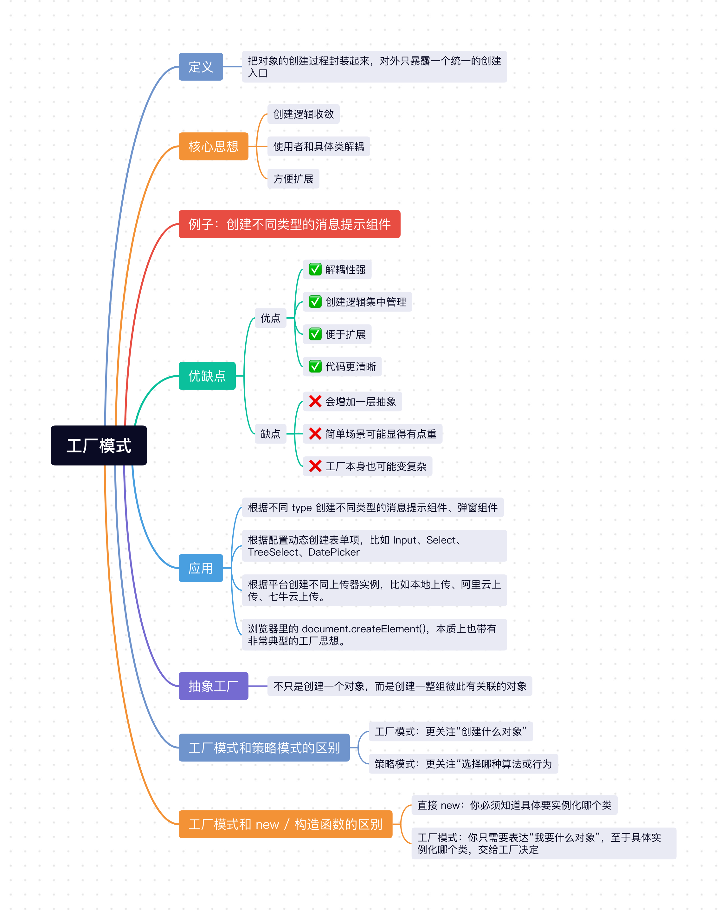

在 JavaScript 中，有一个 `new` 操作符，用于创建对象，经常会写各种“创建对象”的代码，比如：
- 创建不同类型的消息提示组件，比如 `SuccessMessage`、`ErrorMessage`、`WarningMessage`。
- 创建不同类型的表单项，比如 `Input`、`Select`、`TreeSelect`、`DatePicker`。
- 创建不同平台的上传实例，比如本地上传、阿里云上传、七牛云上传。
- 创建不同环境下的请求实例，比如开发环境的 mock 请求实例、测试环境实例、生产环境实例。

刚开始这些创建逻辑看起来都不复杂，直接 `new` 一下就完事了。

但项目一旦复杂起来，你很快就会发现一个问题：**对象的创建逻辑也会越来越乱**。

比如你有 `success`、`warning`、`error` 三种消息提示，一开始可能只是在某个地方 `new SuccessMessage()`，后面随着项目变大，很多地方都开始根据 `type` 去写 `if-else` 或 `switch` 来创建对象。再往后如果还要加默认配置、埋点、主题、平台差异，那这些“创建逻辑”就会慢慢变成一团。

这种场景，就很适合用 `工厂模式`。

## 1、工厂模式定义

工厂模式的核心思想就是：**把对象的创建过程封装起来，对外只暴露一个统一的创建入口。**

通俗点来讲就是：
- 你告诉工厂“我要什么对象”。
- 工厂负责决定“具体该怎么创建”。
- 外部不用关心里面到底是 `new` 了哪个类，也不用关心初始化细节。

它的重点不在“对象本身”，而在“**把创建对象这件事集中管理起来**”。

## 2、核心思想
1. **创建逻辑收敛**：不要让对象创建逻辑散落在业务代码各处。
2. **使用者和具体类解耦**：使用者只关心“我要什么”，不关心“它具体是谁创建出来的”。
3. **方便扩展**：后面新增一种对象类型时，通常只需要改工厂，而不需要满项目去找 `new`。

## 3、例子：创建不同类型的消息提示组件

在前端项目里，消息提示组件特别常见，比如：
- 成功提示 `success`
- 失败提示 `error`
- 警告提示 `warning`

看起来只是几个不同样式的小组件，但如果这些对象的创建逻辑散落在业务代码里，后面就很难统一管理。

### 3.1 不用工厂模式（到处自己 new）

不用工厂模式的代码，大概率会先这么写：

```js
class SuccessMessage {
  constructor(text) {
    this.text = text;
    this.type = 'success';
  }

  show() {
    console.log(`[success]: ${this.text}`);
  }
}

class ErrorMessage {
  constructor(text) {
    this.text = text;
    this.type = 'error';
  }

  show() {
    console.log(`[error]: ${this.text}`);
  }
}

class WarningMessage {
  constructor(text) {
    this.text = text;
    this.type = 'warning';
  }

  show() {
    console.log(`[warning]: ${this.text}`);
  }
}

saveBtn.onclick = () => {
  const message = new SuccessMessage('保存成功');
  message.show();
};

submitBtn.onclick = async () => {
  if (!validateForm()) {
    const message = new WarningMessage('表单校验未通过');
    message.show();
    return;
  }

  try {
    const res = await submitForm();

    if (res.code === 0) {
      const message = new SuccessMessage('提交成功');
      message.show();
    } else {
      const message = new ErrorMessage(res.message || '提交失败');
      message.show();
    }
  } catch (error) {
    const message = new ErrorMessage('网络异常，请稍后重试');
    message.show();
  }
};

uploadBtn.onclick = () => {
  const message = new WarningMessage('文件体积过大');
  message.show();
};
```

这种写法虽然能跑，但存在两个问题：
1. **创建逻辑散落在业务代码各处**：保存、提交、上传这些地方都在自己 `new` 对象。
2. **调用方直接依赖具体类名**：业务代码必须知道 `SuccessMessage`、`ErrorMessage`、`WarningMessage` 这些实现细节。
3. **后面不方便统一改规则**：如果消息对象都要增加默认图标、默认时长、主题配置，就得一处处去改。也就是说，如果 `new SuccessMessage` 需要传一些默认参数，比如 `new SuccessMessage('保存成功', { icon: 'xxx.png', duration: 2000, theme: 'dark' })`，那么所有 `SuccessMessage` 都需要改，维护起来就比较麻烦。

### 3.2 使用工厂模式

更合理一点的做法是，把“创建消息对象”这件事单独收敛到工厂里。

先定义不同类型的消息对象：

```js
class SuccessMessage {
  constructor(text) {
    this.text = text;
    this.type = 'success';
  }

  show() {
    console.log(`[success]: ${this.text}`);
  }
}

class ErrorMessage {
  constructor(text) {
    this.text = text;
    this.type = 'error';
  }

  show() {
    console.log(`[error]: ${this.text}`);
  }
}

class WarningMessage {
  constructor(text) {
    this.text = text;
    this.type = 'warning';
  }

  show() {
    console.log(`[warning]: ${this.text}`);
  }
}
```

然后定义一个统一的工厂：

```js
class MessageFactory {
  static create(type, text) {
    if (type === 'success') {
      return new SuccessMessage(text);
    }

    if (type === 'error') {
      return new ErrorMessage(text);
    }

    if (type === 'warning') {
      return new WarningMessage(text);
    }

    throw new Error(`Unknown message type: ${type}`);
  }
}
```

业务代码里就不需要再自己 `new` 具体类了：

```js
const message1 = MessageFactory.create('success', '保存成功');
message1.show();

const message2 = MessageFactory.create('error', '保存失败');
message2.show();
```

这样改造之后，代码的职责就清楚很多了：
- `SuccessMessage`、`ErrorMessage`、`WarningMessage` 只负责各自的展示逻辑。
- `MessageFactory` 只负责统一创建对象。
- 业务代码只负责“使用对象”，而不用关心对象是怎么来的。

这就是工厂模式最核心的价值：**把“对象怎么创建”从“对象怎么使用”里拆出来。**

### 3.3 工厂模式真正解决的是什么？

很多同学第一次看工厂模式，会觉得它只是“帮你少写几个 `new`”。

其实不是。

工厂模式真正解决的是：**把对象创建逻辑收敛，让变化尽量集中发生。**

比如后面需求变了：
- `success` 消息要自动带一个绿色图标。
- `error` 消息要统一上报错误日志。
- 所有消息实例都要带默认展示时长。

如果没有工厂，这些创建细节可能散落在很多地方；但如果有工厂，你只需要改工厂或者改具体产品类，外部调用方式基本不用动。

也就是说，工厂模式的价值从来都不只是“简化创建”，更重要的是“**统一管理创建逻辑**”。

## 4、JavaScript 里怎么理解工厂模式

在 `JavaScript` 里，工厂模式不一定非得写成 class 形式。

很多时候，我们更常见的是“工厂函数”：

```js
function createMessage(type, text) {
  if (type === 'success') {
    return {
      type,
      text,
      show() {
        console.log(`[success]: ${text}`);
      }
    };
  }

  if (type === 'error') {
    return {
      type,
      text,
      show() {
        console.log(`[error]: ${text}`);
      }
    };
  }

  throw new Error(`Unknown message type: ${type}`);
}

const message = createMessage('success', '操作成功');
message.show();
```

这种写法本质上也是工厂模式，因为你依然是在做同一件事：
- 对外提供统一创建入口。
- 内部封装对象创建细节。
- 外部只拿结果，不关心内部过程。

所以在 `JavaScript` 里理解工厂模式，不要把注意力只放在“是不是 class”，更重要的是看：**你有没有把对象创建逻辑集中封装起来。**

顺手说一个大家其实天天都在用的例子：

```js
const div = document.createElement('div');
const span = document.createElement('span');
```

`document.createElement()` 本质上就是一种很典型的工厂思想：
- 你只告诉它“我要什么标签”。
- 浏览器负责创建对应的 DOM 对象。
- 你并不需要自己 `new HTMLDivElement()`。

## 5、工厂模式和 `new` / 构造函数的区别

很多同学学到这里，还会有一个很自然的问题：**工厂模式和直接 `new` 有什么区别？**

区别就在于关注点不一样：
- **直接 `new`**：你必须知道具体要实例化哪个类。
- **工厂模式**：你只需要表达“我要什么对象”，至于具体实例化哪个类，交给工厂决定。

比如下面这两种写法：

```js
const message1 = new SuccessMessage('保存成功');
const message2 = MessageFactory.create('success', '保存成功');
```

看起来都能拿到对象，但它们的含义不一样：
- `new SuccessMessage()` 说明调用方知道具体类名，也直接依赖这个类。
- `MessageFactory.create('success')` 说明调用方只表达需求，不直接依赖具体实现类。

所以工厂模式不是为了替代 `new`，而是为了**在合适的场景下，把 `new` 隐藏到更合适的地方去**。

## 6、工厂模式和策略模式的区别

工厂模式和策略模式都很容易出现 `type` 判断，所以很多同学会把这两个模式搞混。

但它们解决的问题并不一样：
- **工厂模式**：更关注“创建什么对象”。
- **策略模式**：更关注“选择哪种算法或行为”。

你可以简单理解为：
- 工厂模式是在回答：“这次我要造谁？”
- 策略模式是在回答：“这次我要怎么做？”

举个很直观的例子：
- 根据 `type` 创建 `SuccessMessage`、`ErrorMessage`、`WarningMessage`，这是**工厂模式**。
- 根据 `type` 选择不同支付逻辑、校验逻辑、请求策略，这是**策略模式**。

所以一个偏“创建”，一个偏“行为选择”。

## 7、抽象工厂是什么？

前面讲的这种写法，本质上更接近我们平时最常说的`简单工厂思路`：给你一个统一入口，然后根据条件创建某一个对象。

但工厂模式往上再走一步，其实还有一个很经典的概念，叫做`抽象工厂`。

抽象工厂你可以先不用把它想得太玄乎，它本质上就是：

**不只是创建一个对象，而是创建一整组彼此有关联的对象。**

如果说前面的 `MessageFactory` 更像是在回答：
- “这次我要创建哪一种消息组件？”

那抽象工厂更像是在回答：
- “这次我要创建哪一整套组件？”

比如在前端项目里，这种场景就特别常见：
- 你有一套 `PC` 端组件。
- 你有一套 `Mobile` 端组件。
- 每一套里都包含 `Button`、`Dialog`、`Input` 等一组相关组件。

这时候你要解决的，就不是“创建一个按钮”这么简单了，而是“**创建一整套同风格、同平台、彼此配套的组件族**”。

### 7.1 一个前端里很常见的例子

假设我们现在有两套 UI 体系：
- `PC` 端组件
- `Mobile` 端组件

每套体系里，都有两个相关组件：
- `Button`
- `Dialog`

在 `JavaScript` 里虽然没有 `abstract class` 这种语法，但我们完全可以用普通类来表达“抽象层”，只是在那些不希望被直接使用的方法里，手动 `throw new Error`。

你可以把这种写法理解成：**用 `JavaScript` 的普通类，去模拟抽象类的约束能力。**

可以把它写成这样：

```js
class AbstractButton {
  render() {
    throw new Error('render 方法必须由子类实现');
  }
}

class AbstractDialog {
  render() {
    throw new Error('render 方法必须由子类实现');
  }
}

class AbstractUIFactory {
  createButton() {
    throw new Error('createButton 方法必须由子类实现');
  }

  createDialog() {
    throw new Error('createDialog 方法必须由子类实现');
  }
}

class PcButton extends AbstractButton {
  render() {
    console.log('渲染 PC 按钮');
  }
}

class PcDialog extends AbstractDialog {
  render() {
    console.log('渲染 PC 弹窗');
  }
}

class MobileButton extends AbstractButton {
  render() {
    console.log('渲染 Mobile 按钮');
  }
}

class MobileDialog extends AbstractDialog {
  render() {
    console.log('渲染 Mobile 弹窗');
  }
}

class PcUIFactory extends AbstractUIFactory {
  createButton() {
    return new PcButton();
  }

  createDialog() {
    return new PcDialog();
  }
}

class MobileUIFactory extends AbstractUIFactory {
  createButton() {
    return new MobileButton();
  }

  createDialog() {
    return new MobileDialog();
  }
}
```

这里的关系其实就很清楚了：
- `AbstractButton`、`AbstractDialog` 是抽象产品。
- `AbstractUIFactory` 是抽象工厂。
- `PcUIFactory`、`MobileUIFactory` 是具体工厂。
- `PcButton`、`PcDialog`、`MobileButton`、`MobileDialog` 是具体产品。

业务代码里只需要选择当前要用哪一套工厂：

```js
function createPage(factory) {
  const button = factory.createButton();
  const dialog = factory.createDialog();

  button.render();
  dialog.render();
}

createPage(new PcUIFactory());
createPage(new MobileUIFactory());
```

这样做的好处很明显：
- 你切换的是“一整套产品族”，而不是一个个零散产品。
- `PC` 按钮一定搭配 `PC` 弹窗。
- `Mobile` 按钮一定搭配 `Mobile` 弹窗。
- 外部不用自己关心这一套里每个对象该怎么创建。

这就是抽象工厂模式最核心的点：**它不是在创建单个对象，而是在创建一组相互关联、相互匹配的对象。**

### 7.2 抽象工厂和普通工厂的区别

很多同学第一次学到这里，会觉得：这不还是工厂吗？

是的，它当然还是工厂思想，但它解决的问题比普通工厂更大一层。

你可以这样理解：
- **普通工厂 / 简单工厂**：更像是在创建“一个产品”。
- **抽象工厂**：更像是在创建“一整个产品族”。

比如：
- 创建一个 `success message`，这是普通工厂更擅长的事。
- 创建一整套 `PC UI` 或 `Mobile UI` 组件，这是抽象工厂更擅长的事。

所以它们的区别，不是“谁更高级”，而是**抽象层级不一样**。

### 7.3 抽象工厂适合什么场景？

抽象工厂通常适合下面这类场景：

1. 系统里存在多套彼此对应的产品族。
2. 这些产品之间有明显的配套关系，不能随便混用。
3. 你希望切换的是一整套规则，而不是某一个单独对象。

像前端里这些场景，其实都挺适合：
- `PC` 端和 `Mobile` 端组件体系。
- 浅色主题和深色主题组件体系。
- 国内环境和海外环境下的一整套服务实例。

所以如果说前面的工厂模式解决的是“**对象怎么统一创建**”，那抽象工厂解决的就是“**一整套对象怎么统一创建**”。

## 8、工厂模式的优缺点
### 8.1 优点：
- ✅ **解耦性强**：使用者不需要依赖具体类名。
- ✅ **创建逻辑集中管理**：对象创建规则可以统一收敛。
- ✅ **便于扩展**：新增一种对象类型时，通常不需要满项目改调用代码。
- ✅ **代码更清晰**：业务层更专注“使用对象”，而不是“创建对象”。

### 8.2 缺点：
- ❌ **会增加一层抽象**：相比直接 `new`，工厂模式会多一层封装。
- ❌ **简单场景可能显得有点重**：如果对象创建本来就非常简单，硬加工厂未必划算。
- ❌ **工厂本身也可能变复杂**：如果所有创建逻辑都堆在一个大工厂里，工厂类本身也会越来越臃肿。

## 9、工厂模式的应用

工厂模式在前端和日常业务开发里其实非常常见，比如：

1. 根据不同 `type` 创建不同类型的消息提示组件、弹窗组件。
2. 根据配置动态创建表单项，比如 `Input`、`Select`、`TreeSelect`、`DatePicker`。
3. 根据运行环境创建不同请求实例，比如开发环境的 mock 请求实例、测试环境实例、生产环境实例。
4. 根据平台创建不同上传器实例，比如本地上传、阿里云上传、七牛云上传。
5. 浏览器里的 `document.createElement()`，本质上也带有非常典型的工厂思想。

## 小结
上面介绍了`Javascript`中非常经典的`工厂模式`，它的核心思想就是：**把对象创建逻辑封装起来，对外提供统一的创建入口，从而让使用者和具体实现解耦。**

对于前端开发来说，工厂模式非常实用，像消息组件创建、表单项创建、上传器创建、请求实例创建这些场景里，都能看到它的影子。它本质上就是帮我们把“怎么创建对象”从“怎么使用对象”里拆开，这样代码会更清晰，后面扩展起来也更从容。

如果系统里不仅仅是创建“一个对象”，而是要创建“一整套相互配套的对象”，那就可以继续往抽象工厂的方向去设计。你可以简单把它理解成：**普通工厂负责造单品，抽象工厂负责造整套。**



## 往期回顾
- [JavaScript设计模式（一）：单例模式实现与应用](https://mp.weixin.qq.com/s/L9y4ZrBDb59EZvA8n_vkjQ)
- [JavaScript设计模式（二）：策略模式实现与应用](https://mp.weixin.qq.com/s/kd_CnuU6sn3n3jltPEETBw)
- [JavaScript设计模式（三）：代理模式实现与应用](https://mp.weixin.qq.com/s/lnLSMSgk_JECkVlqQ0PKtg)
- [JavaScript设计模式（四）：发布-订阅模式实现与应用](https://mp.weixin.qq.com/s/EaNMMrNMlkE8d_ADRWSs4g)
- [JavaScript设计模式（五）：装饰者模式实现与应用](https://mp.weixin.qq.com/s/YhuVTbvAdkgdmiuIb4TWQg)
- [JavaScript设计模式（六）：职责链模式实现与应用](https://mp.weixin.qq.com/s/fdWglSpROz2P4S687iVxfw)
- [JavaScript设计模式（七）：迭代器模式实现与应用](https://mp.weixin.qq.com/s/RawGBNaHbghv1bVdG3ZNFw)
- [JavaScript设计模式（八）：命令模式实现与应用](https://mp.weixin.qq.com/s/ybow3trfDnCEwSE6mhQ_6A)