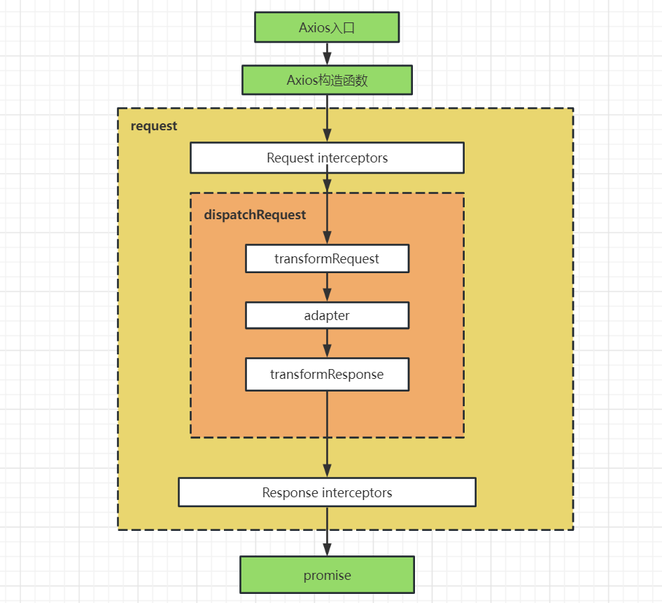
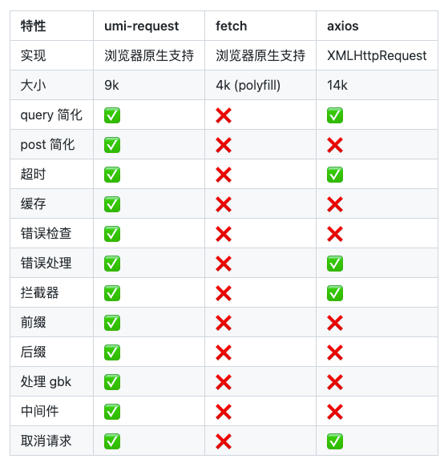

## 1、前端请求方式

- **原生XHR**：最初，在 Web 开发的早期，前端请求库的唯一选择是使用 XMLHttpRequest（XHR）对象。XHR提供了一种在浏览器中发起HTTP请求的方式，但使用XHR需要编写大量重复的代码，并且缺乏灵活性。
- **JQuery Ajax**：随着 JQuery 的兴起，JQuery Ajax成为了主流的前端请求库。JQuery Ajax 使用简单，可以轻松地发送异步请求，并且具有良好的跨浏览器支持。它为开发人员提供了简单易用的 API，并支持各种数据格式，例如 JSON 和 XML。
- **Fetch API**：Fetch API 是浏览器内置的一种用于发起 HTTP 请求的 API，它支持 Promise，更加简洁易用。Fetch API基于标准的 Promise 接口，可以更好地支持异步请求，从而提高代码的可读性和可维护性。
- **Axios**：Axios 是一个基于 Promise 的 HTTP 客户端库，它提供了简单、一致的 API，可以轻松地处理 HTTP 请求和响应。Axios 可以用于浏览器和 Node.js，并且可以与 React、Vue 等框架很好地配合使用。它支持拦截请求和响应，支持取消请求等高级功能。

## 2、axios 是什么

`axios` 是一个基于 `promise` 的网络请求库，它可以用于浏览器和 nodejs 当中。在不同环境，它所使用的请求API是不同的，在 nodejs 环境使用的 node 原生的 `http` 模块，而在浏览器中使用的是 `XMLHTTPRequest`。

## 3、axios 的特性

- 从浏览器创建 `XMLHttpRequests`。
- 从 node.js 创建 `http` 请求。
- 支持 `Promise` API。
- 拦截请求和响应。
- 转换请求和响应数据。
- 取消请求。
- 自动转换 `JSON` 数据。
- 客户端支持防御 `XSRF`。

## 4、axios的原理

**axios 整体架构图：**




### 4.1 axios的调用方式

```js
// 第一种：直接调用
axios(config)
// 第二种：通过axios的属性方法调用
axios.get(url[, config])//'delete', 'get', 'head', 'options'请求方法一样的调用方式
axios.post(url[, data[, config]])// 'post', 'put', 'patch'请求方法永阳的调用方式

// 第三种：并行调用
axios.all([axios1, axios2, axios3]).then(axios.spread(function (axios1response, axios2response, axios3response) {
  // 三个请求现在都执行完成
}));
// 第四种：通过axios.create方法建立自定义全局默认配置的Axios实例
axios.create(config)
```

**为什么 axios 既可以当函数调用，也可以当对象使用？**

```js
function createInstance(defaultConfig) {
  const context = new Axios(defaultConfig);
  const instance = bind(Axios.prototype.request, context);

  // Copy axios.prototype to instance
  utils.extend(instance, Axios.prototype, context);

  // Copy context to instance
  utils.extend(instance, context, null);

  // Factory for creating new instances
  instance.create = function create(instanceConfig) {
    return createInstance(mergeConfig(defaultConfig, instanceConfig));
  };

  return instance;
}

// Create the default instance to be exported
const axios = createInstance(defaults);

axios.create = function create(instanceConfig) {
  return createInstance(mergeConfig(axios.defaults, instanceConfig));
};

axios.all = function all(promises) {
  return Promise.all(promises);
};

axios.spread = function (callback) {
  return function wrap(arr) {
    return callback.apply(null, arr);
  };
}
export default axios
```

**axios 类：**

```js
class Axios {
  constructor(instanceConfig) {
    this.defaults = instanceConfig;
    this.interceptors = {
      request: new InterceptorManager(),
      response: new InterceptorManager()
    };
  }
  request(configOrUrl, config) {
    /*eslint no-param-reassign:0*/
    // Allow for axios('example/url'[, config]) a la fetch API
    if (typeof configOrUrl === 'string') {
      config = config || {};
      config.url = configOrUrl;
    } else {
      config = configOrUrl || {};
    }

    config = mergeConfig(this.defaults, config);
    // ....省略了一些代码
    
  }
}

utils.forEach(['delete', 'get', 'head', 'options'], function forEachMethodNoData(method) {
  Axios.prototype[method] = function(url, config) {
    return this.request(mergeConfig(config || {}, {
      method,
      url,
      data: (config || {}).data
    }));
  };
});
```

可以看到：
- 定义了一个 `Axios` 类，在 `constructor` 中初始化了拦截器 `interceptor`，并在 `Axios.prototype` 上定义了 `delete`, `get`, `head`, `options` 方法。
- `new Axios` 实际上就是创建了一个 `Axios` 实例。
- 调用 `Axios` 方法内部实际上也是调用了 `new Axios`。


#### 4.2 axios的拦截器

**拦截器的使用：**

```js
// 请求拦截器
const requestInterceptor = axios.interceptors.request.use(config => {
    return config;
}, error => {
    return Promise.reject(error);
});

// 添加响应拦截器
const responseInterceptor = axios.interceptors.response.use(response => {
  return response;
}, error => {
  return Promise.reject(error);
});

// 移除拦截器
axios.interceptors.request.eject(requestInterceptor);
```

**多个拦截器：**


**拦截器执行顺序：**
- 请求拦截器：先添加的后执行。
- 响应拦截器：先添加的先执行。

**拦截器的原理：**

1. 存储拦截器

```js
class InterceptorManager {
  constructor() {
    this.handlers = [];
  }

  use(fulfilled, rejected, options) {
    this.handlers.push({
      fulfilled,
      rejected
    });
    return this.handlers.length - 1;
  }
  eject(id) {
    if (this.handlers[id]) {
      this.handlers[id] = null;
    }
  }
}

export default InterceptorManager;
```

2. 建立 promise 链

```js
class Axios {
  constructor() {
    this.interceptors = {
      request: new InterceptorManager(),
      response: new InterceptorManager()
    }
  }
  request(config) {
        const chain = [{
            onFulfilled: this.dispatchRequest,
            onRejected: null
        }]
        this.interceptors.request.interceptors.forEach((interceptor) => {
            interceptor && chain.unshift(interceptor)
        })

        this.interceptors.response.interceptors.forEach((interceptor) => {
            interceptor && chain.push(interceptor)
        })
        let promise = Promise.resolve(config);

        while (chain.length) {
            const { onFulfilled, onRejected } = chain.shift()!;
            promise = promise.then(onFulfilled, onRejected);
        }
        return promise
    }
}
```

#### 4.3 cancelToken 取消请求

**取消请求用法：**

```js
// 第一种取消方法
const CancelToken = axios.CancelToken;
const source = CancelToken.source();

axios.get('/user/12345', {
  cancelToken: source.token
}).catch(function (thrown) {
  if (axios.isCancel(thrown)) {
    console.log('Request canceled', thrown.message);
  } else {
    // handle error
  }
});

source.cancel('Operation canceled by the user.');

// 第二种取消方法
const CancelToken = axios.CancelToken;
let cancel;

axios.get('/user/12345', {
  cancelToken: new CancelToken(function executor(c) {
    // An executor function receives a cancel function as a parameter
    cancel = c;
  })
});

// cancel the request
cancel();
```

**取消请求实现：**

```ts
export class Cancel {
    constructor(public reason: string) { }
}
export function isCancel(error: any) {
    return error instanceof Cancel;
}
export class CancelToken {
    public resolve: any;
    source() {
        return {
            token: new Promise((resolve) => {
                this.resolve = resolve;
            }),
            cancel: (reason: string) => {
                this.resolve(new Cancel(reason));
            }
        }
    }
}

// axios.js
axios.CancelToken = new CancelToken();
axios.isCancel = isCancel;

function dispatchRequest(config){
  // 发送xhr请求
   if (config.cancelToken) {
       config.cancelToken.then((reason: string) => {
          request.abort();
          reject(reason);
      });
   }
}
```

## 5、其它请求库

`umi-request`，基于 fetch 封装, 兼具 fetch 与 axios 的特点, 旨在为开发者提供一个统一的 api 调用方式, 简化使用, 并提供诸如缓存, 超时, 字符编码处理, 错误处理等常用功能。

`umi-request` 和 `fetch` 和 `axios` 的对比：


