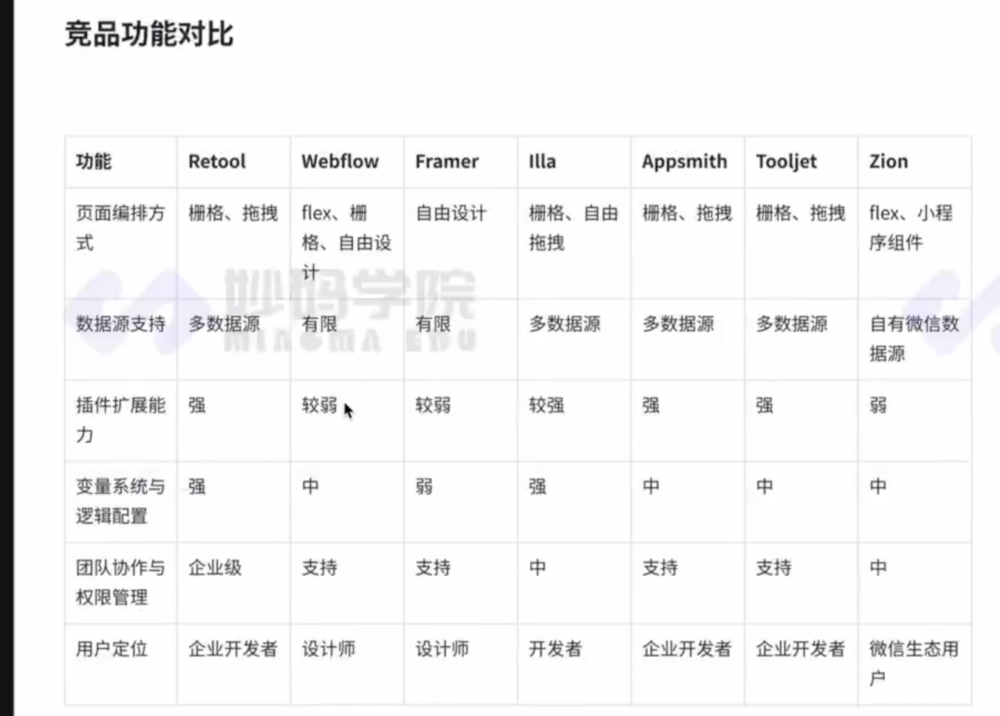

# 学习目标
初中级：
1. **低代码核心需求分析与竞品研究**：能够理解低代码平台的核心需求，包括编排引擎、数据整合与变量系统的设计与实现，掌握多种编排引擎（如珊格布局、Flex布局、自由拖拽）的工作原理和适用场景；通过分析 Retool、Webflow、Framer、llla、Appsmith、Tooljet、Zion、Flutterflow 等竞品，理解不同低代码平台的设计特点与差异化优势。
2. **项目架构设计与模块化分析**：理解低代码平台的架构设计原则，掌握基于 monorepo 的全栈架构的组织方式，能够设计和组织模块化代码结构，支持平台的灵活性和扩展性。
3. **核心功能分析与实现**：理解低代码平台核心功能的设计与实现，包括页面布局、动态数据绑定、事件触发机制等，能够设计并分析基础功能（如变量配置、数据源连接、操作事件）的作用以及实现原理。

高级：
1. **高级架构设计与模块化思想**：具备从零开始设计低代码平台架构的能力，理解如何将核心功能模块、编排引擎和 UI 组件库整合在项目架构中，并掌握性能优化与扩展性设计的最佳实践。
2. **编排引擎扩展与实现分析**：能够深入理解低代码编排引擎的实现原理与扩展机制，分析不同模式（如珊格布局、Flex布局、自由拖拽）的适用场景，掌握动态组件加载与布局调整等高级功能的实现方案。
3. **变量系统与数据整合机制**：能够设计与实现动态变量管理和全局状态共享，分析多种数据源（如REST API、数据库、第三方服务）的整合方案，掌握动态数据绑定与展示的核心流程。
4. **工程化与质量控制思想**：理解使用 ESLint、Prettier、CommitLint 等工具进行代码质量控制的工程化思想，掌握制定开发规范的流程，理解如何通过代码风格一致性、提交信息规范化和工程化工具的使用提升项目可维护性和团队协作效率。
5. **UI 组件库设计思路**：理解给予 Tailwind CSS 和 Radix UI 构建低代码平台 UI 组件库的设计思想，掌握工具栏、菜单、动态表单等复杂 UI 组件的实现方式，提升平台界面的一致性和扩展性。

# 项目需求评审

## 项目概述
该项目旨在设计和开发一个具有灵活性、易用性和高扩展性的低代码平台，核心目标是为企业或个人用户提供快速搭建复杂业务场景的能力。项目需支持最好用的编排引擎体系、丰富的数据源集成，以及可视化的变量系统和流程配置。通过该平台，用户可以以最小的技术投入实现高度定制化的业务功能。

## 背景需求
在当前技术与市场环境中，企业用户需要快速开发内部管理工具，而C端用户则希望拥有简单易用的页面构建工具。
这种双重需求推动了低代码平台的发展，需要一款既支持企业用户高效处理复杂业务逻辑，又能满足C端用户轻松实现可视化页面设计的低代码解决方案。

通过借鉴Retool的强大变量体系和Query数据管理能力，以及 Webflow 的易用编排引擎设计，我们旨在开发一款兼具功能强大与操作简单的低代码平台，满足多场景、多角色的需求。

## 核心业务需求
1. 双重编排引擎：易用与扩展并重
- 基于栅格和自由拖拽（最终选择类似Figma、framer flex形态的编排引擎）：设计符合Webflow风格的直观可视化界面构建器，支持栅格布局、自由拖拽布局，兼容Flex和Absolute模式。
- 组件库丰富化：提供企业常用的复杂组件（如表单、表格、图表等）以及C端友好的简单组件(如按钮、图片、文本框等)。
- 实时预览和响应式支持：用户可以实时预览搭建效果，同时支持多终端（如PC端、移动端）的响应式布局配置。

2. Retool风格的变量体系与Query模块
- 全局变量管理：允许用户定义全局变量，用于状态共享、跨组件通信，支持动态变量更新。
- Query数据操作：内置类似Retool的Query模块，支持多种数据源连接（如REST API、SQL数据库、GraphQL等），实现动态数据获取、更新和缓存功能。
- 条件逻辑和动态绑定：允许用户基于变量设置动态条件逻辑，轻松实现表单验证、组件显示/隐藏、数据过滤等功能。
3. 可视化逻辑编排与流程配置
- 简单易懂的逻辑流设计：通过拖拽式的逻辑编辑器，用户可以轻松配置事件响应（如按钮点击触发数据更新）。
- 触发器和自动化工作流：提供事件触发器（如页面加载、用户交互等）和定时任务，支持用户自动化处理复杂业务逻辑。
- 企业级复杂业务支持：支持跨页面变量传递、权限控制、数据校验等高级功能。

4. 企业用户与C端用户的多角色支持
- 企业用户需求：
  - 协同编辑与权限管理：支持多人协作开发，提供基于角色的权限分配功能（如管理员、开发者、访客）。
  - 安全性与合规性：为企业提供紫据加密、权限隔离等安全方案，满足行业合规性要求。
  - 模块复用与模板化：支持用户定义可复用模块与业务逻辑模板，提升开发效率。
- C端用户需求：
  - 简单易用的操作体验：界面操作友好，无需编程知识即可上手。
  - 丰富的设计工具：提供色彩搭配、字体选择、动画效果等功能，让用户轻松实现个性化设计。
  - 社区共享与学习支持：内置社区模板库，支持用户共享设计成果，降低学习成本。

5. 跨端体验与多终端适配
- 提供无缝的Web端和移动端开发能力，支持用户轻松创建跨平台应用。
- 针对移动端设计独立的适配布局工具，确保C端用户可以快速创建移动友好的界面。

## 技术需求
- 支持模块化、插件化的架构设计，确保平台具备良好的可扩展性。
- 提供稳定的编排引擎实现，支持多种布局和交互模式。
- 具备高效的数据处理能力，包括多数据源集成、数据缓存和动态绑定功能。
- 优化平台性能，确保低延迟、高响应和良好的用户体验。

## 竞品分析

### 竞品分析概述
目前市面上有多种低代码平台产品，每个产品针对不同的用户需求和市场定位提供了差异化功能。以下列举了几款有代表性的竞品：
- Retool:主打企业内应用开发，侧重数据操作和系统整合。
- Webflow:专注于可视化网页设计，具有丰富的设计工具和组件库。
- Framer:以设计为核心，兼具交互原型设计和代码生成能力。
- illa:新兴的开源低代码平台，注重开源社区和开发者生态。
- Appsmith:开源低代码工具，支持快速开发企业内部应用。
- Tooljet:开源低代码平台，强调易用性和快速构建能力。
- Zion:国内专注小程序领域的低代码平台，适配微信生态的开发需求。
- FlutterFlow:基于flutter生成web、原生应用

### 竞品功能对比

## 项目价值
1. 提升企业业务开发效率，降低技术门槛
- 通过提供企业级低代码开发平台，企业能够在短时间内完成复杂业务需求的开发和迭代，避免传统开发过程中的高成本和长周期问题。
- 平台的双重编排引擎、可视化逻辑流程配置以及丰富的数据源支持，可以让非技术人员也能快速搭建业务场景，显著降低技术参与的门槛。

2. 满足多样化用户需求，推动多角色协同
- 针对企业用户和C端用户的不同需求，提供灵活、易用的工具链，既能满足企业处理复杂业务的需求，也能让C端用户轻松完成可视化页面设计。
- 支持团队协作与角色权限管理，有助于不同团队和用户高效协同工作，提升企业的整体数字化生产力。

3. 实现高扩展性与跨平台适配
- 模块化、插件化的架构设计和跨端体验功能，使得平台可以轻松适配不同的业务场景和终端设备（如PC、移动端等），为企业提供一体化解决方案。
- 用户可以快速开发和部署Wb端与移动端应用，实现从设计到上线的无缝连接，极大提高开发效率。

4. 赋能复杂业务场景的灵活适配
- 平台的可视化变量系统与流程编排功能可以支持跨页面变量传递、动态逻辑配置以及复杂业务场景的权限控制，帮助企业快速定制高度契合需求的业务应用。
- 支持动态数据绑定和多数据源集成(REST API、SQL数据库、GraphQL等)，帮助企业整合现有资源，打破数据孤岛。

5. 打造强大的生态与用户支持
- 借鉴竞品经验的同时，通过内置社区模板库、可复用模块和丰富的组件库，提供强大的共享与学习支持，进一步降低学习成本和用户门槛。
- 引入用户社区功能，支持模板共享、操作交流和学习资源整合，形成开发者和普通用户的活跃生态。

6. 推动数字化转型与创新
- 平台具备强大的数据处理能力和自动化逻辑配置工具，帮助企业快速完成数字化转型中的核心任务（如数据管理、业务自动化等），释放更多创新潜力。
- 通过安全性和合规性设计，助力企业满足行业标准，同时通过技术手段提升企业运营效率与安全性。

## 项目架构设计
该项目为全栈类型项目，包含编排引擎SDK、变量系统、变量编辑器、编辑端wb网页端、应用web网页端、应用桌面端：
- packages/shadcn 共享shadcn Ul组件
- packages/layout-engine 编排引擎SDK
- packages/variable-editor 变量编辑器
- packages/variable-render 变量渲染器
- packages/variable-provider 变量提供器，用于向下层提供变量体系消费数据
- packages/blocks 物料相关（有可能需要独立这个包，待定）
- apps/backend/builder-server 低代码编辑器服务端
- apps/backend/runner-server 应用服务端
- apps/frontend/builder 低代码编辑器网页端
- apps/frontend/runner-web 应用网页端
- apps/frontend/runner-desktop 应用桌面端构建

## 项目工程化设计
本项目名为 miaoma-lowcode,是一个全栈类型的企业级低代码平台。

该项目采用模块化的文件结构，包含前端、后端、核心SDK、U川套件和基础配置等内容。

## 项目结构
项目分为多个子模块，分别用于前端、后端、核心SDK和U川套件等功能。以下是各主要模块的详细说明：
- apps: 项目的应用层，包含前端和后端应用。
- packages:项目的功能模块层，包含编排引擎SDK、变量解析渲染器、变量编辑器、React适配和UI套件。

## 各目录职责与细节介绍

### 共享组件与基础模块
1. packages/shadcn
- 职责：提供共享的UI组件库，基于Shadcn的组件设计。该模块是整个项目的基础组件库，统一了UI风格与设计语言。
- 细节：
- 提供常见UI组件（如按钮、表单、表格、对话框等）。
- 包含可定制化的主题支持，满足多场景样式需求。
- 集成工具类（如样式库Tailwind CSS以增强设计一致性。
- 支持复杂组件（如树形控件、布局面板、拖拽工具等），为编排引擎和变量编辑器提供基础支持。
2. packages/layout-engine
- 职责：实现核心的编排引擎SDK,为低代码平台提供灵活的页面布局与拖拽能力。
- 细节：
- 提供栅格布局、Flex布局和自由拖拽模式的支持。
- 支持动态组件加载与渲染，以及组件间的数据交互。
- 提供组件注册机制，允许用户自定义组件并扩展。
- 提供事件管理（如点击、拖拽、数据更新）和逻辑编排功能。

3. packages/variable-editor
- 职责：提供变量编辑器模块，基于CodeMirror的代码编辑能力，支持用户定义和管理全局变量与逻辑配置。
- 细节：
- CodeMirror集成：
- 实现语法高亮、自动补全、错误提示等功能，为变量编辑提供优质的代码输入体验。
- 支持JSON和JavaScript格式的变量定义与配置。
- 变量管理功能：
  - 支持全局变量的创建、修改和删除操作。
  - 提供变量分组与层级管理，支持变量依赖关系的自动检测和展示。
  - 允许用户为变量设置默认值与数据校验规则。
- 实时预览与调试：
  - 提供预览窗口，实时显示变量值的变化。
  - 集成控制台日志功能，支持调试复杂变量逻辑。
4. packages/variable-render
- 职责：渲染变量值，为页面组件提供动态数据支持。
- 细节：
  - 动态绑定变量与页面组件，实现实时数据更新。
  - 支持复杂变量（如数组和对象）的深度解析与渲染。
  - 提供变量格式化功能（如日期格式化、数字精度处理等）。
5. packages/variable-provider
- 职责：提供变量体系的核心实现，为下层模块提供统一的变量访问接口。
- 细节：
  - 实现变量的定义、存储和状态管理。
  - 支持跨组件、跨页面的全局变量共享。
  - 提供订阅机制，确保变量变化时通知消费方更新。

### 服务端
1. apps/backend/builder-server
- 职责：低代码编辑器服务端，提供编辑端核心功能支持。
- 细节：
  - 提供组件、模板和资源的管理接口。
  - 实现用户权限管理，支持协同编辑。
  - 提供变量和逻辑配置的存储与解析服务。
  - 负责生成并保存用户的页面和应用配置。
2. apps/backend/runner-server
- 职责：应用服务端，为用户发布的低保码应用提供运行支持。
- 细节：
  - 提供页面与组件的动态加载服务。
  - 实现用户行为的实时数据处理（如表单提交、数据更新）。
  - 提供数据源接口对接（如REST API、.数据库、GraphQL）。
  - 支持跨用户和跨终端的同步操作与服务调用。

### 前端

1. apps/frontend/builder
- 职责：低代码编辑器的前端网页端，实现可视化的页面搭建与逻辑配置。
- 细节：
  - 提供直观的编排界面，支持拖拽、布局调整和实时预览。
  - 集成变量编辑器，支持动态逻辑配置和调试。
  - 提供组件市场，允许用户选择和添加所需组件。
  - 支持页面配置的实时保存和回滚功能。

2. apps/frontend/runner-web
- 职责：应用运行的网页端，为用户提供动态可访问的应用交付。
- 细节：
  - 渲染用户创建的页面和组件。
  - 支持实时数据绑定与交互。
  - 提供全屏响应式支持，确保在不同终端上的良好表现。
3. apps/frontend/runner-desktop
- 职责：应用运行的桌面端构建，支持跨平台的本地化体验。
- 细节：
  - 基于Electron或Tauri实现桌面应用构建。
  - 支持本地文件处理和系统级权限调用（如打印、文件保存等）。
  - 与runner-server交互，实现数据实时同步。
  - 提供离线模式支持，用户可在无网络环境下使用部分功能。

## 代码质量控制与自动化工具
- husky: 用于设置Git钩子，确保在提交代码之前执行自动化检查。
- .cspell: 拼写检查工具，保证代码中无拼写错误。
- commitlint.config,js: 用于规范Git提交信息。
- eslint.config.js: 代码风格检查配置。
- .prettierrc 和 .prettierignore: 用于代码格式化，确保代码风格一致。
# 低代码其他核心功能简述
## 流程引擎（也是重点，这期暂不展开）
- 内存型流程引擎编辑器与执行器
- OA审批流程
- 工作流于自动化流程执行器（服务端）
## 权限管理
- 角色与权限配置：支持管理员、开发者、访客等角色，提供基于角色的操作权限分配。
- 组件级权限控制：限制敏感数据或功能的访问，保障安全性。

## 模板与复用机制
- 页面与组件模板：支持用户保存自定义的页面与组件配置，提升复用效率。
- 官方模板库：内置常见业务场景的模板，帮助用户快速开始项目开发。
## 实时协作
- 多人协作：支持多人同时在线编辑，通过WebSocket实现实时同步。
- 协同功能：如协同光标、操作记录与版本历史，增强团队合作效率。
## 导入与导出
- 项目导入导出：支持JSON或YAML格式，便于项目的备份与迁移。
- 代码导出：生成React、Vue项目代码，便于用户在传统开发环境中继续扩展。

## 动画与用户体验优化
- 拖拽对齐与吸附：帮助用户快速完成精准的布局调整。
- 交互动画与过渡效果：提升操作体验，帮助用户理解平台逻辑。
- 动效体系：可以为物料提供丰富的动效设置，极大丰富构建应用的定制化能力。