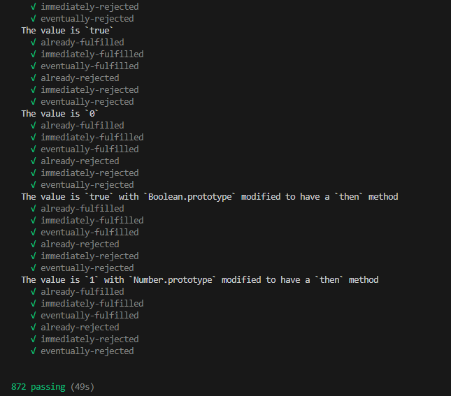

## 1、什么是 promise？
`Promise` 译为 “承诺”，是 JavaScript 中用于处理异步操作的解决方案。它代表一个异步操作的最终完成（或失败）及其结果值。

## 2、Promise 的特点

**特点一：Promise 有三种状态。**
- `pending`：等待态，promise的初始状态
- `fulfilled`：成功态，promise调用`resolve`函数后即会从`pending等待态`变为`fulfilled成功态`。
- `rejected`：失败态：promise调用`reject`函数后即会从`pending等待态`变为`rejected失败态`

**特点二：Promise 状态不可逆。**
- promise的状态一旦发生变更，便无法再更改。比如调用`resolve`从`pending`变为`fulfilled`,它的状态就永远是`fulfilled`了，再调用reject也无法从`fulfilled`变成`rejected`。
- 并且状态只能从`pending` 变为`fulfilled`或`rejected`，不能从`fulfilled`或`rejected`返回到`pending`，这个也很好理解，状态只能前进不能倒退。

**特点三：支持链式调用。**
- 通过 `.then()`、`.catch()`、`.finally()` 等方法进行链式调用。

## 3、Promise 手写流程

先看用法：
```js
const p = new Promise((resolve, reject) => {
    resolve(111);
})
p.then((value) => {
    console.log(value)
}, (error) => {
    console.log(error)
})
```
首先，`Promise`肯定是一个类，所以我们才可以`new`它，然后`Promise实例化`的时候给它传入一个回调我们叫它`executor`方法，Promise内部会`立即调用`这个`executor方法`，并且会传入`resolve`和`reject`两个函数作为调用参数，另外在Promise类的原型上应该提供一个`then`方法，它里面可以传入两个回调，分别为`Promise成功的回调`和`Promise失败的回调`。调用`resolve`后会走入`成功的回调中`，调用`reject`后会走入`失败的回调中`。

### 3.1 版本一：搭建整体架子

```js
const PENDING = 'pending'
const FULFILLED = 'fulfilled'
const REJECTED = 'rejected'

class Promise {
    constructor(executor) {
        this.value = undefined
        this.reason = undefined
        this.status = PENDING
        
        const resolve = (value) => {
            if (this.status === PENDING) {
                this.value = value
                this.status = FULFILLED
            }
        }
        const reject = (reason) => {
            if (this.status === PENDING) {
                this.reason = reason
                this.status = REJECTED
            }
        }
        executor(resolve, reject);
    }
    then(onFulfilled, onRejected) {
       if (this.status === FULFILLED) {
        onFulfilled && onFulfilled(this.value)
       }
       if (this.status === REJECTED) {
        onRejected && onRejected(this.reason)
       }
    }
}

module.exports = Promise;
```

### 3.2 版本二：支持异步的 resolve 或者 reject 
如果是异步调用 resolve 或者 reject ，那么上面 `onFulfilled` 和 `onRejected` 将无法执行了。

```js
const p = new Promise((resolve, reject) => {
    setTimeout(() => {
      resolve(111);
    }, 1000)
})
p.then((value) => {
    console.log(value)
}, (error) => {
    console.log(error)
})
```

所以我们需用两个数组充当队列把 `then` 里边的回调存起来。
```js

class Promise {
    constructor(executor) {
        // ...
        // 定义两个数组
        this.onResolvedCallbacks = [];
        this.onRejectedCallbacks = [];
        const resolve = (value) => {
            if (this.status === PENDING) {
                this.value = value
                this.status = FULFILLED
                this.onResolvedCallbacks.forEach(fn => fn())
            }
        }
        const reject = (reason) => {
            if (this.status === PENDING) {
                this.reason = reason
                this.status = REJECTED
                this.onRejectedCallbacks.forEach(fn => fn())
            }
        }
        // 默认执行executor函数，并传入resolve和reject函数
        executor(resolve, reject)
    }
    then(onFulfilled, onRejected) {
       if (this.status === FULFILLED) {
        onFulfilled && onFulfilled(this.value)
       }
       if (this.status === REJECTED) {
        onRejected && onRejected(this.reason)
       }
       if (this.status === PENDING) {
        this.onResolvedCallbacks.push(() => {
            onFulfilled(this.value)
        })
        this.onRejectedCallbacks.push(() => {
            onRejected(this.reason)
        })
       }
    }
}
```
这里定义了两个数组`onResolvedCallbacks`和`onRejectedCallbacks`分别存储 then 里面`成功的回调`和`失败的回调`，然后再调用`resolve`和`reject`时分别循环执行这两个数组里存储的回调函数。

### 3.3 版本三：支持 Promise 链式调用
比如：下面这段代码：
```js
const p = new Promise((resolve, reject) => {
   setTimeout(() => {
    resolve(111)
   }, 1000)
})
p.then((value1) => {
    console.log('value1', value1)
    return 222
}, (error1) => {
    console.log('error1', error1)
}).then((value2) => {
    console.log('value2', value2)

}, (error2) => {
    console.log('error2', error2)
})

```
它的打印结果为：


这个是如何实现的呢？

这个其实也简单，它内部调用`then`方法时，返回了一个新的`promise`，并让这个新的`promise`接管了它下一个`then`方法。
> 注意：这里不能返回`this`，这样会导致多个`then`方法全部受同一个`promise`控制。
```js
class Promise {
    // ...
    then(onFulfilled, onRejected) {
       const promise2 = new Promise((resolve, reject) => {
        if (this.status === FULFILLED) {
            // onFulfilled方法可能返回值或者promise
            const x = onFulfilled(this.value)
            resolvePromise(promise2, x, resolve, reject)
           }
           if (this.status === REJECTED) {
            // onRejected方法可能返回值或者promise
            const x = onRejected(this.reason)
            resolvePromise(promise2, x, resolve, reject)
           }
           if (this.status === PENDING) {
            this.onResolvedCallbacks.push(() => {
                const x = onFulfilled(this.value)
                resolvePromise(promise2, x, resolve, reject)
            })
            this.onRejectedCallbacks.push(() => {
                const x = onRejected(this.reason)
                resolvePromise(promise2, x, resolve, reject)
            })
           }
       })
       return promise2
    }
}

```
最核心的就是`resolvePromise`，来看下它做了什么：

```js
function resolvePromise(promise2, x, resolve, reject) {
    if (promise2 === x) {
        return reject(new TypeError('UnhandledPromiseRejectionWarning: TypeError: Chaining cycle detected for promise #<Promise>'))
    }
    let called
    // 判断x的类型 x是对象或函数才有可能是一个promise
    if (typeof x === 'object' && x !== null || typeof x === 'function') {
        try {
            const then = x.then
            if (typeof then === 'function') {
                // 只能认为它是一个promise
                then.call(x, (y) => {
                    if (called) return
                    called = true
                    resolvePromise(promise2, y, resolve, reject)
                }, (r) => {
                    if (called) return
                    called = true
                    reject(r)
                })
            }else {
                resolve(x)
            }
        } catch (e) {
            if (called) return
            called = true
            reject(e)
        }
    } else {
        resolve(x)
    }
}
```
1. 首先，先判断新返回的一个promise`promise2`是不是等于`x`，抛出错误`UnhandledPromiseRejectionWarning: TypeError: Chaining cycle detected for promise #<Promise>`，这一步是防止内部的循环引用。
2. 声明一个变量`called`，相当于加了一把锁，让`promise`只能调用一次成功或者失败回调，防止死循环。
3. 解析x，如果它的类型是`object`并且不为`null`，或者它是一个`函数`，并且它有`then`方法，我们认为这是一个`promise`
4. 递归解析，`then`里面再次调用`resolvePromise`


### 3.4 版本四：模拟异步微任务
因为`promise`在`EventLoop`里面是个微任务，不过我们可以简单通过`setTimeout`模拟。

然后我们再加上一些报错的捕获代码以及一些参数的兼容代码，以及实现`catch`方法。

```js
class Promise {
    constructor(executor) {
        // ...
        // 这里增加try catch
        try {
            executor(resolve, reject)
        } catch (e) {
            reject(e)
        }
    }
    then(onFulfilled, onRejected) {
        // 这里兼容下 onFulfilled 和 onRejected 的传参
        onFulfilled = typeof onFulfilled === 'function' ? onFulfilled : v => v
        onRejected = typeof onRejected === 'function' ? onRejected : err => {
            throw err
        }
        const promise2 = new Promise((resolve, reject) => {
            if (this.status === FULFILLED) {
                // 用 setTimeout 模拟异步
                setTimeout(() => {
                    try {
                        const x = onFulfilled(this.value)
                        resolvePromise(promise2, x, resolve, reject)
                    } catch (e) {
                        reject(e)
                    }
                }, 0)


            }
            if (this.status === REJECTED) {
                // 用 setTimeout 模拟异步
                setTimeout(() => {
                    try {
                        const x = onRejected(this.reason)
                        resolvePromise(promise2, x, resolve, reject)
                    } catch (e) {
                        reject(e)
                    }
                }, 0)
            }
            if (this.status === PENDING) {
                this.onResolvedCallbacks.push(() => {
                    // 用 setTimeout 模拟异步
                    setTimeout(() => {
                        try {
                            const x = onFulfilled(this.value)
                            resolvePromise(promise2, x, resolve, reject)
                        } catch (e) {
                            reject(e)
                        }
                    }, 0)
                })
                this.onRejectedCallbacks.push(() => {
                    // 用 setTimeout 模拟异步
                    setTimeout(() => {
                        try {
                            const x = onRejected(this.reason)
                            resolvePromise(promise2, x, resolve, reject)
                        } catch (e) {
                            reject(e)
                        }
                    }, 0)


                })
            }
        })

        return promise2
    }
    // catch函数实际上里面就是调用了then方法
    catch (errCallback) {
        return this.then(null, errCallback)
    }
}

```
1. `executor`执行时增加`try catch`，防止执行用户传入的函数直接就报错了，这时我们应该直接`reject` promise。
2. 调用`onFulfilled`和`onRejected`时，需要包裹`setTimeout`。
3. `catch`函数实际上里面就是调用了`then`方法，然后第一个参数传`null`。

ok，这样就写的差不多了。最后我们来测试下我们写的`promise`是否符合规范。

## 4、测试 promise，使其符合 Promises/A+ 规范

`promise`是有规范的，即[Promises/A+](https://promisesaplus.com/)，我们可以跑一段脚本测试写的`promise`是否符合规范。

首先，需要在我们的`promise`增加如下代码：
```js
// 测试脚本
Promise.defer = Promise.deferred = function () {
    let dfd = {}
    dfd.promise = new Promise((resolve, reject) => {
        dfd.resolve = resolve
        dfd.reject = reject
    })
    return dfd
}
```
然后安装`promises-aplus-tests`包，比如用npm可以使用命令`npm install -g promises-aplus-tests`安装到全局，然后使用命令`promises-aplus-tests 文件名`即可进行测试，里面有`872`测试用例，全部通过即可以认为这是一个标准的`promise`。



测试全部通过，大功告成了！


