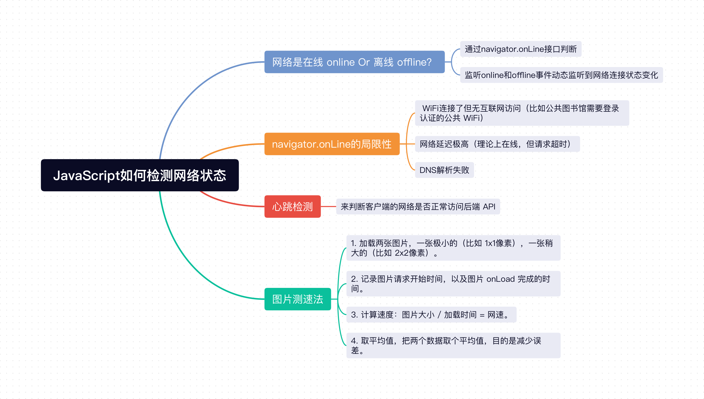
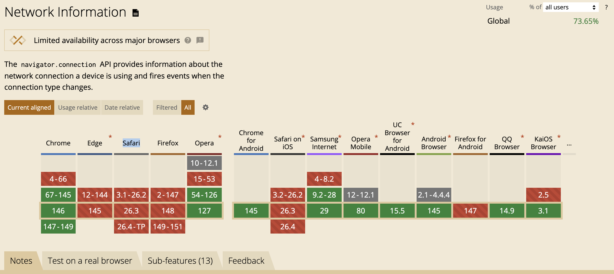

在实际开发项目中，有时候需要拿到用户网络状态，然后根据用户的网络情况进行优化。常见的网络状态有离线 offline、WiFi、2G/3G、4G、5G 等，但在实际开发中，我们一般会划分成断网、弱网、强网三个等级，并针对等级进行优化。比如在视频播放时，可以根据不同网络情况给用户分别默认播放不同清晰度的视频（高清、标清、流畅等）。

那么 JavaScript 中如何检测用户网络状态呢？



## 1、网络状态：在线 online Or 离线 offline？

HTML5 规范提供了 `navigator.onLine` 来拿到浏览器的在线状态。该属性返回一个布尔值，`true` 表示在线，`false` 表示离线。同时提供了 `online` 和 `offline` 事件，通过监听这两个事件，可以动态监听到网络连接状态变化。

```js
// 监听网络连接状态
window.addEventListener('online', () => {
  console.log('网络已连接');
  // 触发数据同步...
});

window.addEventListener('offline', () => {
  console.log('网络已断开');
  // 进入离线模式...
});

// 实时获取当前状态
console.log('当前网络状态:', navigator.onLine ? '在线' : '离线');
```

但是 `navigator.onLine` 有一定的局限性，比如在某些情况下，网络是连接的，它也返回 `true` 了，但实际上无法访问你的后端 API：
- WiFi连接了但无互联网访问（比如公共图书馆需要登录认证的公共 WiFi）。
- 网络延迟极高（理论上在线，但请求超时）。
- DNS解析失败。

我们需要更加准确的判断用户此刻是否网络能正常访问服务端，这就需要做**心跳检测**。

## 2、心跳检测

顾名思义，心跳检测就像人的心跳一样，每隔一段时间跳动一下，告诉外界"我还活着"。它是一种用于判断连接对端（如服务器或客户端）是否存活的机制。它常常用于 `WebSocket` 连接，用来解决非正常关闭造成的"死连接"问题。我们这里可以借用它检测客户端“是否存活”的能力，来判断客户端的网络是否正常访问后端 API。

**心跳检测客户端代码：**
```js
// client.js
class NetworkMonitor {
  constructor(options = {}) {
    this.options = {
      pingUrl: '/api/ping',        // 心跳检测接口
      interval: 30000,              // 30秒检测一次
      timeout: 5000,                 // 5秒超时
      onStatusChange: null,          // 状态变化回调
      ...options
    };
    
    this.isOnline = navigator.onLine;  // 当前网络状态
    this.checking = false;              // 是否正在检测
    this.timer = null;                  // 定时器
    this.consecutiveFailures = 0;       // 连续失败次数
    this.maxFailures = 2;                // 最大允许失败次数
    
    this.init();
  }
  
  init() {
    // 监听浏览器原生事件
    window.addEventListener('online', () => this.handleBrowserOnline());
    window.addEventListener('offline', () => this.handleBrowserOffline());
    
    // 启动心跳检测
    this.startHeartbeat();
  }
  
  startHeartbeat() {
    this.stopHeartbeat();
    this.timer = setInterval(() => this.checkNetwork(), this.options.interval);
    // 立即执行一次
    this.checkNetwork();
  }
  
  stopHeartbeat() {
    if (this.timer) {
      clearInterval(this.timer);
      this.timer = null;
    }
  }
  
  async checkNetwork() {
    if (this.checking) return;
    
    this.checking = true;
    const startTime = Date.now();
    
    try {
      // 使用fetch发起一个轻量级请求
      const response = await fetch(this.options.pingUrl, {
        method: 'HEAD',  // 只获取头部，减少数据传输
        mode: 'no-cors', // 如果跨域且无需读取响应
        cache: 'no-cache',
        headers: {
          'X-Network-Check': 'ping'
        }
      });
      
      // 请求成功
      this.handleSuccess();
      
    } catch (error) {
      // 请求失败（超时、网络错误等）
      this.handleFailure();
    } finally {
      this.checking = false;
    }
  }
  
  handleSuccess() {
    // 重置失败计数
    this.consecutiveFailures = 0;
    
    // 如果之前是离线，现在变为在线
    if (!this.isOnline) {
      this.setOnlineStatus(true);
    }
  }
  
  handleFailure() {
    this.consecutiveFailures++;
    
    // 连续失败达到阈值，判定为离线
    if (this.consecutiveFailures >= this.maxFailures && this.isOnline) {
      this.setOnlineStatus(false);
    }
  }
  
  handleBrowserOnline() {
    // 浏览器说在线了，但我们仍需验证真正的API可达性
    console.log('浏览器报告网络已连接，开始验证...');
    this.checkNetwork();
  }
  
  handleBrowserOffline() {
    // 浏览器明确说离线，直接更新状态
    this.setOnlineStatus(false);
  }
  
  setOnlineStatus(status) {
    if (this.isOnline !== status) {
      this.isOnline = status;
      
      console.log(`网络状态变更为: ${status ? '在线' : '离线'}`);
      
      // 触发回调
      if (this.options.onStatusChange) {
        this.options.onStatusChange(status);
      }
      
      // 触发自定义事件，方便其他地方监听
      window.dispatchEvent(new CustomEvent('network-status-change', {
        detail: { isOnline: status }
      }));
    }
  }
  
  // 手动触发一次检测
  async checkNow() {
    return this.checkNetwork();
  }
  
  // 销毁
  destroy() {
    this.stopHeartbeat();
    window.removeEventListener('online', this.handleBrowserOnline);
    window.removeEventListener('offline', this.handleBrowserOffline);
  }
}

// 使用示例
const monitor = new NetworkMonitor({
  pingUrl: 'https://your-api.com/api/ping',
  interval: 15000,  // 15秒检测一次
  timeout: 3000,
  onStatusChange: (isOnline) => {
    if (isOnline) {
      // 网络恢复，触发数据同步
      syncWithServer();
      showToast('网络已恢复，正在同步数据...');
    } else {
      // 网络断开，进入离线模式
      enableOfflineMode();
      showToast('网络已断开，进入离线模式');
    }
  }
});
```
**心跳检测服务端代码：**
```js
// server.js
const express = require('express');
const app = express();
const port = 3000;

// 心跳检测接口
app.head('/api/ping', (req, res) => {
  // 可选：记录心跳日志
  console.log(`[${new Date().toISOString()}] 收到心跳检测请求 from ${req.ip}`);
  
  // 可选：检查自定义头
  if (req.headers['x-network-check'] === 'ping') {
    console.log('网络健康检查请求');
  }
  
  // 只需返回 200 状态码即可
  res.status(200).end();
});

// 如果需要 GET 也支持（某些场景可能需要）
app.get('/api/ping', (req, res) => {
  // 可以返回一些轻量级数据
  res.json({ 
    status: 'ok', 
    timestamp: Date.now(),
    message: 'success' 
  });
});

// 启动服务器
app.listen(port, () => {
  console.log(`网络监控服务运行在 http://localhost:${port}`);
});
```

## 3、网速检测

### 3.1 navigator.connection

HTML5 规范提供了 `navigator.connection` 可以获取网络类型 `effectiveType` 和网络下行速度 `downlink`。

```js
console.log("网络状态：" + navigator.connection.effectiveType); // 比如：4g/3g/2g
console.log("网络下行速度：" + navigator.connection.downlink  + "MB/S"); // 比如：10MB/S
```

但 `navigator.connection` 存在两个问题，第一个是**兼容性很差**，像 `Edge`、`Firefox`、`Safari` 这种主流浏览器都不支持。



第二个是**数据不准确**，与一些测速器的结果有一定的偏差。基于这两个问题，实际项目中不会采用 `navigator.connection` 方案。

### 3.2 图片测速法

图片测速法就是通过客户端加载图片，拿到图片大小和加载时间，进而算出用户的网速，其具体步骤如下：
1. 加载两张图片，一张极小的（比如 1x1像素），一张稍大的（比如 2x2像素）。
2. 记录图片请求开始时间，以及图片 `onLoad` 完成的时间。
3. 计算速度：`图片大小 / 加载时间 = 网速`。
4. 取平均值，把两个数据取个平均值，目的是减少误差。

## 小结
1. 浏览器可以通过 `navigator.onLine` 接口拿到浏览器的在线状态，并通过监听 `online` 和 `offline` 事件监听网络变化。
2. 由于 `navigator.onLine` 存在一定的局限性，比如无法识别到 WiFi 连接了但无互联网访问、网络延迟极高、DNS 解析失败等情况，我们还需要通过**心跳检测**方案来判断客户端是否能正常访问后端 API。
3. `navigator.connection` 虽然能拿到用户的网络下行速度 `downlink`，但 `connection` 接口存在兼容性和数据不准的问题，所以我们需要用**图片测速法**来更加准确地拿到用户网速情况。
