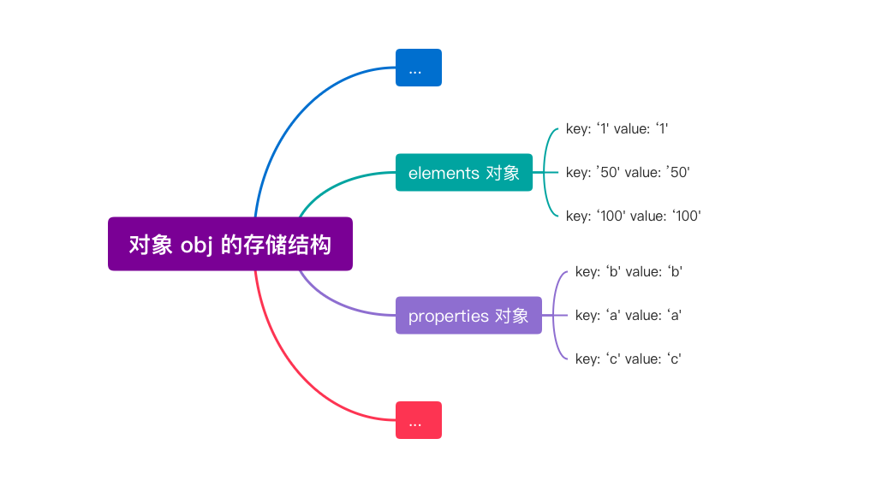
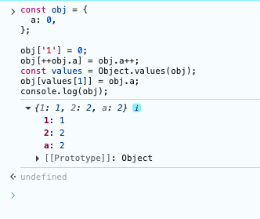

<!-- 从一道前端代码输出面试题---谈 JS 对象属性存储特点和运算符的执行顺序 -->

## 本文大纲


今天来看一道前端面试的代码输出题。

面试官提供了一段 `Javascript` 代码，要求给出这段代码运行后的输出结果。

```js
const obj = {
  a: 0,
};

obj['1'] = 0;
obj[++obj.a] = obj.a++;
const values = Object.values(obj);
obj[values[1]] = obj.a;
console.log(obj);

```

先分析这道题前，先补充两个个前置知识点。

## 知识点一：对象的常规属性 (properties) 和排序属性 (elements)
先来看下面一段代码：

```js
const obj = {};
obj['b'] = 'b'
obj[100] = '100';
obj[1] = '1';
obj['a'] = 'a';
obj[50] = '50';
obj['c'] = 'c';

for (const key in obj){ 
  console.log(`key: ${key} value: ${obj[key]}`)
}
/**
 * 打印结果如下：
  key: 1 value: 1
  key: 50 value: 50
  key: 100 value: 100
  key: b value: b
  key: a value: a
  key: c value: c
 */
```

观察下打印的数据，很明显属性的设置顺序并不是打印的顺序，比如 `b` 属性是第一个设置的，打印结果却排在 `100` 后面，仔细分析他们的打印规律，可以得到如下特点：
1. 数字类的属性不管设置的顺序先后，都会被优先打印，而且是按照从小到大的升序进行打印的。
2. 字符类属性会按照设置的顺序进行打印，上面我们是按照 `b`、`a`、`c` 的顺序进行设置的，打印顺序也是如此。

为什么会出现这样的结果呢？

这是因为 ECMAScript 规范中定义了**数字属性应该按照索引值大小升序排列，字符串属性根据创建时的顺序升序排列**。在 `V8` 中数字属性被称为 `elements`，字符串属性被称为 `properties`。之所以这样设置，主要是为了提升访问性能。`elements` 对象中会按照顺序存放数字属性，类似于数组的存储，这样查询的效率当然就很高了。



## 知识点二：JavaScript 运算符的执行顺序

`JavaScript` 中最常见运算符如下（**运算顺序从高到低排列**）：
- 对象属性访问，比如 `obj.a`，`obj['a']`。
- 递增/递减，比如 `a++`(后置递增) 或 `++a`（前置递增）。
- 算术，比如 `a + 1`。
- 比较，包括 `<`(小于)、`>`(大于)、`<=`(小于等于)、`>=`(大于等于)，比如 `a > 3`。
- 相等，包括 `==` 粗略相等， `===`严格相等，`!==` 粗略不等，`!==` 严格不等，比如 `a == 1`。
- 逻辑，也就是与或非，`&`(与)、`|`(或)、`!`(非)，比如 `a && b`。
- 三元，比如 `flag ? '1' : '0'`。
- 赋值，比如 `a = 1`。


对于单个赋值语句 `LHS = RHS` 的求值，根据 `ECMAScript` 规范（`ECMA-262, AssignmentExpression evaluation`），对于 `LeftHandSideExpression = AssignmentExpression`，其计算顺序如下：
- 第一步，先得到一个 `引用（Reference）`，即“要写入的位置”，也就是 `Evaluate LeftHandSideExpression`。
- 第二步，再计算右侧的值，`Evaluate AssignmentExpression`。
- 最后将第二步得到的值写入第一步的引用当中。

也就是说，对于`LHS = RHS` 这样的赋值表达式，其计算顺序是左侧先求值（为了知道写到哪），右侧后求值（为了知道写什么），最后将右侧的值写入左侧。

>📌 注意：这里说的“左侧求值”不是求它的值，而是求它的“位置”（比如属性名、变量名等）。例如对于 `obj[++obj.a]`，要确定属性名，就必须先执行 `++obj.a`。


写个简单例子：

```js
const obj = {
  get a() {
    console.log('获取 a 的值');
    return 1;
  },
  get b() {
    console.log('获取 b 的值');
    return 2;
  }
}
obj[++obj.a] = obj.b++;
console.log('obj: ', obj);

```

我们前面说过，运算符顺序是**对象属性访问 > 递增/递减 > 赋值**，对于赋值运算符 `LHS = RHS`，会先求出左侧 `LHS` 的`引用（Reference）`，再计算右侧 `RHS` 的值，最后将右侧的值赋值给左侧的引用。所以用这个逻辑来分析下这段代码的执行顺序：
- 第一步，先取 `obj.a` 的值， 取到的值为 `1`， 然后执行前置递增 `++obj.a`，结果为 `2`，然后程序就知道要往 `obj` 的 `2` 属性上赋值了。
- 第二步，然后再取 `obj.b` 的值，执行后置递增 `obj.b++`，右侧计算的值为 `2`。
- 最后把右侧计算的结果值 `2` 赋值给 `obj[2]` 属性。


## 逐行分析代码执行过程

了解了这两个知识点后，让我们来逐行解析下这段代码。

```js

const obj = {
  a: 0,
};

obj['1'] = 0;
obj[++obj.a] = obj.a++;
const values = Object.values(obj);
obj[values[1]] = obj.a;
console.log(obj);

```

1. 首先，我们定义了一个对象 `obj`，它有一个属性 `a`，值为 `0`。

```js
const obj = {
  a: 0,
};
```

2. 接下来，我们给 `obj` 添加了一个属性 `1`，值为 `0`，此时对象中有两个属性，`a` 和 `1`。

```js
obj['1'] = 0;
```

由于数字属性会排在前面，此时 `obj` 的值为：
```json
{
  "1": 0,
  "a": 0,
}
```

3. 然后会执行 `obj[++obj.a] = obj.a++`，前面我们分析过运算符的优先级，先执行左侧 `++obj.a` 得到 `1`，然后执行右侧 `obj.a++`, 由于是后置递增，所以右侧的值为 `1`，执行赋值后，`obj` 的值为：

```json
{
  "1": 1,
  "a": 2,
}
```

4. 经过 `Object.values(obj)` 后，`values` 的值为 `[1, 2]`。
5. 执行 `obj[values[1]] = obj.a` ，转换后就是 `obj[2] = 2`。`obj` 的值变为：
```json
{
  "1": 1,
  "2": 2,
  "a": 2,
}
```

**这就是最终的输出结果了。**



## 小结


该题主要考察两个知识点：
1. 在 `JavaScript` 对象中，属性的设置顺序并不一定是循环打印顺序，在 `V8`中，数字类的属性在被称为 `elements`（按从小到大排列存储），字符类属性被称为 `properties`（按添加顺序存储）。
2. `JavaScript` 运算符的运算顺序是**对象属性访问 > 递增/递减 > 赋值**，对于赋值运算符 `LHS = RHS`，会先求出左侧 `LHS` 的`引用（Reference）`，再计算右侧 `RHS` 的值，最后将右侧的值赋值给左侧的引用。