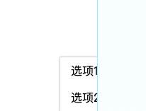

## 一、右键菜单是什么

所谓右键菜单，就是指我们在浏览器页面中，点击`鼠标右键`后弹出来的包含一系列功能键的组合框。

## 二、核心代码

核心就是监听 `contextmenu` 事件。

最最核心的代码如下：
```js
document.addEventListener('contextmenu', function (e) {
  e.preventDefault(); // 阻止默认的右键菜单弹出
  showMyMenu(e); // 显示自定义菜单
})
```

## 三、Web Component
`什么是 Web Component？`

`Web Component`是一项 `W3C` 制定的原生技术，它允许开发者定义可重用的**自定义HTML元素**。

简单来说，它可以帮我们自定义一个标签，然后可以**像使用普通标签一样在HTML中使用它，并且可以给它添加样式和事件**。

要使用`Web Component`，分为3步：

1. 在html中定义一个模版

```html
<template id="user-card-template">
  <style>
    .card {
      border: 1px solid #ddd;
      padding: 24px;
      margin: 12px;
      border-radius: 12px;
    }
  </style>
  <div class="card">
    <h2><slot name="name">默认名称</slot></h2>
    <p><slot name="address">默认地址</slot></p>
  </div>
</template>
```

2. 在js中定义自定义元素

```html
<script>
class UserCard extends HTMLElement {
  constructor() {
    super();
    
    // 创建影子DOM
    const shadow = this.attachShadow({ mode: 'open' });
    
    // 获取模板内容
    const template = document.getElementById('user-card-template');
    const templateContent = template.content.cloneNode(true);
    
    // 将模板添加到影子DOM
    shadow.appendChild(templateContent);
  }
}

// 注册自定义元素
customElements.define('user-card', UserCard);
</script>
```

3. 在html中使用自定义元素

```html
<user-card>
  <span slot="name">小张</span>
  <span slot="address">中国</span>
</user-card>
```

`Web Component`有以下优势：
1. 样式隔离：`Shadow DOM` 可以天然实现样式隔离，相当于`vue`的`scoped`
2. 跨框架：纯原生js实现，可以与任何框架或纯 JavaScript 一起使用
3. 无额外依赖：浏览器原生支持的标准，不需要额外库

`Web Component`的缺点：
1. 浏览器兼容性问题，旧版浏览器兼容差
2. `Shadow DOM`的样式隔离是把双刃剑，外部样式难以穿透到`Shadow DOM`中，，没有`vue`、`react`的样式隔离方案强大。
3. 某些搜索引擎爬虫可能无法正确处理 `Shadow DOM` 中的内容，导致`SEO`变差。

## 四、配合 Web Component 封装一个跨框架的右键菜单

之前说过 `Web Component`一大优势就是**跨框架**，既可以在原生js中使用，也可以在`vue`、`react`等框架中使用，如果公司项目使用的技术比较杂，不想用多个技术重复封装，又能接受`Web Component`的缺点，就可以考虑用`Web Component`进行开发。

`html`和`css`部分：
```html
<style>
  #customContextMenu {
    display: none;
    position: absolute;
    background: var(--menu-bg, #fff);
    border: 1px solid #ccc;
    box-shadow: 2px 2px 5px rgba(0, 0, 0, 0.2);
    z-index: 100;
  }
  #customContextMenu ul {
    list-style: none;
    margin: 0;
    padding: 0;
  }
  #customContextMenu li {
    width: 72px;
    padding: 8px 15px;
    box-sizing: border-box;
    cursor: pointer;
  }
  #customContextMenu li:hover {
    background: var(--li-bg, #f0f0f0);
  }
</style>
<script type="text/html">
  <ul>
    <li onclick="alert('选项1被点击')">选项1</li>
    <li onclick="alert('选项2被点击')">选项2</li>
    <li onclick="alert('选项3被点击')">选项3</li>
  </ul>
</script>
```

- 这里我用了两个`css变量`方便后续修改，`--menu-bg`是菜单背景色，`--li-bg`是菜单项的背景色。
- 用`<script type="text/html">`标签来抽离模版。

js部分：
```js
class CustomMenu extends HTMLElement {
  constructor() {
    super()
    this.attachShadow({ mode: 'open' });
    this.createCSS();
    this.createHTML();
    document.addEventListener('contextmenu', e => {
      e.preventDefault()
      this.container.style.display = 'block';
      this.container.style.left = `${e.pageX}px`;
      this.container.style.top = `${e.pageY}px`;
    })

    document.addEventListener('click', e => {
      this.container.style.display = 'none';
    })
  }
  createHTML() {
    const script = document.querySelector('script[type="text/html"]');
    const container = document.createElement('div');
    container.setAttribute('id', 'customContextMenu');
    container.innerHTML = script.innerHTML;
    this.container = container;
    this.shadowRoot.appendChild(container);
  }
  createCSS() {
    const style = document.querySelector('style');
    const variableStyle = document.createElement('style');
    const bg = '#f0f0f0';
    const menuBg = '#fff';
    variableStyle.innerHTML = `
      #customContextMenu {
        --menu-bg: ${menuBg};
        --li-bg: ${bg};
      }
    `;
    this.shadowRoot.appendChild(style)
    this.shadowRoot.appendChild(variableStyle)
  }
}

customElements.define('custom-menu', CustomMenu);
```

**加上边界限制:**

右键菜单在浏览器窗口的`右侧`和`底部`边界时打开时，会超出窗口，导致右键菜单的一部分在视口外看不到了，所以需要加上边界限制。



这个是模拟右键菜单在视口右下角的出现情况，右侧蓝色的线及之后是浏览器控制台。

具体修改代码如下：

```diff
document.addEventListener('contextmenu', e => {
    e.preventDefault()
    this.container.style.display = 'block';
    this.container.style.left = `${e.pageX}px`;
    this.container.style.top = `${e.pageY}px`;

+   const { width, height } = this.container.getBoundingClientRect();
+   if (e.clientY + height > document.documentElement.clientHeight) {
+     console.log('纵向超出了');
+     this.container.style.top = document.documentElement.clientHeight - height + 'px';
+   }
+   if (e.clientX + width > document.documentElement.clientWidth) {
+     console.log('横向超出了');
+     this.container.style.left = document.documentElement.clientWidth - width + 'px';
+   }
})
```

## 五、指定某个范围内的右键菜单

一般是在某些区域内进行自定义的右键菜单，比如画板、表格等区域。

```html
<style>
  #draw {
    width: 200px;
    height: 200px;
    border: 1px solid #ccc;
  }
</style>
<div id="draw">
  画板
</div>

<script>
  draw.addEventListener("contextmenu", (e) => {
    e.preventDefault();
    openCustomMenu(e); // 打开自定义右键菜单
  });
</script>
```

## 六、小结
本文主要介绍用`Web Component`封装一个自定义右键菜单，核心点如下：
- 监听`contextmenu`事件，阻止默认行为，打开自定义菜单；
- 用`<script type="text/html">`抽离模板，用`css变量`封装；
- 菜单在最底部和最右侧出现会被遮挡，需要处理边界；
- 需要指定某个范围才出现右键菜单，只需要拿到对应的容器元素监听`contextmenu`事件即可。
