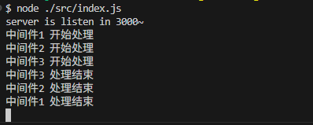
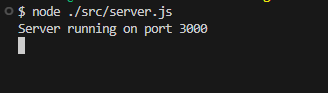

## 1、koa 是什么？

用 `Koa` 官方的话来说就是，**Koa是基于Node.js平台的下一代web开发框架。**
## 2、koa 的作用
作为一个 `nodejs` 服务器给 `web` 提供服务。

## 3、 koa 的使用
### 3.1 安装 Koa
```
npm init -y
npm i koa
```
> 注意：使用 Koa 时 nodejs 版本需大于 `v7.6.0`，不然无法支持 Es6 的 `async await` 语法

### 3.2 使用
新建一个文件**src/index.js**：

```js
const Koa = require('koa')
const app = new Koa()

app.listen(3000, () => {
    console.log('server is listen in 3000~')
})

```
- Koa是一个**类**，使用的时候需要创建一个实例，然后通过调用实例上的**listen**方法监听一个端口。
- 然后使用`node src/index.js`启动服务器，控制台会打印出 `server is listen in 3000~`。
- 可通过`http://localhost:3000/`来访问服务器，此时页面上会显示`Not Found`，因为此时我们没做任何的处理。

## 4、koa的核心概念

### 4.1. Context（上下文）

Koa 将 nodejs 服务器原生的 `request` 和 `response` 封装在了 `Context` 上下文对象中。
```js
app.use(async ctx => {
    ctx; // koa的上下文对象
    ctx.request; // koa封装的请求对象
    ctx.response; // koa封装的响应对象
})
```
### 4.2. 中间件
```js
app.use(async (ctx, next) => {
    // 返回 hello world 作为页面的显示内容
    ctx.body = 'Hello World';
})
```
**中间件**顾名思义就是一个中间的处理单元，其中 `app` 是 `Koa` 的一个实例，先调用 `app.use` 注册一个 `Koa` 的中间件，然后在回调函数有两个参数，通过 `ctx` 可以拿到请求的上下文信息，处理完后调用`next`接着往下执行，中间件可以使用多个，执行顺序按注册顺序的先后执行。

**多个中间件的使用**：
```js
const Koa = require('koa')
const app = new Koa()

app.use(async (ctx, next) => {
    console.log('中间件1 开始处理')
    await next()
    console.log('中间件1 处理结束')
})
app.use(async (ctx, next) => {
    console.log('中间件2 开始处理')
    await next()
    console.log('中间件2 处理结束')
})
app.use(async (ctx, next) => {
    console.log('中间件3 开始处理')
    await next()
    console.log('中间件3 处理结束')
})
app.listen(3000, () => {
    console.log('server is listen in 3000~')
})

```
打印结果如下：



这个就是著名的**洋葱模型**，一层一层往里执行，先执行的后结束。
## 5、使用 koa-generator 快速搭建项目

如果是需要开发一个完整的服务端项目，可以用 `koa` 的脚手架 `koa-generator`（类似于 vue 的 `vue-cli`， react 的 `create-react-app`） 来快速生成一个项目。
```js
// 先全局安装 koa-generator
npm i koa-generator -g
// 使用 koa2 命令 + 项目名来创建一个项目
koa2 koa-example
```

# 6、实战
下面使用 `koa` 简单实现一个登录功能。

**客户端代码如下**：
```html
<!-- 创建 login.html 文件 -->
<!DOCTYPE html>
<html lang="en">

<head>
    <meta charset="UTF-8">
    <meta name="viewport" content="width=device-width, initial-scale=1.0">
    <title>Login Form</title>
</head>

<body>
    <h1>Login Form</h1>
    <form id="login-form">
        <div>
            <label for="username">Username:</label>
            <input type="text" id="username" name="username" required>
        </div>
        <div>
            <label for="password">Password:</label>
            <input type="password" id="password" name="password" required>
        </div>
        <div>
            <button type="submit">Login</button>
        </div>
    </form>
    <div id="message"></div>

    <script>
        const loginForm = document.querySelector('#login-form');
        const usernameInput = document.querySelector('#username');
        const passwordInput = document.querySelector('#password');
        const messageElement = document.querySelector('#message');

        // 监听提交事件
        loginForm.addEventListener('submit', async (event) => {
            event.preventDefault();

            // 获取用户名和密码
            const username = usernameInput.value;
            const password = passwordInput.value;

            // 发送登录请求
            const response = await fetch('http://localhost:3000/login', {
                method: 'POST',
                headers: {
                    'Content-Type': 'application/json'
                },
                body: JSON.stringify({
                    username,
                    password
                })
            });

            // 处理响应
            if (response.ok) {
                const user = await response.json();
                messageElement.textContent = `Welcome, ${user.username}!`;
            } else {
                const error = await response.json();
                messageElement.textContent = error.message;
            }
        });
    </script>
</body>

</html>
```
界面如下：


**服务端代码如下**：
```js
// server.js
const Koa = require('koa')
const Router = require('koa-router')
const bodyParser = require('koa-bodyparser')

const app = new Koa()
const router = new Router()

// 添加中间件
app.use(async (ctx, next) => {
    ctx.set('Access-Control-Allow-Origin', '*');
    ctx.set('Access-Control-Allow-Headers', '*');
    await next();
});
app.use(bodyParser());
app.use(router.routes());
app.use(router.allowedMethods());
// 假设这里使用了一个模拟数据库的 users 对象来存储用户信息
const users = {
    'user1': {
      username: 'user1',
      password: 'password1'
    },
    'user2': {
      username: 'user2',
      password: 'password2'
    }
};

router.post('/login', (ctx) => {
    const { username, password } = ctx.request.body
    const user = users[username]
    if (!user) {
        ctx.status = 401
        ctx.body = { message: 'User is Not Found' }
        return;
    }
    if (user.password !== password) {
        ctx.status = 401
        ctx.body = { message: 'Error Password' }
        return;
    }
    ctx.body = { username: user.username }
})

// 启动服务
app.listen(3000, () => {
    console.log('Server running on port 3000');
});
```
# 7、测试应用
我们需要测试三个 `case`：
1. 用户名和密码都错误。
2. 用户名正确，密码错误。
3. 用户名和密码都正确。

先通过在命令行输入 `node ./src/server.js`将服务启动起来。




当然为了方面开发，我们一般会使用 `nodemon` 来替代 `node` 命令来启动服务，`nodemon` 是一个命令行工具，它可以监听本地文件变化，并自动重启服务，实现热更新，对于我们开发非常方便。

**安装 nodemon**：
```bash
npm i nodemon -g
```
**启动服务**：

```bash
nodemon ./src/server.js
```


## case1： 用户名和密码都错误

在页面上输入一个错误的用户名和密码，比如我们输入用户名 `123`，密码 `456`，页面会提示 `User is Not Fount`


## case2： 用户名正确，密码错误

我们输入一个正确的用户名和错误密码，比如用户名 `user1`，密码 `password`，页面会提示`Error Password`


## case3： 用户名和密码都正确 

我们输入一个正确的用户名和密码，比如用户名 `user1`，密码 `password1`，页面会提示`Welcome, user1!`，证明此时已经登录成功了。


当然，这个主要是一个简单的登录模拟，作为学习使用，实际登录场景比这个复杂得多，还要结合`数据库`、`session`和`cookie`以及`token`等很多东西来实现。
