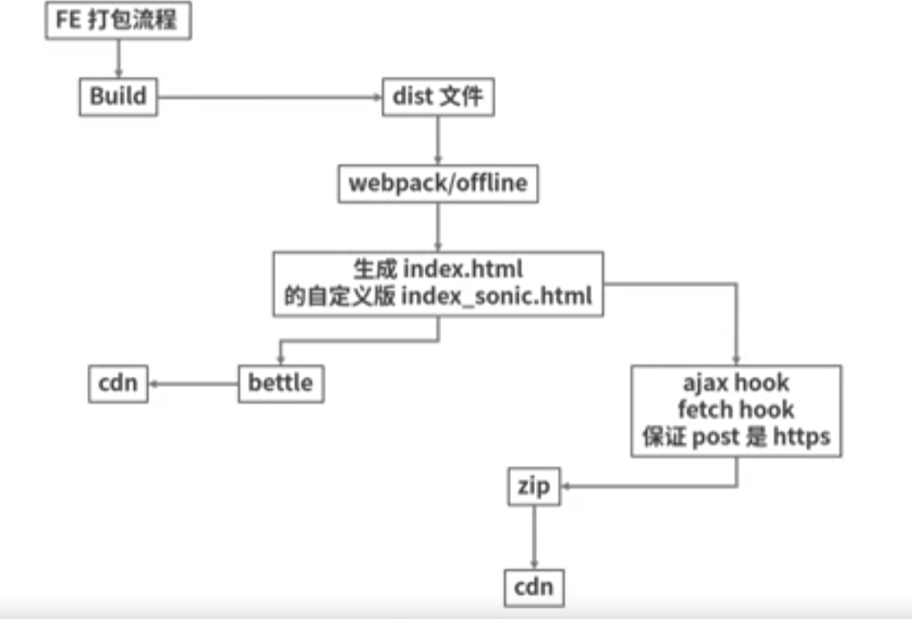

## 引言

上一讲整体介绍了 Hybrid 的性能优化整体分析，简单介绍了离线包、webview、骨架屏、SSR及接口预加载等优化方案。

离线包可以最大程度地摆脱网络环境对 H5 页面的影响。

技术 VP 报了一个手机首页访问时间长的问题，我们详细定位性能平台后给出了一个回复是弱网环境下导致的白屏时间过长。

如果是弱网的问题，为啥淘宝首页还可以打开？

离线包整体实现方案：


1. 先从 gitlab 下载前端工程到本地，通过 CI/CD 将离线包上线。
2. 开发离线包资源管理后台，用的技术包括 Egg.js 和 MongoDB。
3. 将离线包存储到 CDN 上，当用户进入 App 向服务器发起请求时，App 会拦截下来，并根据内置离线配置，请求离线包管理后台，离线包管理后台返回结果，客户端决定是直接使用全量包还是请求差分包，当这部分工作完成后，客户端将请求代理到它内置的离线资源中，返回给用户页面内容。

整个过程包括离线包生成、离线包管理后台、离线包部署及优化三部分。

## 离线包生成

可以把需要离线的资源，通过 webpack 插件打包生成压缩包。
1. 将前端项目从 git 仓库中 clone 出来，然后打出一个 offline 分支。
2. 拷贝离线包专用的 webpack 配置文件到项目中，我们在此开源项目的基础上做了一些修改。

```json
{
  "builduploadtest": "node build/uploadtest.js",
  "buildupload": "node build/upload.js",
}
```

这样在本地测试时，可以将离线包直接拷贝到测试机上，以方便进行测试。

3. 通过 npm i 安装所需的包，并执行命令 npm run build 查看效果，然后同步修改 config/offline.js 中的对象 URL 为页面真实 URL，修改导出静态资源的路径为真实的 CDN 资源路径。

```json
{
  "bizid": 13,
  "date": "1516398400000", // 13 位时间戳
  "ver": "20171219185710", // 版本号
  "offlinePath": [ // 需要拦截的静态资源请求路径
    "example.com/youpin/activities"
  ]
}
```

如果一些资源不需要走离线包，比如非首屏的图片资源，可以选择 webpack 排除的方式设置。

做完这些时候，我们可以把离线包功能封装进脚手架里，在初始化一个项目时就可以直接接入离线包。

## 离线包管理后台

离线宝管理后台主要是提供离线包监控及配置管理的平台，我们可以通过它查看某条业务的离线包使用情况。比如是否在使用，离线包版本是多少，启动时间多长等，还可以通过它启动和关闭离线包。

离线包管理后台怎么搭建呢？
- 管理后台的技术栈选型最好和性能平台保持一致，这样可以尽最大程度与性能平台相互复用组件和页面模板。react + antd + mongodb + nodejs
- 主要通过三个核心页面————全局页、离线包列表页、详情页来完成对离线包的管理功能。

### 全局页
全局页提供离线包管理功能，可以开启和关闭离线包，由于这个开启和关闭是针对所有离线包的，所以它的权限设置要高一些，防止误操作带来的线上问题。

### 离线包列表页
- 主要是对所有的离线包资源进行展示和操作。
- 这个列表页包括展示业务名称、版本好、包类型、发布时间、在线情况
- 此外这个列表页上还有可以点击在线和离线的按钮，方便离线包上下线操作，以及进入详情页的链接

离线包的类型一般包括差分和全量包，我们可以通过它们大大减少用户的流量使用，降低下载离线包的时间。

在 App 里面，我们会先内置一份全量包作为基线版本，但如果当前判断到当前版本不是最新的话：
1. 第一种做法就是下载一个全新的版本
2. 第二种做法就是下载一分差分包的版本
3. 第三种做法就是直接绕过离线包，请求线上接口

显然第三种最不可取，它等于没有离线包优化的效果，第二张呢，全量包体积都比较大（600k），而使用差分包，只需要 200k左右，并不影响性能。

如何实现差分包呢？
- BSDP————一个基于二进制 diff 的 Node 工具包，它有两个核心模块：bsdiff 和 bspatch。
- bsdiff 是个库函数，用于对源文件和目标文件求 diff，生成差分包。
- 客户端请求资源之前，先查看本地配置文件
- 而 bspatch 主要是用来根据差分包的内容，合并本地版本生成一个新的全量包。

### 详情页
详情页主要是方面我们查看下载离线包检查内容是否正确，以及设置业务优先级。

为什么要设置业务优先级？
- 随着业务规模的扩大，每条业务都想使用离线包来提升页面性能，离线包对的体积就越来越大，这时候必须得设置优先级，给流量大的业务优先使用离线包，如果出现冲突时，其他业务暂停使用。

## 离线包部署及优化
离线包是提前下载到本地，那么更新问题怎么解决呢？



如果离线包功能异常（如出现无法访问），该怎么快速解决？
- 建议一定要做好离线包的开关功能，在出现问题时，通过在离线包后台操作，及时关掉离线包功能，就可以及时确保用户功能恢复正常。比如在某一次详情页升级项目中，发现用户在下载离线包时由于网络错误导致无法解压，进而页面内容无法展示，当时做法就是立即关闭离线包功能，确保用户正常使用。

## 小结
- 第一，在 IOS 系统，如果要实现离线包，必须解决 WKWebview 下面的请求拦截难题，这时可以借助私有 API 方案来实现。
- 第二，问题的诊断定位流程和原来不一样了，平时只需要抓包看source接口，而在离线包的问题诊断，需要先抓包 getOfflineConfig 接口，找到对应的 bid ，然后通过 bid 找到正确的配置项，点击配置项进行详情页下载离线包，最后解压离线包确认代码是否正确。

问题：使用离线包功能的页面，前端工程师上线操作过程中遇到问题时如何回滚？