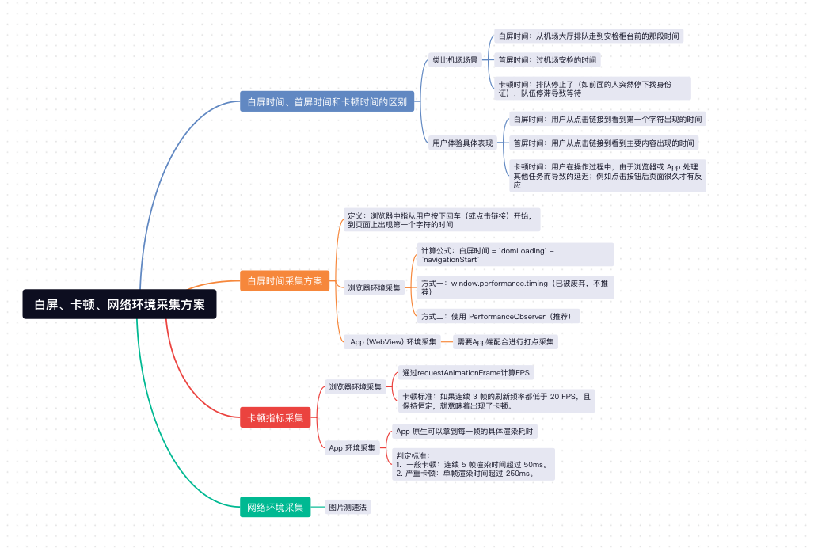

作为一名前端工程师，我们常说“性能即体验”。但“性能”这个词太过于宏大，具体落实到用户感知的层面，其实主要就是两件事：**我打开页面的速度快不快？界面操作流不流畅?**

而在前端性能指标中，与此相对应的分别是**白屏指标**和**卡顿指标**。



## 1、白屏时间、首屏时间和卡顿时间的区别

**举个例子，想象一下你去机场坐飞机：**
- **白屏时间**：从机场大厅排队走到安检柜台前的那段时间。
- **首屏时间**：过机场安检的时间。
- **卡顿时间**：排队停止了。比如前面的人突然停下找身份证，也就是排队的队伍停止了，你就得等着，这就是卡顿。

**具体反映在用户体验上：**
- **白屏时间**：用户从点击链接到看到第一个字符出现的时间。
- **首屏时间**：用户从点击链接到看到主要内容出现的时间。
- **卡顿时间**：用户在操作过程中，由于浏览器或 App 处理其他任务而导致的延迟。比如点击按钮后，页面很久才有反应，这就是卡顿。

## 2、白屏时间采集方案

在浏览器中，**白屏时间**指的是从用户按下回车（或点击链接）开始，到页面上出现第一个字符的时间。


### 2.1 浏览器环境采集

我们可以利用浏览器的 `Performance API` 来计算：
> **白屏时间 = `domLoading` - `navigationStart`**

其中，`domLoading` 表示**浏览器开始解析 DOM 结构的时间**，首屏时间就是指浏览器开始解析 DOM 结构的时间减去导航开始的时间。


#### 方式一：window.performance.timing（已被废弃，不推荐）
```js
function getDomLoadingTime() {
  if (!window.performance || !window.performance.timing) {
    return null;
  }
  
  const timing = window.performance.timing;
  const navigationStart = timing.navigationStart;
  const domLoading = timing.domLoading;
  
  if (navigationStart === 0 || domLoading === 0) {
    return null;
  }
  
  return domLoading - navigationStart;
}

window.addEventListener('load', function() {
  const domLoadingTime = getDomLoadingTime();
  if (domLoadingTime) {
    console.log('DOM 开始解析时间:', domLoadingTime, 'ms');
  }
});
```

#### 方式二：使用 PerformanceObserver（推荐）

```js
new PerformanceObserver((entryList) => {
  for (const entry of entryList.getEntries()) {
    if (entry.name === 'first-contentful-paint') {
      console.log('首屏时间（基于FCP）:', entry.startTime);
    }
  }
}).observe({ entryTypes: ['paint'] });
```

### 2.2 App (WebView) 环境采集

与浏览器环境不同的是，在 `APP(Webview)` 环境中，多了一个启动浏览器内核，也就是 `Webview` 初始化的过程，这就好比你要过安检，安检员需要先把安检机器给打开。 

所以在这个环境下，检测白屏时间需要 APP 端配合。在 APP 创建 `Webview` 时，需要打一个点，在开始建立网络连接时，再打一个点，这两个点之间的差值，就是初始化的耗时，在计算白屏时间的时候，需要加上这部分的耗时。

> 当然，我们也可以通过**并行初始化**的方案，来规避掉这部分的耗时。也就是在 APP 启动时，并行初始化 `Webview`，并放入 `Webview` 池，当用户需要打开 H5 页面时，直接从池子里取出来，而不需要重新初始化。当然，也需要对 `Webview` 池进行最大容量限制，避免内存占用过多。
 
## 3、卡顿

**卡顿**很好理解，直白点来说就是页面“卡”住了。比如用户点击了一个按钮，但是页面过了 3-4s 才有反应，或者页面某些动画看起来很不流畅，这都是卡顿的现象。

### 3.1 怎么判定卡顿呢？

`FPS（Frames Per Second）`，即**每秒帧数**，是衡量页面流畅度的一个指标。一般来说，**FPS 超过 60 就可以认为是流畅的**，也就是单帧渲染时间在 16.6ms（1000ms / 60） 以下。因为刷新率超过 60 Hz 时，人脑无法区分出单独的帧，会将快速变化的静态图片序列融合成一个平滑、连续的动态视觉体验。

但也如果用平均帧数 > 60 去判断页面是否卡顿，也是不靠谱的，无法描述画面的抖动情况。比如几帧只用了 8ms 渲染，中间有两帧达到了 200ms，总体平均下来还是超过 60FPS，但用户中途却感觉到了明显的卡顿。

### 3.2 浏览器环境采集

浏览器并没有直接提供 FPS 指标，但是我们可以通过 `requestAnimationFrame` 来变相计算。

```js
// 统计FPS
function calculateFPS() {
  let lastTime = performance.now(); // performance.now() 比 Date.now() 更精准
  let frameCount = 0;

  function animate() {
    const currentTime = performance.now();
    const deltaTime = currentTime - lastTime;

    if (deltaTime >= 1000) {
      const fps = frameCount / (deltaTime / 1000);
      console.log('当前 FPS:', fps);
      lastTime = currentTime;
      frameCount = 0;
    }

    frameCount++;
    requestAnimationFrame(animate);
  }

  animate();
}
calculateFPS();
```


> **判定标准**：如果连续 3 帧的刷新频率都低于 20 FPS，且保持恒定，就意味着出现了卡顿。

### 3.3 App 环境采集
App 原生可以拿到每一帧的具体渲染耗时。
> **判定标准**：
> *   一般卡顿：连续 5 帧渲染时间超过 50ms。
> *   严重卡顿：单帧渲染时间超过 250ms。

## 4、如何采集用户的网络环境？

用户的网络环境有很多种，比如 5G、4G、WiFi、3G/2G 等。我们需要通过采集真实用户的网络环境，从而绘制出具体的网速分布图，进行针对性优化。

采取**图片测速法**来采集用户的网络环境，具体步骤如下：
1. 加载两张图片，一张极小的（比如 1x1像素），一张稍大的（比如 3x3像素）。
2. 记录图片请求开始到 `onLoad` 完成的时间。
3. 计算速度：`文件大小 / 加载时间 = 网速`。
4. 取平均值，把两个数据取个平均值，减少误差。

最常见的优化例子就是，在用户观看视频时，根据用户的网络情况，分别加载不同清晰度的视频，高清、标清、流畅等。

## 5、总结

以上主要介绍了白屏时间和卡顿指标的区别和采集方案，以及如何采集用户的网络环境：
- 白屏时间相当于你去安检柜台的时间，首屏时间指的是过安检的时间，卡顿指的是排队停止了。
- 白屏时间的采集：浏览器通过 `PerformanceObserver`, APP Webview 环境需要 APP 配合进行打点采集。
- 不能简单用平均帧数超过 60FPS来判断页面是否卡顿，在浏览器环境，如果连续 3 帧的刷新频率都低于 20 FPS，且保持恒定，就意味着出现了卡顿，在 App 环境中，**连续 5 帧渲染时间超过 50ms** 判定为**一般卡顿**，**单帧渲染时间超过 250ms** 判定为**严重卡顿**。
- 一般用**图片测速法**来采集用户的网络环境，并根据用户的网速分布图来进行优化。


## 往期回顾
- [前端性能优化之首屏时间采集篇](https://mp.weixin.qq.com/s/CO47rnZrzYpqTwPPifRjQQ)
- [前端性能优化之性能指标篇](https://mp.weixin.qq.com/s/9OsrlYXrvJbkGDrTiJ6NHQ)
- [前端性能优化之Webpack篇](https://mp.weixin.qq.com/s/W8fkvEjbHlFpIg3_RMXGpA)
- [前端性能优化之CSS篇](https://mp.weixin.qq.com/s/0Gl2sGa2Ev44tyrSYjjyFg)
- [前端遇到页面卡顿问题，如何排查和解决？](https://mp.weixin.qq.com/s/eIKLx_kegGzrB00KXeKYLQ)