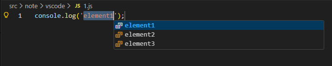

## 前言

`snippets` 意思是**片段**，在 `vscode` 中可以通过 `Snippets：Configure Snippets` 命令，可以定义`全局级（global）、项目级（Project）、语言级（Language）`代码片段，可以按照自定义的规则来快速生成一段代码，进而大幅提升我们的开发效率，可谓是开发提效利器。

## 1、如何创建 snippets？

1. 第一步，在 vscode 按 `ctrl/command + shift + p`，输入 snippets，选择 `Snippets：Configure Snippets`，可以看到如下界面。


可根据需要选择 snippets 的创建类型，一般选择 global 全局级别的 snippets 即可。

2. 第二步，选择 `New Global Snippets file`，输入文件名，按 `enter` 键，即进入 `snippets` 配置文件设置。

snippets 文件以 JSON 编写，里面支持书写注释，并可定义无限数量的 snippets。

```json
"snippet": {
	"scope": "javascript,typescript",
	"prefix": "snippet",
	"body": [
		"console.log('$1');",
	],
	"description": "a simple snippet"
}
```

- **prefix**：必填，可以定义一个或多个触发词，由于子字符串匹配不是严格匹配的，类似正则匹配，比如输入 `ts` 可以匹配到 `test`。
- **body**：必填，表示正文，是一行或多行内容，插入时会合并为多行。换行和嵌入的标签页将根据插入摘要的上下文进行格式化。
- **description**：可选，表示片段的描述。
- **scope**：可选，表示支持的语言，默认支持所有。

## 2、snippets 支持语法

### 2.1 光标控制

- 在 body 正文，它里面可以使用占位符：`$0、$1、$2...`，代表光标位置，`$0` 代表光标最后停留的位置，`$1` 代表光标第一个停留的位置，`$2` 代表光标第二个停留的位置，以此类推，在使用 `prefix` 触发词触发词生成代码片段后，可使用 `Tab` 键跳转到光标位置。
- 同名光标可以同时使用多个，比如可以使用多个 `$1`，就可以实现**多光标同时编辑**。
- 光标也可以加上默认值，比如 `${1：element}`，默认值为 `element`，如果触发词触发后，不输入任何内容，则光标位置默认为 `element`。
- 光标也可以提供多个值来选择，比如 `${1|element1,element2,element3|}`，当按 `Tab` 键移动到对应光标时，会出现下拉框可供选择。




### 2.2 Variables 变量

在 body 正文可以使用变量，语法是 `$name` 或 `${name：default}`。其中 `default` 表示默认值（占位符），当变量未知（即其名称未定义）时，会采用这个默认值。

vscode 中内置一些变量：
- `${TM_FILENAME}`：当前文件名。
- `${TM_FILENAME_BASE}`：当前文件名（不带扩展名）。
- `${TM_DIRECTORY}`：当前文件所在目录。
- `${TM_FILEPATH}`：当前文件路径。
- `${RELATIVE_FILEPATH}`：当前文档的相对（相对于已打开的工作区或文件夹）文件路径。
- `${RELATIVE_FILEPATH}`：当前文档的相对（相对于已打开的工作区或文件夹）文件路径。
- `${CLIPBOARD}`：剪切板的内容。
- `${TM_SELECTED_TEXT}`：当前选择的文本或空字符串。
- `${CURRENT_SECONDS_UNIX}`：10位 unix 时间戳。
- ...等等。

更多变量可查看[vscode snippets 官方文档](https://code.visualstudio.com/docs/editing/userdefinedsnippets#_variables)。

### 2.3 Transform 变换

还支持对变量做正则替换。

举个例子，变量 `${TM_FILENAME}` 是表示当前文件名，比如当前文件名为 `test.js`，使用 `"${TM_FILENAME/[\\.]/_/}"`，表示将文件名中的 `.` 替换为 `_`，会把 `test.js` 变成 `test_js`。

这个语法怎么理解呢？

拿 js 对比来说，比如当前字符串 s 为 `test.js`，使用正则替换 `s.replace(/(.+)\.js/i, '$1df')`，其输出结果为 `testdf`，而在 vscode 中，如果当前文件名为 `test.js`，使用 `${TM_FILENAME/(.+)\\.js/$1df/i}`，也能得到同样的结果。

**具体规则差异总结如下**：
- 也就是不用逗号分开，而改为 `/`。
- 在以前 `\.js` 的正则语法中，需要增加一个 `\` 表示再多转义一次，要不然会报错。


## 3、多人项目协作时如何实现 snippets 共享？

之前说过，snippets 可以定义在**全局级、项目级、语言级**，所以，如果多人协作时，可以把 snippets 定义在项目级，这样 vscode 在根目录生成配置配置，目录如下： `根目录/.vscode/[snippet名].code-snippets`，可以在这个文件提交到 `git` 仓库中，这样项目成员都可以共享该 `snippets` 了。

## 4、如何在 markdown 文件中使用 vscode snippets?

默认在 `vscode` 中，在`markdown` 文件编写内容是默认不支持 snippets 的，比如我平时写一些 `markdown` 表格时，会配置一个 `markdown` 表格的 `snippets`，但发现在 `markdown` 文件中输入触发词 `prefix` 根本无法使用。

```json
{
	"md-table": {
		"prefix": "md-table",
		"body": [
			"| 列1标题 | 列2标题 | 列3标题 |",
			"|---------|---------|---------|",
			"| 内容A   | 内容B   | 内容C   |",
			"| 内容D   | 内容E   | 内容F   |"
		],
		"description": "markdown 表格"
	}
}
```

后面发现可以手动插入 snippets。在 vscode 按 `ctrl/command + shift + p`，输入 snippets，选择 `Snippets：Insert Snippet`，就可以看到所有之前配置好对的 `snippets` 了，选择对应的 `snippet` 插入即可。


## 小结

- vscode 支持`全局级（global）、项目级（Project）、语言级（Language）`代码片段，一般个人使用的话为了方便，直接定义`全局级`即可，需要进行多人协助时，可使用`项目级` snippets，将生成的配置文件上传到 `git` 仓库即可。
- snippets 支持语法：**光标控制、Variables 变量、Transform 变换**等语法，可按需使用。
- markdown 中默认不支持 snippets，但可以通过手动插入 snippets 来使用。


最后为了方便，snippets 配置文件的编写可以使用这个工具网站进行生成：[snippet-generator](https://snippet-generator.app/?description=&tabtrigger=&snippet=&mode=vscode)


