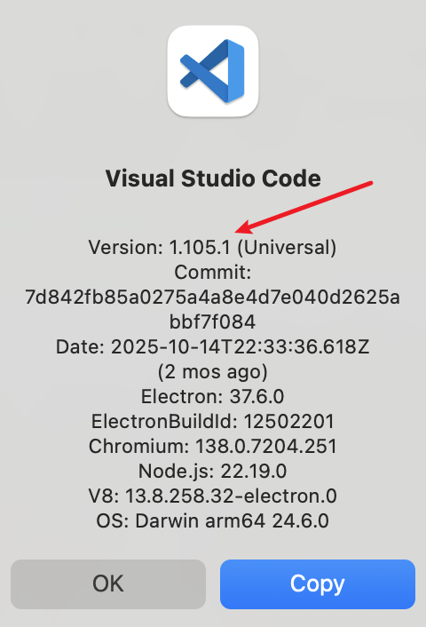
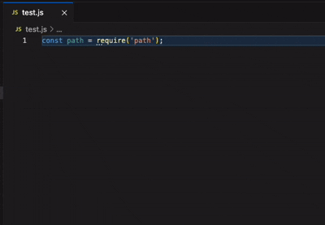

## 前言

`vscode` 几乎是前端开发人员的标配，而现在编辑器往往只提供**代码编辑**、**文件和项目管理**、**终端集成**、**源代码管理**、**调试支持**等核心功能，而一些扩展功能则交给插件来实现。

会编写 `vscode` 插件可以极大提升我们的开发效率，本文将介绍如何编写一个简单的 `vscode` 插件。

## 1、 安装工具，初始化项目

首先肯定要安装 `node`，再通过其自带 `npm` 包管理工具安装 `yo` 和 `generator-code`。
- `yo`：全称叫 `Yeoman`，是一个现代 Web 应用的脚手架工具（命令行工具），用于快速生成项目。
- `generator-code`：`VS Code` 扩展生成器。

```bash
npm install -g yo@5 generator-code
```
> 注意，使用 `yo` 最新的 `6.0.0` 版本运行 `yo` 命令会报错，因此这里指定安装 `5` 版本。

安装完成后，运行 `yo code` 命令，初始化项目。

```bash
yo code
```

这里按提示即可，我这里选择的是 `pnpm + Typescript`。


其主要项目结构如下：

```bash
my-vscode-extension/
├── .vscode/            # VS Code 调试配置
│   ├── launch.json
│   └── tasks.json
├── src/
│   ├── test/           # 测试文件
│   └── extension.ts    # 插件主入口文件
├── .gitignore          # git 忽略文件
├── .npmrc              # npm 配置文件
├── .vscode-test.mjs    # 单测配置文件
├── .vscodeignore       # 插件发布忽略文件
├── package.json        # 项目依赖管理文件
├── tsconfig.json       # TypeScript 配置文件
├── eslint.config.mjs   # Eslint 配置文件
└── README.md
```

介绍一下 `package.json` 中提供的几个重要命令：
```json
{
  "scripts": {
    "vscode:prepublish": "pnpm run compile",
    "compile": "tsc -p ./",
    "watch": "tsc -watch -p ./",
    "pretest": "pnpm run compile && pnpm run lint",
    "lint": "eslint src",
    "test": "vscode-test"
  },
}
```

- `npm run compile`：编译 TypeScript 代码。
- `npm run watch`：监听 TypeScript 文件变化并实时编译。
- `npm run test`：运行单元测试。

另外是 `package.json` 中提供的插件命令。

```json
{
  "contributes": {
    "commands": [
      {
        "command": "my-vscode-extension.helloWorld",
        "title": "Hello World"
      }
    ]
  },
}
```

在默认提供的 `demo` 中，插件命令名字叫 `hello world`。

## 2、调试插件

在调试插件前，需要先运行下 `npm run compile` 编译 TypeScript 代码，经编译后会生成 `out/` 文件，然后便可以开始调试了。

为什么要先编译呢？因为在 `package.json` 中定义了插件运行的入口文件，也就是 `main` 字段，默认值为 `./out/extension.js`，所以如果不先编译生成 `out/` 文件是会运行报错的。
```json
{
  "main": "./out/extension.js",
}
```

有两种启动调试的方式：
1. 按快捷键 `F5`。
2. 点击编辑器左下方的 `Run Extension（插件名）`。

启动后，会自动打开一个新的 VS Code 窗口，并启动调试模式，我们可以在该窗口中调试插件。

先按 `Ctrl/Command + Shift + P`，输入 `hello word`，会发现找不到命令。


这里是因为我们本地安装的 vscode 版本不符合插件要求，我们在 `package.json` 找到如下配置：

```json
{
  "engines": {
    "vscode": "^1.107.0"
  },
}
```

然后我们再查看下本机的 vscode 版本，`Code -> About VisualStdio Code`。



发现我们本地版本为 `1.105.1`，不满足 `^1.107.0`，于是我们把 `engines.vscode` 修改为 `^1.105.0`。

```json
{
  "engines": {
    "vscode": "^1.105.0"
  },
}
```

再通过 `F5` 或者左下角 `Run Extension` 启动调试，按 `Ctrl/Command + Shift + P`，输入`hello world`，就能看到命令了。这个 `hello world` 就对应我们上面说的 `package.json` 文件中的 `contributes.commands.title` 字段。

成功运行后，会在编辑器右下角看到如下提示：


这个提示就是对应 `src/extension.ts` 的如下代码：


然后我们就可以开始编写插件的具体功能了。

## 3、编写插件核心逻辑

我们来实现一个简单的功能，平时我们写代码时，经常会写 `console.log`，如果每次都写这个太麻烦了，我们希望能实现下面的功能：
1. 通过快捷键，可以快速生成 `console.log` 语句。
2. 光标选中变量并按下快捷键时，能把变量名也显示出来。

### 3.1 修改 package.json，定义插件名字、描述和快捷键

定义名字 `name`，描述 `description`，快捷键 `keybindings`，通过 `ctrl/command+alt+l` 可以运行插件。

```json
{
  "name": "log-util",
  "displayName": "log-util",
  "description": "generate log statement",
   "contributes": {
    "commands": [
      {
        "command": "log-util.logUtil",
        "title": "log util"
      }
    ],
    "keybindings": [
      {
        "command": "log-util.logUtil",
        "key": "ctrl+alt+l",
        "mac": "cmd+alt+l",
        "when": "editorTextFocus"
      }
    ]
  },
}
```

### 3.2 核心功能代码
修改 `src/extension.ts` 文件，实现插件功能。


先实现第一步，快速生成 `console.log` 语句。

```js
import * as vscode from "vscode";

export function activate(context: vscode.ExtensionContext) {
  const disposable = vscode.commands.registerCommand(
    "log-util.logUtil",
    async () => {
      const editor = vscode.window.activeTextEditor;
      if (!editor) {
        vscode.window.showWarningMessage("没有打开的编辑器");
        return;
      }
      // 获取配置
      const getConfig = () =>
        vscode.workspace.getConfiguration("consoleLogGenerator");
      const config = getConfig();
      const logType = config.get<string>("logType", "log");
      const prefix = config.get<string>("logPrefix", "🚀 ~ ");

      const position = editor.selection.active;

      const document = editor.document;
      const selection = editor.selection;
      const text = document.getText(selection);

      const statement = `console.${logType}('${prefix}:', );`;

      editor
        .edit((editBuilder) => {
          const insertPosition = new vscode.Position(position.line, position.character + 1);
          editBuilder.insert(insertPosition, statement);
        })
        .then((success) => {
          if (success) {
            // 设置光标位置
            const newPosition = new vscode.Position(position.line, statement.length + position.character - 2);
            editor.selection = new vscode.Selection(newPosition, newPosition);
          }
        });
    }
  );

  context.subscriptions.push(disposable);
}

export function deactivate() {}

```

然后实现第二步，增加对光标选中变量的处理。

```diff
		 // 获取变量名
+   let variableName = text.trim();
-   const statement = `console.${logType}('${prefix}:', );`;
+   const statement = `console.${logType}('${prefix}${variableName ? ` →  ${variableName}` : ''}:', ${variableName});`;
  
    editor.edit(editBuilder => {
-     const insertPosition = new vscode.Position(position.line, position.character + 1);
+     const insertPosition = new vscode.Position(position.line + (variableName ? 1 : 0), variableName ? 0 : position.character + 1);
+     if (variableName) {
+       editBuilder.insert(insertPosition, '\n');
+     }
      editBuilder.insert(insertPosition, statement);
    }).then(success => {
        if (success) {
          // 设置光标位置
-         const newPosition = new vscode.Position(position.line, statement.length + position.character - 2);
+         const newPosition = new vscode.Position(position.line + (variableName ? 1 : 0), variableName ? statement.length : statement.length + position.character - 2);
          editor.selection = new vscode.Selection(newPosition, newPosition);
			}
		});
```

测试插件功能：

```js
const path = require('path')
console.log('🚀 ~  →  path:', path); // 光标选中上一行的 path 变量，按 ctrl/command+alt+l 生成
console.log('🚀 ~ :', ); // 在当前行按 ctrl/command+alt+l 生成
```
效果如下：



## 4、发布插件

1. 进入[这个网站](https://marketplace.visualstudio.com/)，点击 `Sign in`，先注册一个开发者账号。

2. 点击 `Public extensions`，按照提示一步步发布即可。

。

## 小结

本文主要介绍了如何编写一个简单的 VSCode 插件步骤：
1. 安装 `yo` 和 `generator-code`。
2. 运行 `yo code` 命令生成插件项目，这里可以选择插件的开发语言，定义插件的名称、描述等。
3. 修改 `package.json` 文件，可以修改插件的名称、描述、入口文件，定义插件的快捷键。并要注意设置 `engines.vscode` 字段，指定插件支持的 VSCode 版本。
4. 在 `src/extension.ts` 文件中编写插件逻辑。
5. 运行 `npm run compile` 编译插件，或者运行 `npm run watch` 监听文件变化并编译。
6. 按快捷键 `F5`，或者点击编辑器左下方的 `Run Extension` 进行插件调试。
7. 在调试的新窗口中，使用 `Ctrl/Command + Shift + P`，输入配置的命令，或者按配置的快捷键，测试插件功能是否正常。
8. 运行 `npm run test` 测试插件功能。（本文未涉及到单元测试）
9. 发布插件。

希望本文对你有所帮助，如果你有任何问题，欢迎在评论区留言。


