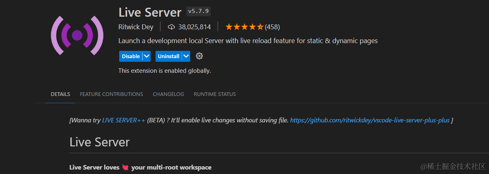
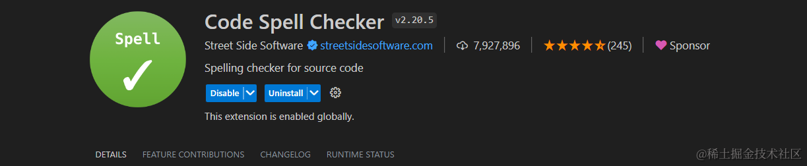
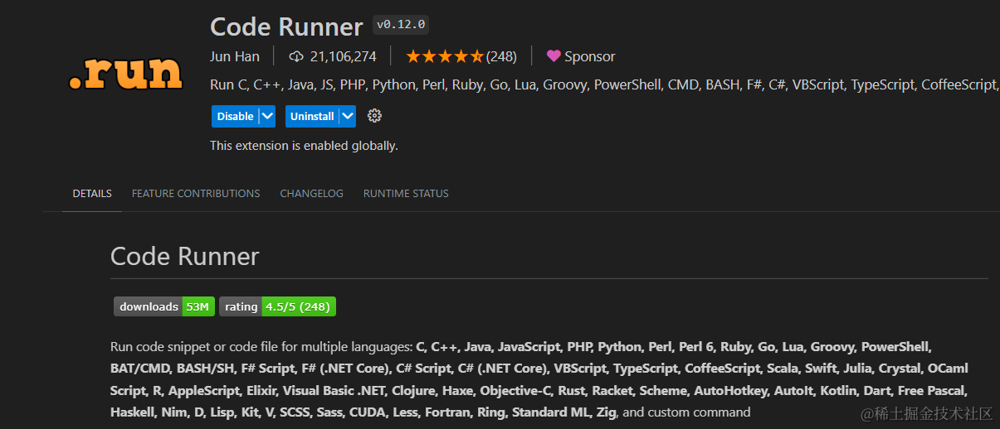
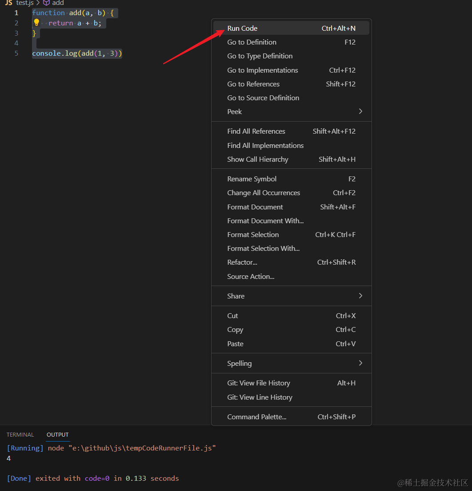
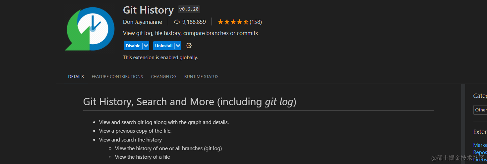
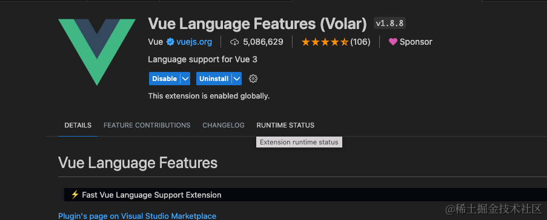

U## 前言
先来说下`vscode`的优点：
1. **轻量级和灵活性**：`vscode`走的是`插件化`的设计思路，因此它本身软件比较轻量，其它功能通过插件进行扩展，我们也可以自己动手去写插件，集轻量性和灵活性于一身。
2. **强大的插件生态系统和活跃的社区**：`vscode`拥有十分强大的插件生态系统，各种常见的功能都能很容易找到对应的插件，满足我们日常的开发可以说是绰绰有余啦！而且它的社区非常活跃，有问题可以去社区寻找答案。
3. **跨平台**：在`Windows`、`macOS` 和 `Linux`三端的操作系统上都能用。
4. **Git支持**：`vscode`提供了图形化的git操作，可以很方便的进行`版本控制`、`分支管理`、`查看差异`、`解决冲突`，用起来巨爽。
5. **强大的维护团队**：`vscode`背后的维护团队是`Microsoft微软`，这团队实力不用多说。

拥有这么多优点，难怪现在能成为我们前端程序员的宠儿。

在日常开发中，如果能掌握好vscode的使用方法和技巧，那写起代码来真的是`手拿把攥`，事半功倍，接下来给大家介绍一些又好用又能提升效率的`vscode插件和快捷键`。
## vscode插件
### 1. live-server

这个插件会启动一个本地的服务器，可以实时预览代码效果，不需要手动刷新，比如我们写一个`html文件`时，想实时看到`html`在浏览器中的预览效果，这个就非常合适了。
### 2. Auto Rename Tag

这个插件可以帮助我们对`XML/HTML标签对`重命名，比如你需要把标签``改成`

`，你只需要改把`开始标签`的`a`改成`p`即可，这个插件会帮你同步修改`结束标签`。
### 3. Auto Close Tag

这个一看名字就知道，这是一个自动添加 `HTML/XML 关闭标签`的插件。
### 4. Code Spell Checker

这个插件可以对你的代码进行`拼接检查`，比如你拼写了一个错误的单词，他会给出标记。

### 5. Code Runner

可以右键直接运行代码，支持多种语言，比如C, C++, Java, Javascript, JS, PHP, Python, Ruby, Go等。

如果要运行ts，需要先全局安装`typescript`和`ts-node`。
### 6. CodeGeeX

这是一款`免费的`AI代码辅助工具，它提供代码生成/完成、评论生成、代码翻译和基于AI的聊天等功能，我们用它写代码的话，它会帮助我们进行`代码推导`和`自动补全`，还可以帮助我们`一键生成注释`，有什么技术问题也可以使用它的聊天功能进行询问找寻答案，可以说十分方便，最重要的是只需要去它的官网注册一个账号即可`免费使用`。
### 7. JavaScript (ES6) code snippets

这个插件预设了很多`ES6`的代码片段（现在不会有人写项目还用ES5吧，不会吧不会吧！），可以使用它定义好的一些快捷键触发对应预设的 ES6 语法片段，从而提高我们的开发效率。
### 8. Git History

这个插件可以帮助我们`查看git日志、文件历史记录、比较分支或提交`，对于项目多人协助和定位bug非常有用。

### 9. Volar

一款支持`vue3`的官方推荐插件。

接下来给大家介绍一些`vscode非常好用的快捷键`。
## VScode快捷键
### 1. 下一个相同变量
光标选中某个变量后，可以用`Ctrl/Command + d`向后查找下一个相同变量，再继续按一次可以继续往下查找。
### 2.选择所有相同变量
如果相同变量非常多，又需要对它们统一进行编辑操作，可以使用`Ctrl/Command+shift+l`选中所有相同变量，然后就可以统一进行编辑操作了。
### 3. 查找并跳转到某个文件
如果需要查找并跳转到某个文件，可以先按下`Ctrl/Command+p`，然后用输入`文件名`或者`文件路径`，在筛选出的文件列表中点击文件即可跳转到对应的文件中。
### 4.搜索
- `Ctrl/Command + f`：文件内搜索 
- `Ctrl/Command + shift + f`：全局搜索
### 5. 打开/关闭侧边栏
可以使用`Ctrl/Command + b`打开/关闭侧边栏。
### 6. 移动当前行
先光标选中某一样，然后可以使用`alt+上/下方向键`向上/向下移动该行。
### 7. 向上/向下插入一行
- `Ctrl/Command + enter`：向上插入一行
- `Ctrl/Command + shift + enter`：向下插入一行
### 8. 切换工作区
可以使用`Ctrl + r`切换打开目录，也就是切换工作区，先按下`Ctrl + r`，然后选择目录即可切换，默认是覆盖当前窗口打开，要新窗口打开需要先按住`Ctrl`键再点击目录。 
### 9. 重命名文件/文件夹
先选中某一个文件/文件夹，然后`window`按`F2`，`mac`按`enter`键即可重命名当前名文件/文件夹。
### 10. 转到某一行
如果文件内容过多，可以使用`Ctrl/Command + g`命令，然后输入行数即可精准定位到某一行。
### 11. 切换编辑的文件
- `Ctrl/Command + tab`：切换到下一个文件
- `Ctrl/Command + shift + tab`：切换到上一个文件
### 12. 格式化文件
可以使用`shfit + alt + f`格式化当前文件。
### 13. 放大缩小编辑器界面
`Ctrl/Command + +/-`可以放大缩小编辑器界面
### 14. CV工程师必备
- `Ctrl/Command + s`：保存
- `Ctrl/Command + c`：复制
- `Ctrl/Command + v`：粘贴
- `Ctrl/Command + x`：剪切
- `Ctrl/Command + z`：撤销
- `Ctrl/Command + a`：全选

<!-- ## 小结
以上就是我个人在日常前端开发中常用的`VSCode插件和快捷键`了，熟练使用之后发现开发编码的效率大大提升了，如果大家还有什么好用的`VSCode插件和快捷键`，欢迎大家推荐给我哦！ -->

